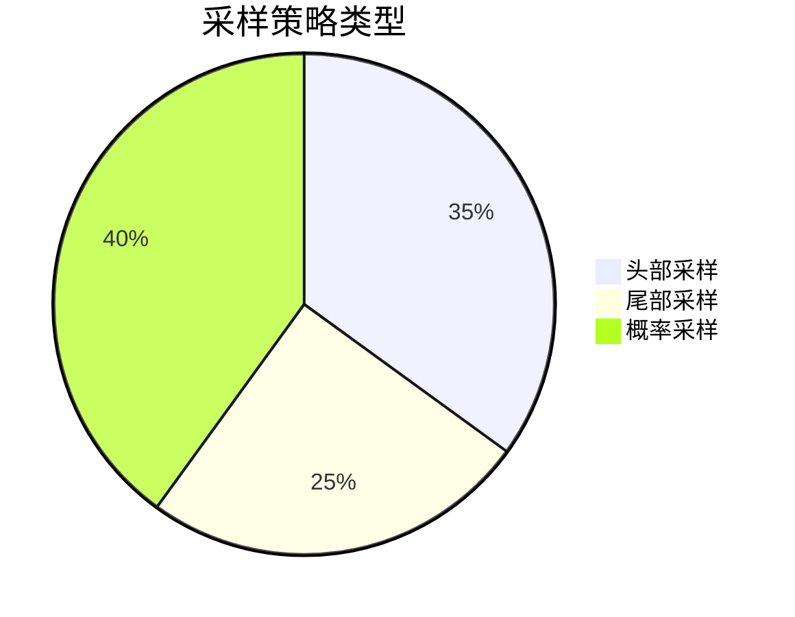

# OpenTelemetry 采样配置

## 什么是采样？

采样（Sampling）是OpenTelemetry中控制收集多少遥测数据（如跟踪、指标、日志）的过程。通过采样，可以在系统开销和数据完整性之间取得平衡——高采样率会提供更全面的数据但增加资源消耗，低采样率则相反。

## 为什么需要采样？

1. **降低存储成本**：全量数据存储可能非常昂贵。
2. **减少网络带宽**：避免传输所有生成的遥测数据。
3. **控制后端负载**：防止分析系统过载。
4. **聚焦重要数据**：优先保留对调试和监控最有价值的信息。

## 采样类型

OpenTelemetry支持多种采样策略：



### 1. 头部采样 (Head-based Sampling)
在请求开始时决定是否采样，常用策略包括：
- **固定比率采样**：按固定比例采样（如10%）。
- **速率限制采样**：每秒最多采样N个请求。

#### 代码示例：固定比率采样
```python
from opentelemetry.sdk.trace.sampling import TraceIdRatioBased

# 采样率设置为10%
sampler = TraceIdRatioBased(0.1)
```

### 2. 尾部采样 (Tail-based Sampling)
在请求完成后根据其特征决定是否保留，例如：
- 只保留包含错误的请求
- 只保留慢请求（延迟高于阈值）

#### 代码示例：组合采样器
```python
from opentelemetry.sdk.trace.sampling import (
    TraceIdRatioBased,
    ParentBased,
)

sampler = ParentBased(
    root=TraceIdRatioBased(0.1),  # 根span采样率10%
    remote_parent_sampled=TraceIdRatioBased(0.5),  # 远程父span已采样时50%
)
```

### 3. 概率采样 (Probability Sampling)
每个span独立决定是否采样，可能导致不完整的跟踪链。

## 实际案例：电商平台采样策略

:::note 场景
一个电商平台需要监控下单流程，但每天有百万级请求。
:::

**解决方案**：
1. 对 `/checkout` 路径使用20%采样率
2. 对错误响应（HTTP 5xx）100%采样
3. 对延迟超过2秒的请求100%采样

```python
from opentelemetry.sdk.trace.sampling import (
    TraceIdRatioBased,
    ParentBased,
    Decision,
)

class CustomSampler:
    def should_sample(self, context, trace_id, name, attributes, links):
        if attributes.get("http.target") == "/checkout":
            return Decision(True)  # 强制采样结账流程
        if attributes.get("http.status_code", "").startswith("5"):
            return Decision(True)  # 采样所有错误
        return Decision(False)

sampler = ParentBased(root=CustomSampler())
```

## 配置最佳实践

1. **生产环境推荐**：结合 `ParentBased` 和 `TraceIdRatioBased`
   ```python
   sampler = ParentBased(root=TraceIdRatioBased(0.01))  # 1%采样率
   ```
2. **开发环境**：使用 `AlwaysOnSampler` 全量采样
3. **关键路径**：对核心业务逻辑提高采样率
4. **错误优先**：确保所有错误都能被捕获

:::warning 注意
采样决策应在服务边界保持一致，避免跟踪链断裂！
:::

## 总结

采样是OpenTelemetry中平衡系统开销与数据价值的关键配置。通过合理组合头部采样、尾部采样和概率采样，可以构建高效的遥测数据收集策略。

## 延伸学习

1. **练习**：尝试为你的应用配置不同的采样策略，比较存储数据量变化
2. **进阶阅读**：
   - OpenTelemetry官方采样文档
   - 分布式跟踪中的采样理论
3. **工具实验**：使用Jaeger或Zipkin查看不同采样策略的效果