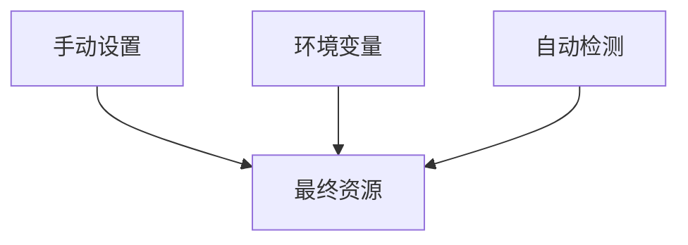

## 介绍

在分布式系统中，**资源属性(Resource Attributes)** 是为遥测数据（如追踪、指标、日志）添加上下文信息的关键机制。它们描述了产生数据的实体特征，例如：

- 服务名称和版本
- 运行环境（开发/生产）
- 主机/容器信息
- 云提供商元数据

通过合理配置资源属性，你可以：

1. 在多个服务间关联数据
2. 快速过滤和分组遥测数据
3. 增强故障排查能力

## 基础资源配置

### 手动定义资源属性

最基本的配置方式是通过 `Resource` 类直接定义属性：

```javascript
const { Resource } = require('@opentelemetry/resources');
const { SemanticResourceAttributes } = require('@opentelemetry/semantic-conventions');

const resource = new Resource({
  [SemanticResourceAttributes.SERVICE_NAME]: 'payment-service',
  [SemanticResourceAttributes.SERVICE_VERSION]: '1.0.0',
  'environment': 'production'
});
```

### 使用环境变量

OpenTelemetry SDK 会自动检测以下环境变量：

```bash
export OTEL_SERVICE_NAME=payment-service
export OTEL_RESOURCE_ATTRIBUTES="environment=production,team=finance"
```

## 高级配置技巧

### 自动检测资源

SDK 可以自动检测运行环境信息：

```javascript
const { detectResources } = require('@opentelemetry/resources');
const { awsEc2Detector } = require('@opentelemetry/resource-detector-aws');

const resource = await detectResources({
  detectors: [awsEc2Detector],
});
```

### 资源合并策略

当多个来源提供资源属性时，合并策略决定优先级：



合并规则：
1. 手动设置具有最高优先级
2. 环境变量次之
3. 自动检测值作为后备

## 实际案例

### 微服务场景配置

假设我们有用户服务和订单服务：

```javascript
// 用户服务配置
const userServiceResource = new Resource({
  [SemanticResourceAttributes.SERVICE_NAME]: 'user-service',
  [SemanticResourceAttributes.SERVICE_VERSION]: '2.1.3',
  'domain': 'account'
});

// 订单服务配置
const orderServiceResource = new Resource({
  [SemanticResourceAttributes.SERVICE_NAME]: 'order-service',
  [SemanticResourceAttributes.SERVICE_VERSION]: '1.4.0',
  'domain': 'commerce'
});
```

### Kubernetes环境

结合K8s下自动检测：

```javascript
const { k8sDetector } = require('@opentelemetry/resource-detector-kubernetes');

const resource = await detectResources({
  detectors: [k8sDetector],
});
```

这会自动添加：
- k8s.pod.name
- k8s.namespace.name
- k8s.node.name

## 最佳实践

:::tip 资源属性设计原则
1. **一致性**：跨服务使用相同的属性键
2. **语义化**：优先使用 [语义约定](https://opentelemetry.io/docs/reference/specification/resource/semantic_conventions/)
3. **适度**：避免添加过多无关属性
4. **安全**：不要包含敏感信息
:::

## 总结

资源属性配置是OpenTelemetry可观测性数据的基础上下文层。通过本文你学到了：

- 基本手动配置方法
- 环境变量配置方式
- 自动资源检测技术
- 实际应用场景示例

## 延伸学习

1. [OpenTelemetry资源规范](https://opentelemetry.io/docs/reference/specification/resource/)
2. [语义属性完整列表](https://github.com/open-telemetry/semantic-conventions)
3. 练习：为你的服务添加云提供商特定的资源属性

:::caution 注意
不同语言SDK的资源API可能有细微差别，请始终参考对应语言的文档。
:::