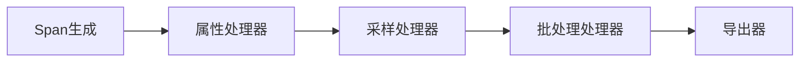

# OpenTelemetry 处理器配置

## 介绍

OpenTelemetry处理器（Processor）是遥测数据处理流水线中的关键组件，负责在数据导出前对其进行修改、过滤或批量处理。理解处理器配置能帮助你优化数据采集效率、减少网络开销，并确保只收集有价值的遥测数据。

处理器在SDK中按顺序执行，典型流程为：  
`采集数据 → 处理器1 → 处理器2 → ... → 导出器`

## 处理器类型

### 1. 批处理处理器（Batch Processor）
将多个数据点打包成批次发送，显著减少网络请求次数。

```javascript
const { BatchSpanProcessor } = require('@opentelemetry/sdk-trace-base');
const { ConsoleSpanExporter } = require('@opentelemetry/sdk-trace-base');

const batchProcessor = new BatchSpanProcessor(new ConsoleSpanExporter(), {
  maxQueueSize: 2048,       // 队列最大容量
  maxExportBatchSize: 512,  // 单次导出最大批大小
  scheduledDelayMillis: 5000 // 批次间隔(毫秒)
});
```

:::tip 何时使用
- 高吞吐量应用
- 需要降低导出频率的场景
:::

### 2. 简单处理处理器（Simple Span Processor）
每条数据立即发送，适合调试但性能较差。

```python
from opentelemetry.sdk.trace.export import SimpleSpanProcessor, ConsoleSpanExporter

simple_processor = SimpleSpanProcessor(ConsoleSpanExporter())
```

### 3. 属性处理器（Attribute Processor）
修改或删除Span中的属性：

```yaml
# 通过YAML配置示例
processors:
  attributes:
    actions:
      - key: "credit_card"
        action: delete
      - key: "account_id"
        action: insert
        value: "obfuscated"
```

## 实战案例

### 案例1：过滤健康检查请求
```go
import (
  "go.opentelemetry.io/collector/processor/filterprocessor"
)

cfg := &filterprocessor.Config{
  Spans: filterprocessor.SpanFilters{
    Include: &filterprocessor.MatchProperties{
      Attributes: []filterprocessor.Attribute{
        {Key: "http.target", Value: "^/(?!healthcheck).*$"},
      },
    },
  },
}
```

### 案例2：添加全局属性
```javascript
const { attributes } = require('@opentelemetry/semantic-conventions');

const attributeProcessor = new SpanProcessor({
  onStart(span) {
    span.setAttribute('deployment.environment', process.env.NODE_ENV);
  }
});
```

## 处理器链配置

通过Mermaid展示处理流程：


## 总结

关键要点：
- 批处理处理器能显著提升高负载应用性能
- 属性处理器帮助实现数据脱敏和标准化
- 处理器链顺序会影响最终结果

## 延伸学习

推荐练习：
1. 创建一个过滤掉静态资源请求的处理器
2. 实现自定义处理器来统计错误率
3. 比较批处理不同参数对内存占用的影响

官方资源：
- [OpenTelemetry处理器文档](https://opentelemetry.io/docs/concepts/components/)
- [SDK配置示例库](https://github.com/open-telemetry/opentelemetry-collector-contrib)