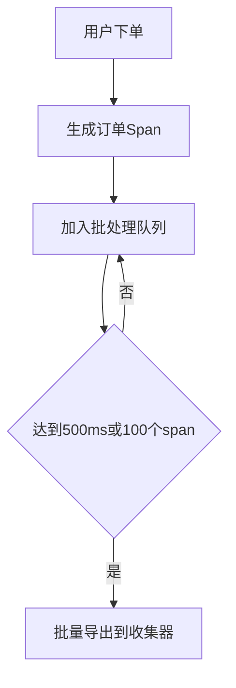

# OpenTelemetry 批处理配置

## 介绍

批处理(Batch Processing)是OpenTelemetry中一个关键的性能优化功能。它通过将多个遥测数据(span、metric、log)打包成批次进行传输，显著减少网络请求次数，提高数据传输效率。对于初学者来说，理解批处理的工作原理和配置方法，是构建高效可观测性系统的基础。

## 为什么需要批处理？

当应用产生大量遥测数据时，如果每条数据都单独发送：
- 会产生大量网络请求
- 增加系统开销
- 可能导致后端服务过载

批处理通过以下方式解决这些问题：
1. 在内存中累积数据
2. 达到特定条件时批量发送
3. 减少网络往返次数

## 基本批处理配置

OpenTelemetry SDK提供了`BatchSpanProcessor`来处理批处理逻辑。以下是一个基础配置示例：

```javascript
const { BatchSpanProcessor } = require('@opentelemetry/sdk-trace-base');
const { NodeTracerProvider } = require('@opentelemetry/sdk-trace-node');

const provider = new NodeTracerProvider();

// 配置批处理器
provider.addSpanProcessor(
  new BatchSpanProcessor(exporter, {
    maxQueueSize: 2048,       // 最大队列大小
    maxExportBatchSize: 512,  // 单次导出最大批大小
    scheduledDelayMillis: 5000, // 调度延迟(毫秒)
    exportTimeoutMillis: 30000 // 导出超时时间
  })
);
```

## 配置参数详解

| 参数 | 描述 | 默认值 | 推荐值 |
|------|------|--------|--------|
| `maxQueueSize` | 内存中最大缓存的span数量 | 2048 | 根据内存调整 |
| `maxExportBatchSize` | 单次导出包含的最大span数 | 512 | 不超过maxQueueSize |
| `scheduledDelayMillis` | 批处理间隔时间(毫秒) | 5000 | 根据数据量调整 |
| `exportTimeoutMillis` | 导出操作超时时间 | 30000 | 根据网络状况调整 |

:::tip 最佳实践
对于高流量应用，建议：
- 增大`maxQueueSize`以避免数据丢失
- 缩短`scheduledDelayMillis`以减少延迟
- 根据后端处理能力调整`maxExportBatchSize`
:::

## 实际应用场景

### 场景1：电商网站订单追踪



在这个场景中，批处理配置为：
- `scheduledDelayMillis: 500`
- `maxExportBatchSize: 100`
- `maxQueueSize: 1000`

### 场景2：物联网设备监控

对于设备上报的遥测数据：
```python
from opentelemetry.sdk.trace.export import BatchSpanProcessor

processor = BatchSpanProcessor(
    exporter,
    max_queue_size=5000,  # 设备可能离线，需要更大队列
    schedule_delay_millis=10000,  # 设备网络不稳定，减少发送频率
    max_export_batch_size=200
)
```

## 高级配置技巧

### 1. 动态调整批处理参数

根据系统负载动态调整参数：
```java
BatchSpanProcessorBuilder builder = BatchSpanProcessor.builder(exporter);

if (isHighTrafficPeriod()) {
    builder.setScheduleDelay(100); // 高峰期缩短延迟
} else {
    builder.setScheduleDelay(5000); // 低峰期增加延迟
}
```

### 2. 处理队列满的情况

当队列满时，可以配置处理策略：
```javascript
new BatchSpanProcessor(exporter, {
    onQueueFull: (span) => {
        // 自定义队列满处理逻辑
        logger.warn('Queue is full, dropping span');
    }
})
```

## 常见问题解决

:::caution 注意
1. **内存问题**：过大的`maxQueueSize`可能导致内存压力
2. **数据延迟**：过长的`scheduledDelayMillis`会增加数据可见延迟
3. **数据丢失**：应用崩溃时，队列中未导出的数据会丢失
:::

解决方案：
- 使用持久化队列(如Kafka)
- 实现优雅关闭，确保导出所有数据
- 监控队列使用情况

## 总结

OpenTelemetry的批处理配置是平衡性能和资源消耗的关键。通过合理配置：
- `maxQueueSize`
- `maxExportBatchSize` 
- `scheduledDelayMillis`

你可以构建既高效又可靠的遥测数据收集系统。

## 延伸学习

1. 尝试在不同流量模式下测试批处理配置
2. 使用OpenTelemetry Collector的批处理功能进行端到端优化
3. 了解如何与持久化队列(如Kafka)集成

:::note 练习
1. 创建一个简单的Node.js应用，配置不同的批处理参数
2. 使用负载测试工具模拟不同流量
3. 观察批处理配置对系统性能的影响
:::