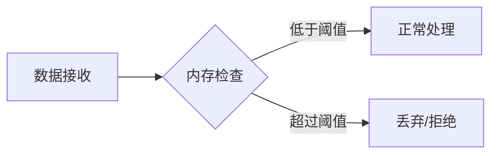

# OpenTelemetry 限流配置

## 什么是限流？

限流（Rate Limiting）是控制系统处理请求速率的技术，防止后端服务因突发流量过载。在OpenTelemetry中，通过Collector的处理器（Processor）组件实现数据采集的流量控制。

:::tip 为什么需要限流？
- 保护下游服务（如Jaeger/Prometheus）不被压垮
- 避免因突发流量导致数据丢失
- 平衡系统资源消耗
:::

## 基础配置示例

OpenTelemetry Collector的`memory_limiter`处理器是最常用的限流组件：

```yaml
processors:
  memory_limiter:
    check_interval: 1s
    limit_mib: 4000       # 内存上限4GB
    spike_limit_mib: 500  # 瞬时突发允许500MB
```

## 核心参数详解

### 1. 内存限制器（Memory Limiter）



关键参数：
- `limit_mib`：内存硬限制（MiB为单位）
- `spike_limit_mib`：允许的瞬时内存增长
- `check_interval`：内存检查频率

### 2. 批量处理器（Batch Processor）

通过批量处理间接实现限流：

```yaml
processors:
  batch:
    send_batch_size: 1000
    timeout: 5s
    send_batch_max_size: 2000
```

## 实战案例：电商系统监控

**场景**：黑色星期五促销期间，订单服务的指标数据暴增10倍。

**解决方案**：

```yaml
service:
  pipelines:
    metrics:
      receivers: [otlp]
      processors: [memory_limiter, batch]
      exporters: [prometheus]

processors:
  memory_limiter:
    check_interval: 500ms
    limit_mib: 8000
    spike_limit_mib: 1000
  batch:
    timeout: 10s
    send_batch_size: 5000
```

:::warning 注意事项
1. 过小的限流值会导致数据丢失
2. 生产环境需要根据实际负载测试调整
3. 结合`loadbalancing` exporter实现多实例分担负载
:::

## 高级技巧：动态调整

通过环境变量实现动态配置（Kubernetes示例）：

```yaml
processors:
  memory_limiter:
    limit_mib: ${env:MEMORY_LIMIT}
    spike_limit_mib: ${env:SPIKE_LIMIT}
```

## 测试与验证

使用`telemetrygen`工具模拟负载：

```bash
telemetrygen metrics --rate 1000 --duration 10m
```

观察Collector日志中的限流警告：

```
WARN processor/memorylimiterprocessor: Memory usage over limit
```

## 总结

关键要点：
- 限流是分布式系统稳定的重要保障
- OpenTelemetry提供内存和批量处理两种限流方式
- 需要根据业务特点调整参数

## 延伸学习

1. 官方文档：[Memory Limiter Processor](https://opentelemetry.io/docs/collector/configuration/#memory_limiter)
2. 实践建议：
   - 从宽松配置开始逐步收紧
   - 监控`otelcol_process_memory_rss`指标
3. 练习：在本地环境模拟不同流量场景测试限流效果