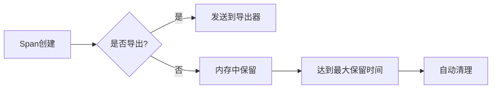

# OpenTelemetry 内存优化

## 介绍

OpenTelemetry是一个强大的可观测性框架，用于收集、处理和导出遥测数据（如指标、日志和跟踪）。然而，在高负载场景下，不当的配置可能导致内存消耗过高。本文将介绍如何通过优化配置和代码实践来减少OpenTelemetry的内存占用。

## 为什么需要内存优化？

默认情况下，OpenTelemetry可能会缓存大量数据（如未导出的Span或指标），尤其是在网络或后端服务出现延迟时。这可能导致：
- 应用内存压力增加
- 频繁的垃圾回收（GC）
- 甚至内存溢出（OOM）错误

---

## 优化策略

### 1. 限制批处理大小
OpenTelemetry的批处理器（Batch Processor）会将多个Span打包后批量导出。通过调整批处理大小，可以平衡内存使用和导出效率。

```javascript
const { BatchSpanProcessor } = require('@opentelemetry/sdk-trace-base');
const { Resource } = require('@opentelemetry/resources');
const { NodeTracerProvider } = require('@opentelemetry/sdk-trace-node');

const provider = new NodeTracerProvider({
  resource: new Resource({ 'service.name': 'my-service' }),
});

provider.addSpanProcessor(
  new BatchSpanProcessor(exporter, {
    maxQueueSize: 2048, // 最大队列大小（默认2048）
    maxExportBatchSize: 512, // 单次导出最大Span数（默认512）
  })
);
```

:::tip
建议值：
- 生产环境：`maxQueueSize = 2048`, `maxExportBatchSize = 512`
- 低内存环境：将两者减少50%
:::

### 2. 调整采样率
通过采样减少收集的Span数量，直接降低内存需求：

```javascript
const { ParentBasedSampler, TraceIdRatioBasedSampler } = require('@opentelemetry/core');

const sampler = new ParentBasedSampler({
  root: new TraceIdRatioBasedSampler(0.5) // 50%采样率
});

const provider = new NodeTracerProvider({
  sampler,
});
```

### 3. 定期清理资源
手动清理未使用的Span和指标：



### 4. 使用高效的导出间隔
较短的导出间隔会减少内存中积压的数据：

```javascript
new BatchSpanProcessor(exporter, {
  scheduledDelayMillis: 5000, // 每5秒导出一次（默认5000ms）
});
```

---

## 实际案例

### 电商平台优化实践
一个日均处理100万请求的电商平台发现内存使用量过高。通过以下优化：
1. 将采样率从100%降至30%
2. 调整批处理大小从2048→1024
3. 导出间隔从5秒→3秒

结果：
- 内存使用减少45%
- GC次数下降60%
- 未影响关键业务监控

---

## 总结

优化OpenTelemetry内存使用的关键点：
- 合理配置批处理器参数
- 根据业务需求调整采样率
- 定期监控内存指标
- 平衡实时性与资源消耗

## 延伸学习

推荐练习：
1. 使用`process.memoryUsage()`监控你的应用内存
2. 尝试不同采样率对监控覆盖率的影响
3. 模拟高负载场景测试不同配置

官方资源：
- [OpenTelemetry性能调优指南](https://opentelemetry.io/docs/concepts/performance-tuning/)
- [BatchSpanProcessor API文档](https://opentelemetry.io/docs/reference/specification/trace/sdk/#batching-processor)