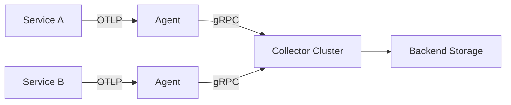
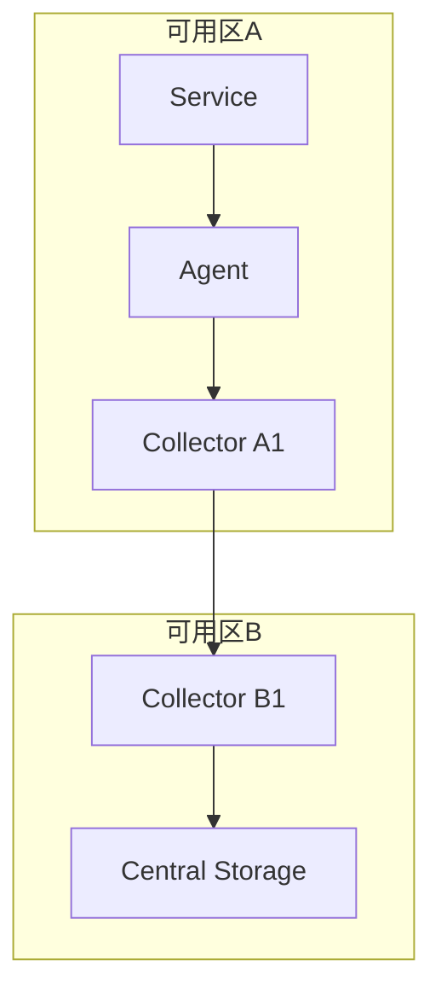

# OpenTelemetry 高可用配置

## 介绍

OpenTelemetry是云原生环境下可观测性的核心工具，但在生产环境中，单点故障可能导致监控数据丢失。高可用配置通过冗余、负载均衡和故障恢复机制，确保数据采集与传输的可靠性。本文将逐步讲解如何实现OpenTelemetry Collector的高可用部署。

## 核心概念

### 1. Collector的部署模式
OpenTelemetry Collector支持两种高可用模式：
- **Agent模式**：每个服务节点部署轻量级Agent，负责本地数据预处理。
- **Gateway模式**：集中式部署Collector集群，通过负载均衡接收数据。



### 2. 关键配置项
高可用配置需关注以下组件：
- **负载均衡**：使用Nginx或云服务商的LB
- **持久化队列**：防止数据因Collector重启丢失
- **重试机制**：网络波动时的自动恢复

---

## 实战配置

### 示例1：多Collector负载均衡
通过Docker Compose部署两个Collector实例，前端使用Nginx分发请求：

```yaml
# docker-compose.yaml
services:
  otel-collector1:
    image: otel/opentelemetry-collector
    command: ["--config=/etc/otel-config.yaml"]
    volumes:
      - ./config.yaml:/etc/otel-config.yaml

  otel-collector2:
    image: otel/opentelemetry-collector
    command: ["--config=/etc/otel-config.yaml"]
    volumes:
      - ./config.yaml:/etc/otel-config.yaml

  nginx:
    image: nginx
    ports:
      - "4317:4317"
    volumes:
      - ./nginx.conf:/etc/nginx/nginx.conf
```

对应的Nginx配置片段：
```nginx
# nginx.conf
upstream otel {
    server otel-collector1:4317;
    server otel-collector2:4317;
}

server {
    listen 4317 http2;
    location / {
        grpc_pass grpc://otel;
    }
}
```

:::tip
生产环境中建议为Collector配置健康检查端点，Nginx可自动剔除异常节点
:::

### 示例2：持久化队列配置
在Collector配置文件中启用队列和重试：

```yaml
# config.yaml
exporters:
  otlp:
    endpoint: "jaeger:4317"
    retry_on_failure:
      enabled: true
      initial_interval: 5s
      max_interval: 30s
    sending_queue:
      enabled: true
      num_consumers: 4
      queue_size: 1000
```

---

## 真实案例：电商系统监控

某电商平台在黑色星期五期间使用以下高可用方案：
1. **数据流**：每个微服务Pod包含Sidecar Agent
2. **传输层**：Agent将数据发送到区域级Collector集群（3节点）
3. **保障措施**：
   - 队列大小设置为平时5倍
   - 跨可用区部署Collector
   - 配置15分钟的重试窗口



---

## 总结与进阶

### 关键要点
- 至少部署2个Collector实例实现冗余
- 队列和重试是数据不丢失的最后防线
- 监控Collector自身的健康状态

### 扩展练习
1. 使用Kubernetes部署具有HPA自动伸缩的Collector集群
2. 测试网络分区场景下的数据恢复能力
3. 比较gRPC与HTTP协议的传输可靠性差异

### 推荐资源
- OpenTelemetry官方文档《Deployment Strategies》
- CNCF白皮书《Observability at Scale》
- 书籍《Distributed Tracing in Practice》