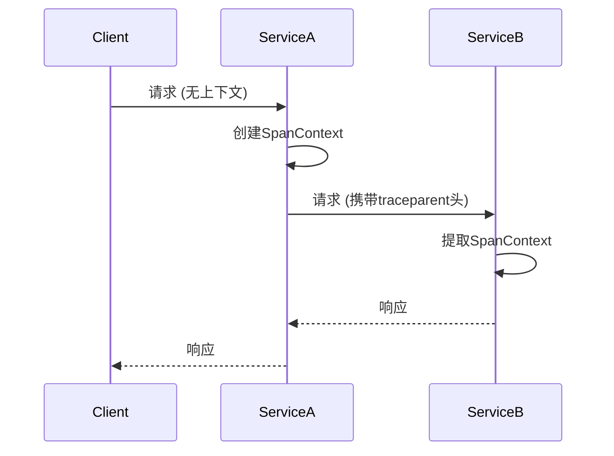

## 介绍

在分布式系统中，一个请求可能跨越多个服务。为了追踪完整的请求链路，需要将上下文信息（如Trace ID、Span ID等）在服务间传递。OpenTelemetry的**上下文传播（Context Propagation）**机制解决了这一问题，确保分布式追踪的连续性。

上下文传播的核心是：
1. **上下文（Context）**：存储当前请求的追踪信息（如`SpanContext`）和自定义键值对。
2. **传播器（Propagator）**：负责将上下文序列化到传输协议（如HTTP头）或反序列化回上下文。

:::note
上下文传播不仅用于追踪，还可传递日志关联信息（如`user_id`）或功能开关（如`experimental_flag`）。
:::

---

## 核心概念

### 1. 上下文（Context）
OpenTelemetry的上下文是一个不可变对象，基于`Context API`（来自`@opentelemetry/api`包）。它存储两类数据：
- **活跃Span**：当前正在执行的Span（用于追踪）。
- **Baggage**：自定义键值对（用于跨服务传递业务数据）。

示例：创建一个上下文并附加Baggage：
```javascript
const { context, propagation, baggage } = require('@opentelemetry/api');

// 创建一个包含Baggage的上下文
const baggageEntries = { 'user.id': '12345' };
const newContext = baggage.setBaggage(
  context.active(),
  baggage.create(baggageEntries)
);
```

### 2. 传播器（Propagator）
传播器定义了如何将上下文注入到请求中（如HTTP头）或提取出来。OpenTelemetry支持以下内置传播器：
- **W3C Trace Context**：标准化的HTTP头格式（`traceparent`、`tracestate`）。
- **B3**：Zipkin兼容的传播格式。
- **Jaeger**：Jaeger专属格式。

示例：使用W3C传播器注入HTTP头：
```javascript
const { propagation } = require('@opentelemetry/api');
const http = require('http');

const headers = {};
// 将上下文注入到headers对象中
propagation.inject(context.active(), headers, {
  set: (carrier, key, value) => {
    carrier[key] = value;
  }
});

console.log(headers);
// 输出示例: { traceparent: '00-0af7651916cd43dd8448eb211c80319c-b7ad6b7169203331-01' }
```

---

## 实际案例

### 场景：跨服务的HTTP调用
假设服务A调用服务B，需要传递追踪上下文：

1. **服务A**：注入上下文到HTTP头
```javascript
const request = require('request');

// 发起请求前注入上下文
const options = {
  url: 'http://service-b/api',
  headers: {}
};
propagation.inject(context.active(), options.headers);

request.get(options, (response) => {
  // 处理响应
});
```

2. **服务B**：从HTTP头提取上下文
```javascript
const http = require('http');

const server = http.createServer((req, res) => {
  // 从请求头提取上下文
  const incomingContext = propagation.extract(
    context.active(),
    req.headers,
    {
      get: (carrier, key) => carrier[key]
    }
  );

  // 使用提取的上下文创建Span
  const tracer = trace.getTracer('service-b');
  tracer.startActiveSpan('process-request', { ctx: incomingContext }, (span) => {
    // 业务逻辑...
    span.end();
  });
});
```

---

## 可视化流程



---

## 总结

OpenTelemetry的上下文传播机制是分布式追踪的关键，它通过以下方式实现：
1. **标准化格式**：如W3C TraceContext，确保跨语言/平台兼容性。
2. **灵活扩展**：支持自定义Baggage和传播器。
3. **低侵入性**：通过API自动处理上下文传递。

:::tip 练习
1. 尝试在本地启动两个Node.js服务，模拟上下文传播。
2. 使用`console.log`输出`traceparent`头，观察其结构。
:::

## 扩展资源
- [OpenTelemetry官方文档：上下文传播](https://opentelemetry.io/docs/concepts/context-propagation/)
- [W3C Trace Context规范](https://www.w3.org/TR/trace-context/)