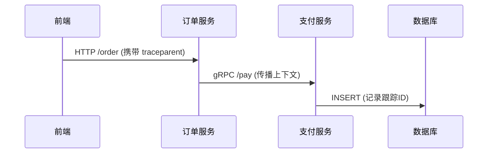

# OpenTelemetry W3C Trace Context

## 介绍

在分布式系统中，**跟踪上下文传播（Trace Context Propagation）**是确保跨服务调用时链路完整性的核心技术。W3C Trace Context 是业界标准，定义了如何通过 HTTP 头部或消息队列传递跟踪信息。OpenTelemetry 实现了此标准，使其成为现代可观测性工具链的核心组件。

:::note 关键概念
- **Trace Context**：包含 `trace-id`（全局唯一跟踪标识）和 `span-id`（当前操作标识）的元数据。
- **传播（Propagation）**：将上下文信息从一个服务传递到另一个服务的过程。
:::

## W3C Trace Context 标准

W3C 标准定义了两种 HTTP 头部格式：
1. **Traceparent**：携带基础跟踪信息（必需）
2. **Tracestate**：携带供应商特定的扩展数据（可选）

### Traceparent 格式
```plaintext
traceparent: 00-0af7651916cd43dd8448eb211c80319c-b7ad6b7169203331-01
```
- **版本（00）**：当前固定为 `00`
- **Trace ID（0af765...）**：16字节的全局唯一标识
- **Parent Span ID（b7ad...）**：8字节的当前跨度标识
- **标志（01）**：控制采样等行为（例如 `01` 表示采样）

### 代码示例：注入和提取

以下展示如何在 Node.js 中手动处理上下文传播：

```javascript
// 注入上下文到 HTTP 请求
const { trace } = require('@opentelemetry/api');
const tracer = trace.getTracer('example');

tracer.startActiveSpan('main', (span) => {
  const traceParent = `00-${span.spanContext().traceId}-${span.spanContext().spanId}-01`;
  const headers = { traceparent: traceParent };
  
  // 模拟发送请求
  console.log('Outgoing headers:', headers);
  span.end();
});
```

输出示例：
```plaintext
Outgoing headers: { traceparent: '00-0af7651916cd43dd8448eb211c80319c-b7ad6b7169203331-01' }
```

## 实际案例：电商系统调用链

假设用户下单触发以下流程：
1. 前端 → 订单服务（HTTP）
2. 订单服务 → 支付服务（gRPC）
3. 支付服务 → 数据库（SQL）



:::tip 上下文无损传递
每个服务必须：
1. 接收请求时提取 `traceparent`
2. 创建子跨度时继承上下文
3. 向下游调用时注入新的 `traceparent`
:::

## 总结

- **为什么重要**：没有上下文传播，分布式跟踪会断裂，导致无法关联跨服务调用。
- **OpenTelemetry 的角色**：自动处理 W3C 标准的实现，支持多种传播格式（B3、Jaeger 等）。
- **最佳实践**：始终验证上下游服务是否兼容相同的传播标准。

## 扩展练习

1. 使用 OpenTelemetry SDK 自动注入上下文（对比手动示例）。
2. 在本地启动两个服务，通过 `curl` 验证头部传递。
3. 尝试解析 `tracestate` 中的自定义键值对。

## 附加资源

- [W3C Trace Context 官方文档](https://www.w3.org/TR/trace-context/)
- [OpenTelemetry 传播规范](https://opentelemetry.io/docs/concepts/sdk-configuration/general-sdk-configuration/#propagators)