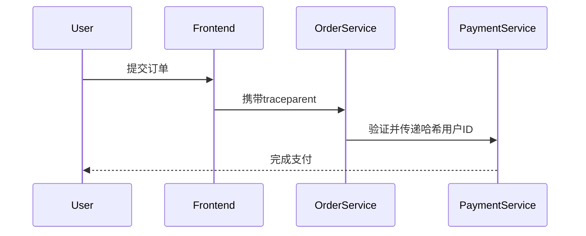

# OpenTelemetry 上下文传播安全

## 介绍

在分布式系统中，**上下文传播（Context Propagation）**是确保请求在不同服务间传递时保持关联性的关键机制。OpenTelemetry通过**Trace Context**（追踪上下文）实现这一功能，但如果不加以安全控制，可能会导致敏感信息泄露或伪造攻击。本文将介绍如何安全地实现OpenTelemetry上下文传播。

:::note 什么是上下文传播？
上下文传播是指将追踪ID（Trace ID）、Span ID等元数据跨服务边界传递的过程，通常通过HTTP头或消息队列属性实现。
:::

---

## 安全风险

在传播上下文时需注意以下风险：
1. **信息泄露**：Trace ID可能暴露系统内部结构。
2. **注入攻击**：恶意用户可能伪造上下文头（如`traceparent`）。
3. **隐私问题**：上下文可能包含敏感数据（如用户ID）。

---

## 安全实践

### 1. 验证上下文头
接收服务应验证传入的`traceparent`头是否符合[W3C Trace Context规范](https://www.w3.org/TR/trace-context/)。例如：

```javascript
// 示例：验证traceparent头
function isValidTraceParent(header) {
  const regex = /^00-[0-9a-f]{32}-[0-9a-f]{16}-[0-9a-f]{2}$/;
  return regex.test(header);
}

// 输入：合法的traceparent
console.log(isValidTraceParent("00-4bf92f3577b34da6a3ce929d0e0e4736-00f067aa0ba902b7-01")); 
// 输出：true

// 输入：伪造的头
console.log(isValidTraceParent("invalid-header")); 
// 输出：false
```

### 2. 限制敏感信息
避免在Span属性或Baggage中存储敏感信息。如需传递用户ID，应使用加密或哈希处理：

```python
from opentelemetry import baggage
import hashlib

# 安全存储用户ID（哈希处理后）
user_id = "user123"
hashed_id = hashlib.sha256(user_id.encode()).hexdigest()
baggage.set_baggage("user.id", hashed_id)
```

### 3. 使用HTTPS
始终通过加密通道（HTTPS/gRPC+TLS）传播上下文，防止中间人攻击。

---

## 实际案例

### 场景：电商订单处理
1. 用户发起订单请求，前端生成`traceparent`头。
2. 订单服务验证头并添加哈希后的用户ID到Baggage。
3. 支付服务验证上下文，拒绝非法请求。



---

## 总结

安全上下文传播的关键点：
- 验证所有传入的追踪头
- 避免在上下文中存储明文敏感数据
- 始终使用加密通信通道

:::warning 注意
生产环境中应结合IAM（身份访问管理）系统进一步控制上下文访问权限。
:::

---

## 扩展资源
1. [W3C Trace Context规范](https://www.w3.org/TR/trace-context/)
2. [OpenTelemetry安全指南](https://opentelemetry.io/docs/concepts/security/)
3. 练习：尝试在本地环境中实现一个验证`traceparent`头的中间件。