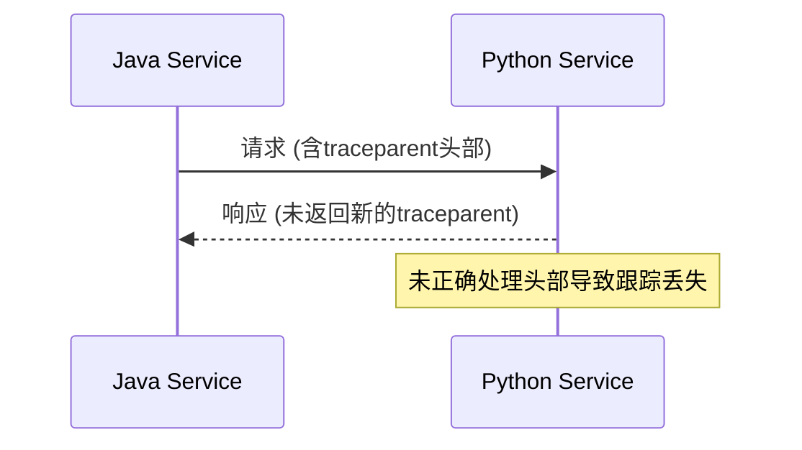

# OpenTelemetry 上下文传播故障排除

## 介绍

OpenTelemetry的**上下文传播（Context Propagation）**是分布式追踪的核心机制，它确保跨服务边界的请求能够关联到同一个跟踪（Trace）。当传播失败时，会导致跟踪链断裂、数据不一致等问题。本文将指导初学者识别和修复上下文传播中的常见故障。

---

## 上下文传播基础

上下文传播通过以下两种主要方式实现：
1. **W3C TraceContext**：标准化的HTTP头部格式（如 `traceparent`）。
2. **B3 Propagation**：Zipkin兼容的头部格式。

:::note
如果服务A调用服务B时未正确传递上下文，服务B的日志和追踪数据将无法关联到服务A的请求。
:::

---

## 常见问题与解决方案

### 1. 跟踪链断裂
**症状**：跨服务调用后，新生成的Span与父Span无关联。

**原因**：
- 未正确注入或提取上下文头部。
- 网络中间件（如负载均衡器）丢弃了追踪头部。

**修复示例（Node.js）**：
```javascript
const { propagation } = require('@opentelemetry/api');

// 正确注入HTTP头部
const carrier = {};
propagation.inject(context.active(), carrier, setter);
// carrier现在包含 `traceparent` 头部

// 在接收端提取上下文
const ctx = propagation.extract(context.active(), carrier, getter);
```

---

### 2. 上下文不一致
**症状**：同一请求在不同服务中显示不同的Trace ID。

**原因**：
- 手动创建了新的Context而未继承父Context。
- 异步操作中未绑定上下文。

**修复示例（Python）**：
```python
from opentelemetry import trace

# 错误：手动创建新Context
bad_span = tracer.start_span("bad_span")

# 正确：继承当前Context
good_span = tracer.start_span("good_span", context=trace.get_current_span().get_context())
```

---

### 3. 跨语言传播失败
**症状**：混合技术栈（如Java调用Python）时跟踪中断。

**解决方案**：
- 确保所有服务使用相同的传播格式（如W3C）。
- 验证头部是否被编码/解码正确处理。



---

## 实际案例：电商订单流程

**场景**：
- 用户下单 → 订单服务（Go） → 支付服务（Java） → 库存服务（Python）

**故障现象**：
支付服务生成的Span与订单服务无关联。

**根本原因**：
Go服务使用B3格式，而Java服务默认配置为W3C格式。

**修复步骤**：
1. 统一所有服务的传播格式为W3C。
2. 在Java服务中显式配置：
```java
OpenTelemetrySdk.builder()
    .setPropagators(
        ContextPropagators.create(
            W3CTraceContextPropagator.getInstance()
        )
    ).build();
```

---

## 总结

| 问题类型         | 检查点                          | 工具辅助                     |
|------------------|---------------------------------|-----------------------------|
| 跟踪链断裂       | 头部是否跨服务传递              | Wireshark抓包分析           |
| 上下文不一致     | 异步操作是否绑定上下文          | 日志中对比Trace ID          |
| 跨语言传播       | 传播格式是否一致                | OpenTelemetry Collector日志 |

---

## 延伸练习
1. 使用`curl`手动发送含`traceparent`头部的请求，观察服务端日志。
2. 在本地模拟两个服务，故意错误配置传播格式，验证跟踪中断现象。

:::tip
调试时启用OpenTelemetry的调试日志：
```bash
export OTEL_LOG_LEVEL=debug
```
:::