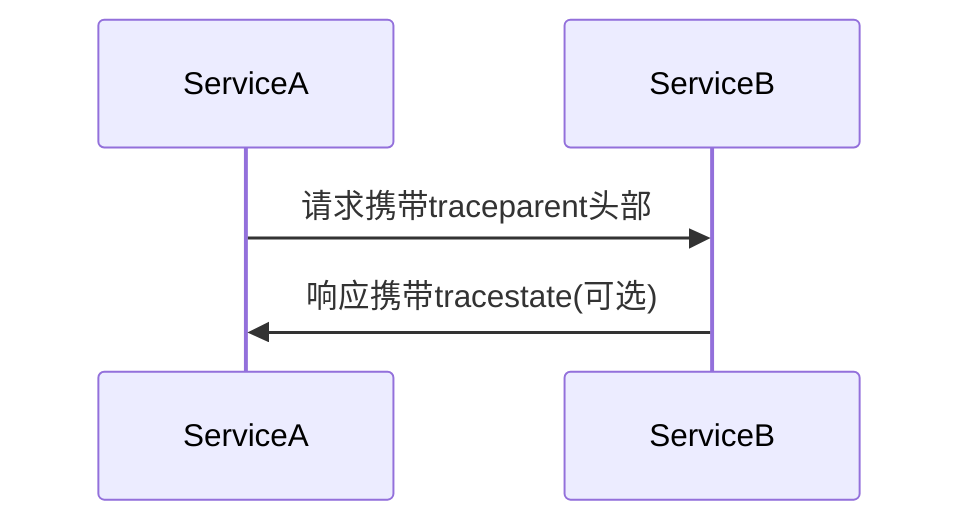

# OpenTelemetry 上下文传播调试

## 介绍

OpenTelemetry上下文传播（Context Propagation）是分布式追踪的核心机制，它允许在服务间传递追踪上下文（如TraceID、SpanID和Baggage）。当出现跨服务调用时，如果上下文未能正确传播，会导致追踪数据断裂，形成"孤立的Span"。本文将介绍调试上下文传播问题的通用方法。

:::note 关键概念
- **上下文（Context）**：包含当前Span的TraceID、SpanID和自定义元数据（Baggage）。
- **传播器（Propagator）**：负责将上下文编码/解码为可传输格式（如HTTP头部）。
:::

## 传播机制的工作原理

OpenTelemetry支持三种标准传播格式：
1. **W3C TraceContext**（默认）
2. **B3**（Zipkin兼容）
3. **Jaeger**



## 常见调试步骤

### 1. 验证传播器配置

确保所有服务使用相同的传播器：

```javascript
// 正确配置示例（Node.js）
const { NodeTracerProvider } = require('@opentelemetry/sdk-trace-node');
const { CompositePropagator, W3CTraceContextPropagator } = require('@opentelemetry/core');

const provider = new NodeTracerProvider();
provider.register({
  propagator: new CompositePropagator({
    propagators: [new W3CTraceContextPropagator()]
  })
});
```

### 2. 检查传输的头部信息

对于HTTP服务，检查请求是否包含正确的头部：

| 传播格式       | 请求头                  | 示例值                              |
|----------------|-------------------------|-----------------------------------|
| W3C TraceContext | `traceparent`          | `00-4bf92f3577b34da6a3ce929d0e0e4736-00f067aa0ba902b7-01` |
| B3             | `x-b3-traceid`         | `4bf92f3577b34da6a3ce929d0e0e4736` |

### 3. 使用诊断日志

启用OpenTelemetry的调试日志：

```javascript
const { diag, DiagConsoleLogger, DiagLogLevel } = require('@opentelemetry/api');
diag.setLogger(new DiagConsoleLogger(), DiagLogLevel.DEBUG);
```

典型输出示例：
```
DEBUG @opentelemetry/api: Extracted trace context: {
  traceId: "4bf92f3577b34da6a3ce929d0e0e4736",
  spanId: "00f067aa0ba902b7",
  traceFlags: 1
}
```

## 实际调试案例

### 案例：丢失的跨服务Span

**现象**：服务A调用服务B后，Jaeger中只显示服务A的Span。

**排查步骤**：
1. 在服务A的出口请求中检查`traceparent`头部是否存在
2. 确认服务B的入口中间件是否正确调用`propagation.extract()`
3. 检查服务B是否返回4xx/5xx错误（可能导致上下文丢失）

**解决方案**：修复服务B的中间件顺序：

```javascript
// Express中间件正确顺序示例
app.use(express.json()); // 1. 先解析body
app.use((req, res, next) => {
  const context = propagation.extract(context.active(), req.headers);
  // 将上下文设置为当前上下文
  context.with(context, () => next());
}); // 2. 然后处理OpenTelemetry上下文
```

## 高级调试工具

### 1. 上下文手动注入/提取测试

```javascript
// 测试传播器是否正常工作
const context = propagation.extract(
  context.active(),
  {
    'traceparent': '00-4bf92f3577b34da6a3ce929d0e0e4736-00f067aa0ba902b7-01'
  }
);
console.log(context); // 应显示提取的TraceID和SpanID
```

### 2. Baggage传播验证

```javascript
// 设置和验证Baggage
const baggage = propagation.createBaggage({
  'user.id': { value: '12345' }
});
const ctxWithBaggage = baggage.setBaggage(context.active(), baggage);

// 在另一个服务中提取
const extractedBaggage = propagation.getBaggage(ctxWithBaggage);
console.log(extractedBaggage.getEntry('user.id')); // 应输出{ value: '12345' }
```

## 总结

调试OpenTelemetry上下文传播时，关键点在于：
1. 确保所有服务使用相同的传播格式
2. 验证传输头部是否正确携带
3. 检查中间件处理顺序
4. 善用诊断日志

:::tip 练习建议
1. 故意配置错误的传播器，观察追踪数据如何断裂
2. 尝试在不同编程语言服务间传递上下文（如Java服务调用Python服务）
3. 测试Baggage在复杂调用链中的传播
:::

## 附加资源

- [W3C TraceContext标准](https://www.w3.org/TR/trace-context/)
- [OpenTelemetry传播器文档](https://opentelemetry.io/docs/concepts/sdk-configuration/general-sdk-configuration/#propagators)
- [分布式追踪调试指南](https://lightstep.com/blog/distributed-tracing-debugging-guide)