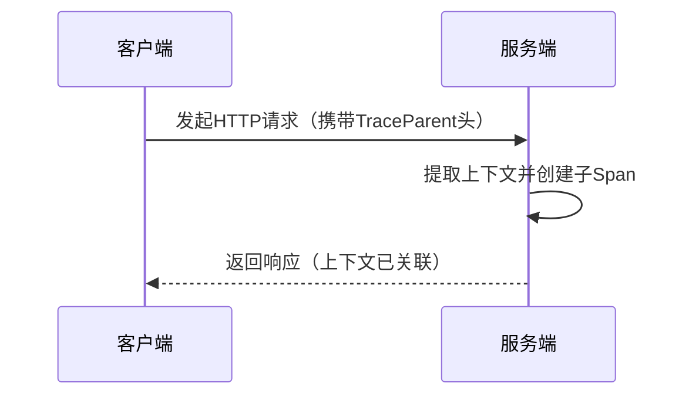

# OpenTelemetry 上下文传播最佳实践

## 介绍

在分布式系统中，**上下文传播（Context Propagation）**是确保跨服务边界的追踪、日志和指标能够关联的关键机制。OpenTelemetry通过标准化的方式实现了上下文传播，使得不同服务间的调用链路能够被完整记录和分析。本文将介绍上下文传播的核心概念、最佳实践以及实际应用场景。

---

## 什么是上下文传播？

上下文传播是指在分布式系统中，将**追踪上下文（Trace Context）**（如Trace ID、Span ID等）从一个服务传递到另一个服务的过程。这确保了所有相关的操作可以被关联到一个统一的追踪视图中。

:::note 关键组件
- **Trace ID**：唯一标识一个分布式追踪。
- **Span ID**：标识单个操作（Span）。
- **Baggage**：可选的键值对，用于传递附加信息（如用户ID）。
:::

---

## 上下文传播的工作原理

OpenTelemetry支持多种上下文传播格式（如W3C TraceContext、B3等），默认使用**W3C TraceContext**。以下是传播过程的简化流程：



---

## 最佳实践

### 1. 使用标准化的传播器

确保所有服务使用相同的传播格式（如W3C TraceContext）。在OpenTelemetry中配置：

```javascript
const { propagation } = require('@opentelemetry/api');
const { W3CTraceContextPropagator } = require('@opentelemetry/core');

// 设置全局传播器
propagation.setGlobalPropagator(new W3CTraceContextPropagator());
```

### 2. 正确处理上下文注入和提取

在HTTP请求中手动注入和提取上下文：

```javascript
// 客户端：注入上下文到HTTP头
const { trace, context } = require('@opentelemetry/api');
const request = {
  headers: {
    // 将当前上下文注入到headers
    ...propagation.inject(context.active()),
  },
};

// 服务端：从HTTP头提取上下文
const incomingContext = propagation.extract(context.active(), request.headers);
```

### 3. 谨慎使用Baggage

Baggage适合传递少量、必要的跨服务数据（如用户ID），但需避免滥用：

```javascript
const baggage = propagation.getBaggage(context.active());
if (baggage) {
  const userId = baggage.getEntry('user.id');
}
```

:::caution 注意
Baggage会增加网络开销，需确保数据是必要的且经过压缩。
:::

---

## 实际案例：电商订单系统

假设一个电商系统的下单流程涉及以下服务：
1. **前端服务**：发起下单请求。
2. **订单服务**：处理订单逻辑。
3. **支付服务**：完成支付。

通过OpenTelemetry上下文传播，可以实现：
- 追踪订单从发起、处理到支付的完整链路。
- 在日志中关联所有服务的操作（如通过Trace ID）。


---

## 总结

- **标准化**：统一使用W3C TraceContext等标准传播格式。
- **完整性**：确保上下文在服务间无损传递。
- **性能**：合理使用Baggage，避免过度传播数据。

---

## 附加资源

1. [OpenTelemetry官方文档](https://opentelemetry.io/docs/)
2. 练习：尝试在本地搭建两个服务，使用OpenTelemetry实现上下文传播并查看追踪结果。
``` 

注意：实际使用时需移除代码块外的 