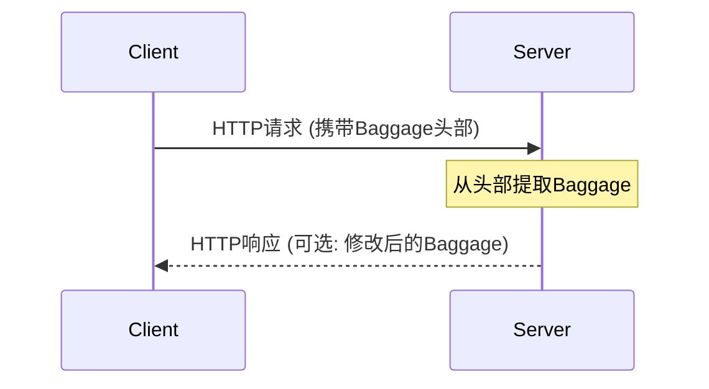

# OpenTelemetry Baggage

## 介绍

OpenTelemetry Baggage（行李）是一种在分布式系统的不同服务间传递**键值对元数据**的机制。与Trace（追踪）不同，Baggage不直接关联到具体的Span，而是用于携带业务或环境相关的上下文信息（如用户ID、实验分组等），这些信息可以在整个调用链中共享。

:::tip 类比理解
想象你乘坐飞机时托运的行李：无论你转机多少次，行李都会跟随你到达最终目的地。Baggage也是如此，它会随着请求在服务间流动。
:::

## 核心概念

### 1. Baggage的结构
Baggage由一组键值对组成，其中：
- 键（Key）：字符串类型，需遵循[W3C Baggage规范](https://www.w3.org/TR/baggage/)
- 值（Value）：URL编码的字符串
- 元数据（可选）：如属性`tenant-id;metadata-key=value`

### 2. 与Context的关系
Baggage存储在OpenTelemetry的`Context`对象中，通过Context API进行访问：

```javascript
const { context, propagation } = require('@opentelemetry/api');
```

## 基本用法

### 设置Baggage
```javascript
const { baggageEntryMetadata } = require('@opentelemetry/api');

// 创建带元数据的Baggage条目
const metadata = new baggageEntryMetadata('value=important');
const baggage = propagation.createBaggage({
  'user.id': { value: '12345', metadata },
  'feature.flag': { value: 'experimental' }
});

// 将Baggage注入Context
const ctx = propagation.setBaggage(context.active(), baggage);
```

### 读取Baggage
```javascript
// 从Context中获取Baggage
const currentBaggage = propagation.getBaggage(ctx);

if (currentBaggage) {
  // 获取特定值
  const userId = currentBaggage.getEntry('user.id')?.value;
  console.log(`User ID: ${userId}`); // 输出: User ID: 12345
}
```

## 传播机制

Baggage通过`propagation.inject`和`propagation.extract`实现跨进程传播：



### 传播示例（HTTP场景）
```javascript
// 客户端 - 注入到HTTP头
const headers = {};
propagation.inject(context.active(), headers, {
  set: (carrier, key, value) => {
    carrier[key] = value;
  }
});
// headers现在包含 'baggage': 'user.id=12345,feature.flag=experimental'

// 服务端 - 从头中提取
const incomingCtx = propagation.extract(context.active(), headers, {
  get: (carrier, key) => carrier[key]
});
```

## 实际应用场景

### 案例1：多租户系统
```javascript
// 网关服务设置租户信息
const tenantBaggage = propagation.createBaggage({
  'tenant.id': { value: 'acme-corp' }
});

// 下游服务使用租户信息
function processOrder(ctx) {
  const baggage = propagation.getBaggage(ctx);
  const tenantId = baggage.getEntry('tenant.id')?.value;
  console.log(`Processing order for tenant: ${tenantId}`);
}
```

### 案例2：功能开关
```javascript
// 前端设置用户分组
const featureBaggage = propagation.createBaggage({
  'user.group': { value: 'beta-testers' }
});

// 后端决定是否启用新功能
if (baggage.getEntry('user.group')?.value === 'beta-testers') {
  enableNewFeature();
}
```

:::caution 注意事项
1. **性能影响**：Baggage会随每个请求传输，避免存储过大值
2. **安全性**：不要存储敏感信息（使用加密或专用头）
3. **标准化键名**：建议使用反向DNS命名（如`com.company.key`）
:::

## 总结

OpenTelemetry Baggage提供了强大的上下文传播能力：
- ✅ 跨服务传递业务相关数据
- ✅ 不影响Trace结构的独立性
- ✅ 与现有传播机制（如HTTP头）无缝集成

## 扩展练习

1. 尝试创建一个Express中间件，自动为所有请求添加`service.version`到Baggage
2. 模拟A/B测试场景，使用Baggage传递`experiment.group`值
3. 测量添加不同大小Baggage对请求延迟的影响

## 附加资源

- [W3C Baggage规范](https://www.w3.org/TR/baggage/)
- [OpenTelemetry JavaScript Baggage文档](https://opentelemetry.io/docs/instrumentation/js/api/baggage/)
- [分布式上下文传播模式](https://microservices.io/patterns/observability/distributed-tracing.html)