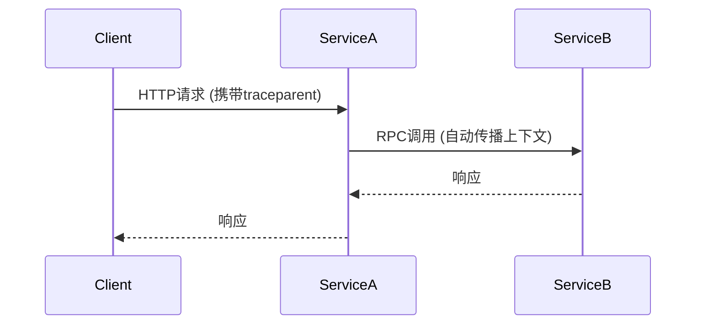

# OpenTelemetry 传播器实现

## 介绍

在分布式系统中，**上下文传播**是确保跨服务边界的追踪信息连续性的关键机制。OpenTelemetry通过**传播器(Propagator)**实现这一功能，它负责在进程间注入(inject)和提取(extract)上下文信息（如TraceID、SpanID和Baggage）。

## 传播器基础

OpenTelemetry提供两种标准传播器：
1. **TraceContext Propagator** - W3C推荐标准
2. **Baggage Propagator** - 用于传播用户自定义属性

传播器需要实现两个核心方法：
```typescript
interface TextMapPropagator {
  inject(context: Context, carrier: unknown, setter: TextMapSetter): void;
  extract(context: Context, carrier: unknown, getter: TextMapGetter): Context;
}
```

## 标准传播器示例

### W3C TraceContext传播

```typescript
import { propagation } from '@opentelemetry/api';

// 注入上下文到HTTP头
const headers = {};
propagation.inject(context.active(), headers, {
  set(carrier, key, value) {
    carrier[key] = value;
  }
});

// 输出示例
console.log(headers);
// {
//   'traceparent': '00-0af7651916cd43dd8448eb211c80319c-b7ad6b7169203331-01',
//   'tracestate': 'rojo=00f067aa0ba902b7'
// }
```

### Baggage传播

```typescript
import { baggageEntryMetadata } from '@opentelemetry/api';

const baggage = propagation.createBaggage({
  'user.id': { value: '123', metadata: baggageEntryMetadata.create('user=1') }
});

const ctxWithBaggage = propagation.setBaggage(context.active(), baggage);
```

## 自定义传播器实现

下面演示如何实现一个简单的HTTP头传播器：

```typescript
class CustomPropagator implements TextMapPropagator {
  fields(): string[] {
    return ['x-custom-trace-id', 'x-custom-span-id'];
  }

  inject(context: Context, carrier: unknown, setter: TextMapSetter): void {
    const spanContext = trace.getSpanContext(context);
    if (!spanContext) return;

    setter.set(carrier, 'x-custom-trace-id', spanContext.traceId);
    setter.set(carrier, 'x-custom-span-id', spanContext.spanId);
  }

  extract(context: Context, carrier: unknown, getter: TextMapGetter): Context {
    const traceId = getter.get(carrier, 'x-custom-trace-id');
    const spanId = getter.get(carrier, 'x-custom-span-id');

    if (!traceId || !spanId) return context;

    const spanContext: SpanContext = {
      traceId,
      spanId,
      traceFlags: TraceFlags.SAMPLED,
      isRemote: true
    };

    return trace.setSpanContext(context, spanContext);
  }
}
```

## 实际应用场景

### 微服务间的传播



### 消息队列中的传播

```typescript
// 生产者
const producer = (message: Message) => {
  const headers = {};
  propagation.inject(context.active(), headers);
  message.headers = headers;
  queue.send(message);
};

// 消费者
queue.consume((message) => {
  const ctx = propagation.extract(context.active(), message.headers);
  // 使用提取的上下文创建span
});
```

## 总结

关键要点：
- 传播器是OpenTelemetry上下文传播的核心组件
- 标准传播器遵循W3C TraceContext规范
- 可以创建自定义传播器适配特殊协议
- 上下文传播使分布式追踪成为可能

## 扩展学习

1. 尝试实现一个基于AMQP协议的传播器
2. 研究OpenTelemetry SDK中`CompositePropagator`的实现
3. 在gRPC服务中测试上下文传播

:::tip 练习建议
创建一个简单的Express应用，实现：
1. 从HTTP头中提取上下文
2. 在处理过程中添加自定义Baggage
3. 向下游服务调用时注入上下文
:::