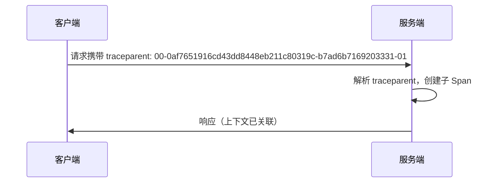

## 介绍

在分布式系统中，一个请求可能跨越多个服务或进程。为了追踪完整的请求链路，OpenTelemetry 提供了**跨进程上下文传播**机制，确保 TraceID、SpanID 等上下文信息能够在服务间正确传递。本文将介绍其核心概念、实现方式及实际应用。

:::note 关键术语
- **上下文（Context）**：包含 TraceID、SpanID、Baggage（自定义键值对）等信息的载体。
- **传播器（Propagator）**：负责序列化/反序列化上下文信息的工具。
:::

---

## 上下文传播的工作原理

OpenTelemetry 通过以下两种标准传播格式实现跨进程通信：

1. **W3C Trace Context**：基于 HTTP 头的标准化格式（如 `traceparent` 和 `tracestate`）。
2. **B3 Propagation**：Zipkin 使用的格式（如 `X-B3-TraceId`）。

### 传播流程示例


---

## 代码示例

### 1. 设置全局传播器（Node.js）
```javascript
const { propagation, trace } = require('@opentelemetry/api');
const { W3CTraceContextPropagator } = require('@opentelemetry/core');

// 使用 W3C 标准传播器
propagation.setGlobalPropagator(new W3CTraceContextPropagator());
```

### 2. 客户端注入上下文（HTTP 请求）
```javascript
const axios = require('axios');
const { context, trace } = require('@opentelemetry/api');

const tracer = trace.getTracer('example');
const span = tracer.startSpan('client_span');

// 将上下文注入到 HTTP 头
const headers = {};
propagation.inject(context.active(), headers, {
  set: (carrier, key, value) => carrier[key] = value,
});

// 发送请求
axios.get('http://service-b', { headers }).then(() => span.end());
```

### 3. 服务端提取上下文（HTTP 服务）
```javascript
const http = require('http');
const { context, propagation } = require('@opentelemetry/api');

http.createServer((req, res) => {
  // 从请求头提取上下文
  const extractedContext = propagation.extract(
    context.active(),
    req.headers,
    { get: (carrier, key) => carrier[key] }
  );

  // 创建子 Span
  const span = tracer.startSpan('server_span', {}, extractedContext);
  // ...处理逻辑
  span.end();
  res.end();
}).listen(8080);
```

---

## 实际应用场景

### 微服务调用链追踪
假设用户请求从 **前端服务** → **订单服务** → **支付服务**：
1. 前端服务生成初始 TraceID 并注入 HTTP 头。
2. 订单服务接收请求后，提取上下文并创建子 Span。
3. 支付服务同理，最终所有 Span 关联到同一个 Trace。

:::tip 调试技巧
使用 `tracestate` 传递自定义信息（如用户ID），但避免敏感数据！
:::

---

## 总结

OpenTelemetry 的跨进程上下文传播是分布式追踪的核心功能，通过标准化的头信息（如 `traceparent`）确保链路完整性。关键步骤包括：
1. 配置全局传播器（如 W3C 或 B3）。
2. 在客户端**注入**上下文到请求头。
3. 在服务端**提取**上下文并创建关联 Span。

---

## 扩展练习
1. 尝试在 Python 或 Java 中实现上下文传播。
2. 使用 Jaeger 或 Zipkin 查看跨进程的完整 Trace。

:::caution 常见问题
- **问题**：服务间时钟不同步导致时间戳混乱。<br />
  **解决**：确保所有服务器使用 NTP 同步时间。
:::