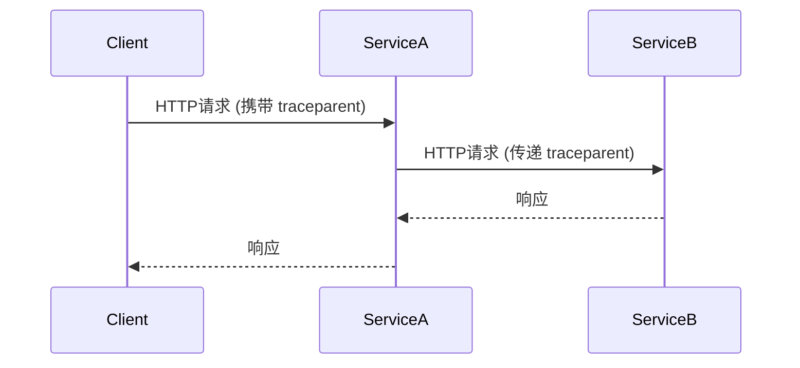

# OpenTelemetry 分布式系统上下文传播

## 介绍

在分布式系统中，一个用户请求可能需要经过多个服务的处理。例如，电商系统中的下单操作可能涉及订单服务、库存服务和支付服务。**上下文传播（Context Propagation）** 是确保这些跨服务调用能够关联到同一个逻辑请求（如一次用户下单）的关键机制。OpenTelemetry 通过标准化协议（如 W3C TraceContext）实现了跨语言、跨框架的上下文传递。

:::note 核心概念
- **上下文（Context）**：包含当前请求的追踪信息（如TraceID、SpanID）和自定义键值对。
- **传播（Propagation）**：将上下文通过HTTP头、消息队列等媒介在服务间传递。
:::

## 上下文传播的工作原理

### 1. 传播格式
OpenTelemetry 支持以下标准传播格式：
- **W3C TraceContext**（默认）：通过 `traceparent` 和 `tracestate` HTTP头传递。
- **B3**：Zipkin使用的格式。
- **Jaeger**：通过 `uber-trace-id` 头传递。



### 2. 代码示例（Node.js）

以下示例展示如何在两个服务间手动传播上下文：

**服务A（发送请求）**：
```javascript
const { trace, context, propagation } = require('@opentelemetry/api');
const axios = require('axios');

async function callServiceB() {
  // 获取当前上下文
  const activeContext = trace.setSpan(context.active(), tracer.startSpan('serviceA-operation'));
  
  // 注入上下文到HTTP头
  const headers = {};
  propagation.inject(activeContext, headers, {
    set: (carrier, key, value) => carrier[key] = value,
  });

  // 发送请求
  const response = await axios.get('http://service-b/api', { headers });
  console.log(response.data);
}
```

**服务B（接收请求）**：
```javascript
const { context, propagation } = require('@opentelemetry/api');

app.get('/api', (req, res) => {
  // 从HTTP头提取上下文
  const extractedContext = propagation.extract(context.active(), req.headers, {
    get: (carrier, key) => carrier[key],
  });
  
  // 使用提取的上下文创建Span
  const span = tracer.startSpan('serviceB-operation', {}, extractedContext);
  // ...处理逻辑
  span.end();
  res.send('Done');
});
```

### 3. 自动传播
大多数OpenTelemetry SDK（如Java、Go、Python）会自动处理HTTP/gRPC的上下文传播。例如，配置Java SDK后，无需手动操作头信息：

```java
// 自动注入traceparent头的HTTP客户端
HttpClient client = HttpClient.create()
  .doOnRequest((req, conn) -> 
    OpenTelemetry.getGlobalPropagators().inject(
      Context.current(), 
      req, 
      (r, k, v) -> r.header(k, v)));
```

## 实际应用场景

### 案例：电商订单流程
1. **用户下单** → 订单服务（生成TraceID）
2. **订单服务** → 调用库存服务（传递TraceID）
3. **库存服务** → 调用支付服务（传递同一TraceID）

在追踪系统（如Jaeger）中，这三个服务的Span会关联到同一个Trace：

```mermaid
gantt
    title 订单处理流程追踪
    dateFormat  X
    axisFormat %s
    section 订单服务
    订单验证 :a1, 0, 3
    调用库存服务 :a2, after a1, 5
    section 库存服务
    库存检查 :b1, after a2, 4
    调用支付服务 :b2, after b1, 2
    section 支付服务
    支付处理 :c1, after b2, 6
```



## 总结

- 上下文传播是分布式追踪的基础，确保所有相关服务共享相同的TraceID。
- OpenTelemetry通过标准化协议（如W3C TraceContext）实现跨语言兼容。
- 大多数SDK支持自动传播，减少手动代码。

## 扩展练习
1. 使用OpenTelemetry搭建两个Python服务，验证gRPC调用的上下文传播。
2. 在Jaeger中观察同一个Trace下的多服务Span。

## 附加资源
- [W3C TraceContext标准](https://www.w3.org/TR/trace-context/)
- [OpenTelemetry传播文档](https://opentelemetry.io/docs/concepts/signals/traces/#context-propagation)