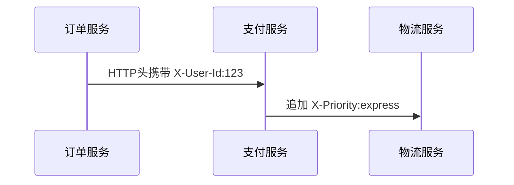

# OpenTelemetry 自定义上下文传播

## 介绍

在分布式系统中，**上下文传播**是跟踪请求在不同服务间流转的关键机制。OpenTelemetry 默认支持 W3C TraceContext 和 B3 等标准协议，但有时你需要传递自定义业务数据（如用户ID、租户信息等）。本文将教你如何实现自定义上下文传播。

:::note 什么是上下文？
上下文（Context）是贯穿请求生命周期的键值对集合，例如：
- TraceID/SpanID（用于链路追踪）
- 业务字段（如 `user_id: "abc123"`）
:::

---

## 基础概念

### 1. 上下文传播的组成
OpenTelemetry 的传播机制包含两个核心接口：
- `TextMapPropagator`：负责序列化/反序列化上下文
- `Context`：存储当前线程/请求的上下文数据

### 2. 默认传播方式
标准传播器通常处理以下头部：
```plaintext
traceparent: 00-0af7651916cd43dd8448eb211c80319c-b7ad6b7169203331-01
```

---

## 实现自定义传播

### 步骤1：创建自定义字段
假设我们需要传播 `X-User-Id` 和 `X-Tenant-Id`：

```java
public class CustomPropagator implements TextMapPropagator {
    private static final String USER_ID_HEADER = "X-User-Id";
    private static final String TENANT_ID_HEADER = "X-Tenant-Id";
    
    // 其他实现代码...
}
```

### 步骤2：实现注入与提取
```java
@Override
public <C> void inject(Context context, C carrier, TextMapSetter<C> setter) {
    String userId = context.get(USER_ID_KEY);
    String tenantId = context.get(TENANT_ID_KEY);
    
    if (userId != null) {
        setter.set(carrier, USER_ID_HEADER, userId);
    }
    // 类似处理tenantId...
}

@Override
public <C> Context extract(Context context, C carrier, TextMapGetter<C> getter) {
    String userId = getter.get(carrier, USER_ID_HEADER);
    if (userId != null) {
        context = context.with(USER_ID_KEY, userId);
    }
    // 返回增强后的Context
    return context;
}
```

---

## 实际案例：电商系统

### 场景需求
在订单服务→支付服务→物流服务间传递：
1. 用户ID（用于审计）
2. 优先配送标记（用于物流调度）

### 传播流程


### 代码调用
```python
# 设置自定义上下文
context = context.with_value("user_id", "123")
context = context.with_value("priority", "express")

# 通过HTTP客户端传播
headers = {}
propagator.inject(context, headers)
requests.post(url, headers=headers)
```

---

## 总结与进阶

### 关键点回顾
1. 自定义传播需实现 `TextMapPropagator` 接口
2. 通过 `inject()` 和 `extract()` 实现双向转换
3. 上下文数据应尽量精简（避免性能损耗）

### 练习建议
1. 尝试在本地微服务项目中添加环境标记（如 `env=staging`）的传播
2. 比较自定义传播与Jaeger/B3传播的性能差异

### 扩展阅读
- [OpenTelemetry官方文档：上下文管理](https://opentelemetry.io/docs/concepts/context/)
- [分布式追踪中的上下文设计模式](https://distributed-tracing.net/patterns/)