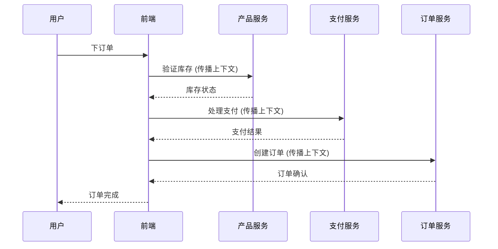

# OpenTelemetry 上下文关联

## 介绍

在分布式系统中，一个请求可能会经过多个服务。为了能够完整地跟踪这个请求的路径和行为，我们需要一种机制来在不同服务间传递跟踪上下文。这就是OpenTelemetry上下文关联（Context Propagation）的核心功能。

上下文关联允许我们将跟踪信息（如Trace ID、Span ID等）从一个服务传递到另一个服务，从而在分布式系统中维护请求的完整视图。这对于调试性能问题、理解系统行为至关重要。

## 基本概念

OpenTelemetry上下文包含两种主要信息：

1. **Span上下文**：包含Trace ID、Span ID、Trace Flags等
2. **Baggage**：用户自定义的键值对，可以跨服务传递


## 上下文传播机制

OpenTelemetry支持多种上下文传播格式，最常见的是：

1. W3C Trace Context (推荐)
2. B3 (Zipkin使用)
3. Jaeger

### W3C Trace Context示例

W3C标准通过HTTP头部 `traceparent` 和 `tracestate` 传播上下文：

```
traceparent: 00-0af7651916cd43dd8448eb211c80319c-b7ad6b7169203331-01
tracestate: congo=t61rcWkgMzE
```

## 代码示例

下面是一个Node.js示例，展示如何手动传播上下文：

```javascript
const { context, propagation } = require('@opentelemetry/api');

// 服务A - 创建并注入上下文
function serviceA() {
  const span = tracer.startSpan('serviceA-operation');
  const ctx = trace.setSpan(context.active(), span);
  
  // 准备HTTP请求头
  const carrier = {};
  propagation.inject(ctx, carrier);
  
  console.log('传播的头部:', carrier);
  // 输出: { traceparent: '00-0af765...-01' }
  
  serviceB(carrier);
  span.end();
}

// 服务B - 提取上下文
function serviceB(carrier) {
  const ctx = propagation.extract(context.active(), carrier);
  const span = tracer.startSpan('serviceB-operation', undefined, ctx);
  
  // 使用提取的上下文工作
  console.log('在服务B中处理请求');
  span.end();
}
```

:::note
在实际应用中，你通常会使用OpenTelemetry的自动检测库，它会自动处理上下文的传播，无需手动操作。
:::

## 实际应用场景

假设你有一个电子商务系统，包含以下服务：

1. 前端Web应用
2. 产品目录服务
3. 支付服务
4. 订单服务

当用户下订单时，请求会依次经过这些服务。通过上下文传播，你可以：

- 查看整个请求的完整路径
- 识别哪个服务导致了延迟
- 追踪特定用户的请求流
- 在不同服务间传递业务上下文（如用户ID、租户信息等）



## 最佳实践

1. **始终传播上下文**：即使你不打算在当前服务中收集遥测数据，也应该传播上下文，因为下游服务可能需要它。

2. **谨慎使用Baggage**：Baggage会跨服务传播，过多数据会影响性能。

3. **标准化传播格式**：在组织中统一使用W3C Trace Context格式。

4. **测试上下文传播**：确保在服务边界正确传播上下文。

:::caution
避免在Baggage中存储敏感信息，因为它可能被日志记录或传输到不受信任的环境。
:::

## 总结

OpenTelemetry的上下文关联是分布式追踪的核心机制，它允许我们在服务间传递跟踪信息，从而构建完整的请求视图。通过理解和使用上下文传播，你可以：

- 获得系统行为的端到端可见性
- 更轻松地调试跨服务问题
- 传递业务上下文而不需要修改API

## 延伸学习

1. 尝试在实际项目中实现上下文传播
2. 使用Jaeger或Zipkin等工具可视化传播的跟踪
3. 探索Baggage的使用场景
4. 阅读W3C Trace Context规范

记住，良好的可观测性始于正确的上下文传播！