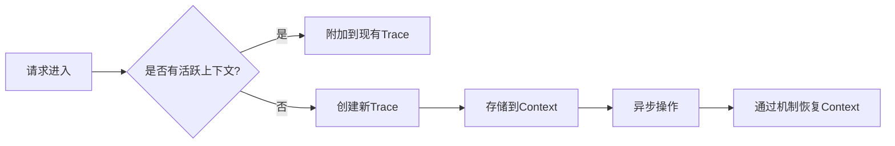

# OpenTelemetry 上下文存储

## 介绍

在分布式系统中，**上下文传播**是确保请求在不同服务间流转时保持关联的关键机制。OpenTelemetry的**上下文存储**（Context Storage）是这一机制的基础设施，它负责在进程内存储和传递追踪上下文（如TraceID、SpanID和Baggage）。本文将深入解析其工作原理与实现方式。

## 什么是上下文存储？

上下文存储是OpenTelemetry的核心组件之一，它提供了以下能力：
1. **存储当前上下文**：保存当前活跃的Span或Baggage信息
2. **跨异步边界传播**：在异步操作（如Promise、回调）中保持上下文一致性
3. **线程/任务局部存储**：在不同执行单元中隔离上下文

:::note 类比理解
想象上下文存储像一个"透明信封"——当你在处理请求时，所有相关数据自动装入信封，随请求一起流动，而代码无需显式传递它。
:::

## 核心API与用法

OpenTelemetry通过`Context` API管理上下文存储。以下是基础操作示例：

```javascript
const { context, trace } = require('@opentelemetry/api');

// 1. 获取当前上下文
const currentContext = context.active();

// 2. 创建新上下文（携带Span）
const span = trace.getTracer('example').startSpan('parent');
const newContext = trace.setSpan(currentContext, span);

// 3. 激活上下文
context.with(newContext, () => {
  // 在此回调中，newContext是活跃上下文
  const activeSpan = trace.getSpan(context.active());
  console.log(activeSpan.spanContext().traceId); // 输出TraceID
});
```

## 实际案例：异步操作中的上下文保持

以下示例展示如何在Node.js异步操作中正确维护上下文：

```javascript
const { context, trace } = require('@opentelemetry/api');

async function processOrder(userId) {
  // 获取当前上下文中的Span
  const activeSpan = trace.getSpan(context.active());
  activeSpan.setAttribute('user.id', userId);

  // 上下文会自动通过AsyncHooks传播
  const inventory = await checkInventory();
  await chargePayment();
  
  activeSpan.addEvent('order_processed');
}

// 启动根Span
const span = trace.getTracer('order').startSpan('process_order');
context.with(trace.setSpan(context.active(), span), async () => {
  await processOrder('user-123');
  span.end();
});
```

:::warning 常见陷阱
在手动创建线程或使用工作池时，需要显式传播上下文：
```javascript
// ❌ 错误：上下文会丢失
new Thread(() => { /* 无法获取父上下文 */ }).start();

// ✅ 正确：显式传递
const ctxToPass = context.active();
new Thread(() => {
  context.with(ctxToPass, () => { /* 可访问父上下文 */ });
}).start();
```
:::

## 底层机制解析

OpenTelemetry使用不同语言的底层特性实现上下文存储：

| 语言       | 实现机制                  |
|------------|--------------------------|
| JavaScript | AsyncLocalStorage/AsyncHooks |
| Java       | ThreadLocal + AutoCloseable |
| Python     | ContextVars               |
| Go         | context.Context           |



## 总结与练习

**关键点总结**：
- 上下文存储是分布式追踪的"粘合剂"
- 使用`context.active()`获取当前上下文
- 始终通过`context.with()`管理上下文边界
- 异步操作中需注意上下文传播

**练习建议**：
1. 尝试在Express中间件中手动传递上下文
2. 创建一个会丢失上下文的代码示例，然后修复它
3. 比较`AsyncLocalStorage`和普通全局变量的区别

**延伸阅读**：
- [OpenTelemetry Context Specification](https://github.com/open-telemetry/opentelemetry-specification/blob/main/specification/context/context.md)
- [Node.js AsyncHooks文档](https://nodejs.org/api/async_hooks.html)