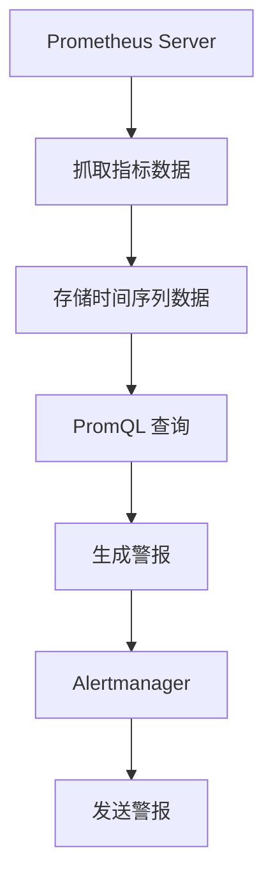

# Prometheus 简介

Prometheus 是一个开源的系统监控和警报工具包，最初由 SoundCloud 开发，并于2012年开源。它现在是云原生计算基金会（CNCF）的毕业项目之一，广泛应用于监控容器化环境、微服务架构以及其他分布式系统。

## 什么是Prometheus？

Prometheus 是一个基于时间序列数据的监控系统，专门设计用于高动态的云原生环境。它通过定期从目标系统中抓取指标数据，并将其存储在本地时间序列数据库中。Prometheus 提供了强大的查询语言（PromQL），允许用户对收集到的数据进行复杂的查询和分析。

### 核心概念

1. **时间序列数据**：Prometheus 存储的数据是以时间戳为索引的键值对。每个时间序列都有一个唯一的标识符（称为指标名称）和一组标签（用于区分不同的维度）。
2. **指标（Metrics）**：指标是 Prometheus 监控的基本单位。每个指标都有一个名称和一组标签，用于描述该指标的特定实例。
3. **抓取（Scraping）**：Prometheus 通过 HTTP 协议定期从目标系统中抓取指标数据。这些目标系统通常通过暴露一个 `/metrics` 端点来提供数据。
4. **PromQL**：Prometheus 查询语言（PromQL）允许用户对时间序列数据进行查询和聚合。它是 Prometheus 的核心功能之一。

## Prometheus 架构

Prometheus 的架构设计简单而高效，主要由以下几个组件组成：

1. **Prometheus Server**：负责抓取和存储时间序列数据。
2. **Client Libraries**：用于在应用程序中嵌入 Prometheus 客户端，以便暴露指标数据。
3. **Pushgateway**：用于处理短期任务或批处理作业的指标数据。
4. **Alertmanager**：负责处理由 Prometheus 生成的警报，并将其发送到适当的接收者（如电子邮件、Slack 等）。



## 实际应用场景

### 监控 Kubernetes 集群

Prometheus 是 Kubernetes 生态系统中广泛使用的监控工具。它可以轻松集成到 Kubernetes 集群中，监控节点、Pod、服务等资源的状态和性能。

```yaml
apiVersion: monitoring.coreos.com/v1
kind: ServiceMonitor
metadata:
  name: example-service-monitor
  namespace: monitoring
spec:
  selector:
    matchLabels:
      app: example-app
  endpoints:
  - port: web
    interval: 30s
```

### 监控微服务架构

在微服务架构中，Prometheus 可以用于监控每个服务的健康状况、请求延迟、错误率等关键指标。通过使用 Prometheus 的客户端库，开发者可以轻松地在服务中暴露自定义指标。

```go
package main

import (
    "net/http"
    "github.com/prometheus/client_golang/prometheus"
    "github.com/prometheus/client_golang/prometheus/promhttp"
)

var (
    requestsTotal = prometheus.NewCounterVec(
        prometheus.CounterOpts{
            Name: "http_requests_total",
            Help: "Total number of HTTP requests.",
        },
        []string{"method", "status"},
    )
)

func init() {
    prometheus.MustRegister(requestsTotal)
}

func main() {
    http.Handle("/metrics", promhttp.Handler())
    http.ListenAndServe(":8080", nil)
}
```

## 总结

Prometheus 是一个功能强大且灵活的监控工具，特别适合用于云原生环境和分布式系统。通过其强大的查询语言和灵活的架构，Prometheus 能够帮助开发者和运维人员实时监控系统的健康状况，并在出现问题时及时发出警报。

### 附加资源

- [Prometheus 官方文档](https://prometheus.io/docs/introduction/overview/)
- [Prometheus 客户端库](https://prometheus.io/docs/instrumenting/clientlibs/)
- [Prometheus 最佳实践](https://prometheus.io/docs/practices/instrumentation/)

### 练习

1. 在你的本地环境中安装 Prometheus，并配置它抓取一个简单的 HTTP 服务的指标。
2. 使用 PromQL 查询 Prometheus 中存储的指标数据，并尝试进行一些基本的聚合操作。
3. 在 Kubernetes 集群中部署 Prometheus，并监控集群中的 Pod 和节点状态。

:::tip
如果你在安装或配置 Prometheus 时遇到问题，可以参考官方文档或社区论坛，那里有丰富的资源和经验分享。
:::