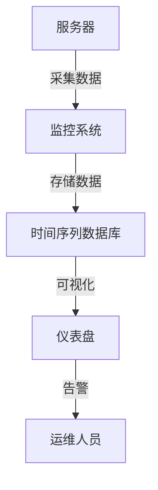
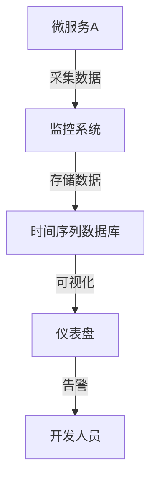

# 监控系统概述

在现代软件开发和运维中，监控系统扮演着至关重要的角色。它帮助我们实时了解系统的运行状态、性能指标以及潜在问题，从而确保系统的稳定性和可靠性。本文将带你了解监控系统的基本概念、核心组件以及实际应用场景。

## 什么是监控系统？

监控系统是一种用于收集、存储、分析和可视化系统运行数据的工具或平台。它能够帮助我们实时监控应用程序、服务器、网络设备等的状态，并在出现异常时及时发出警报。通过监控系统，我们可以更好地理解系统的行为，优化性能，并快速响应潜在问题。

## 监控系统的核心组件

一个典型的监控系统通常由以下几个核心组件组成：

1. **数据采集（Data Collection）**：监控系统需要从各种来源（如服务器、应用程序、数据库等）收集数据。这些数据可以是 CPU 使用率、内存使用情况、网络流量等。

2. **数据存储（Data Storage）**：采集到的数据需要被存储起来，以便后续的分析和查询。常见的存储方式包括时间序列数据库（如 Prometheus 的 TSDB）和分布式存储系统。

3. **数据可视化（Data Visualization）**：通过图表、仪表盘等方式将数据可视化，帮助用户更直观地理解系统的运行状态。

4. **告警系统（Alerting System）**：当系统出现异常或达到某些预定义的阈值时，监控系统会触发告警，通知相关人员进行处理。

5. **数据分析（Data Analysis）**：通过对历史数据的分析，监控系统可以帮助我们识别趋势、预测问题并优化系统性能。

## 监控系统的工作原理

监控系统的工作原理可以简单概括为以下几个步骤：

1. **数据采集**：监控系统通过代理（Agent）或直接访问 API 的方式从目标系统收集数据。
2. **数据传输**：采集到的数据通过网络传输到监控系统的存储组件。
3. **数据存储**：数据被存储在时间序列数据库或其他存储系统中。
4. **数据可视化**：用户可以通过仪表盘查看实时和历史数据。
5. **告警触发**：当数据超出预设的阈值时，监控系统会触发告警。

## 实际应用场景

### 场景 1：服务器监控

假设你管理着一组服务器，你需要实时监控每台服务器的 CPU、内存、磁盘和网络使用情况。通过监控系统，你可以：

- 查看每台服务器的实时性能指标。
- 设置告警规则，当 CPU 使用率超过 80% 时触发告警。
- 通过历史数据分析服务器的负载趋势，优化资源分配。

### 场景 2：应用程序性能监控（APM）

在微服务架构中，应用程序的性能监控尤为重要。通过监控系统，你可以：

- 跟踪每个服务的响应时间、错误率等关键指标。
- 识别性能瓶颈，优化服务调用链。
- 在服务出现异常时及时告警，减少故障影响范围。

## 总结

监控系统是现代软件开发和运维中不可或缺的工具。它帮助我们实时了解系统的运行状态，优化性能，并在出现问题时及时响应。通过本文，你已经了解了监控系统的基本概念、核心组件以及实际应用场景。

## 附加资源与练习

- **练习 1**：尝试在本地搭建一个简单的监控系统，使用 Prometheus 和 Grafana 监控你的开发环境。
- **练习 2**：为你的应用程序设置一个简单的告警规则，当某个关键指标超出阈值时触发告警。

:::tip
如果你对 Prometheus 感兴趣，可以继续学习我们的下一个章节，深入了解 Prometheus 的安装与配置。
:::