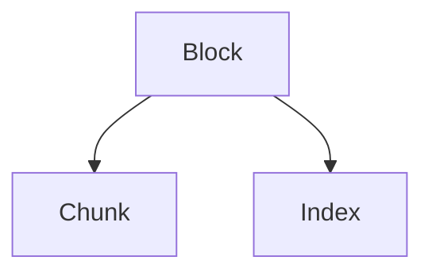
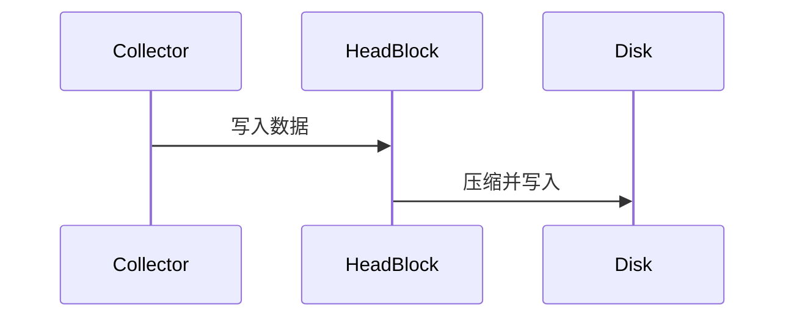
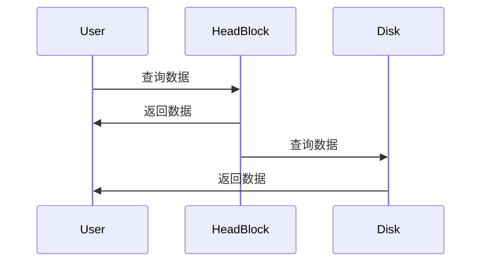

# Prometheus 存储机制

Prometheus 是一个开源的监控和告警工具，广泛用于收集和存储时间序列数据。为了高效地处理这些数据，Prometheus 采用了一种独特的存储机制。本文将详细介绍 Prometheus 的存储机制，帮助初学者理解其工作原理。

## 1. 概述

Prometheus 的存储机制主要分为两部分：**本地存储**和**远程存储**。本地存储是 Prometheus 默认的存储方式，它将数据存储在本地磁盘上。远程存储则允许将数据发送到外部存储系统，如 Thanos、Cortex 等，以实现长期存储和高可用性。

### 1.1 本地存储

Prometheus 的本地存储采用了一种称为 **TSDB（Time Series Database）** 的数据库。TSDB 是专门为时间序列数据设计的数据库，具有高效的写入和查询性能。

### 1.2 远程存储

远程存储允许 Prometheus 将数据发送到外部系统，以实现数据的长期存储和高可用性。常见的远程存储系统包括 Thanos、Cortex 等。

## 2. 本地存储机制

### 2.1 数据存储结构

Prometheus 的本地存储结构由多个部分组成：

- **Block**：每个 Block 包含一段时间内的数据，通常为 2 小时。Block 是不可变的，一旦创建就不能修改。
- **Chunk**：每个 Block 由多个 Chunk 组成，Chunk 是实际存储时间序列数据的最小单位。
- **Index**：索引文件用于快速查找特定时间序列数据。



### 2.2 数据写入流程

当 Prometheus 收集到新的时间序列数据时，数据首先被写入内存中的 **Head Block**。Head Block 是当前正在写入的 Block，它包含最近的数据。当 Head Block 达到一定大小或时间限制时，它会被压缩并写入磁盘，形成一个新的 Block。



### 2.3 数据查询流程

当用户查询时间序列数据时，Prometheus 会首先检查内存中的 Head Block，然后依次检查磁盘上的 Block，直到找到所需的数据。



## 3. 远程存储机制

### 3.1 远程写入

Prometheus 支持将数据远程写入到外部存储系统。通过配置 `remote_write`，Prometheus 可以将数据发送到远程存储系统，如 Thanos、Cortex 等。

```yaml
remote_write:
  - url: "http://thanos:10908/api/v1/receive"
```

### 3.2 远程读取

Prometheus 也支持从远程存储系统读取数据。通过配置 `remote_read`，Prometheus 可以从远程存储系统查询数据。

```yaml
remote_read:
  - url: "http://thanos:10908/api/v1/query"
```

## 4. 实际案例

### 4.1 本地存储优化

假设你有一个高流量的应用，Prometheus 每秒收集大量的时间序列数据。为了优化本地存储性能，你可以调整以下参数：

- `--storage.tsdb.retention.time`：设置数据保留时间，例如 `30d` 表示保留 30 天的数据。
- `--storage.tsdb.min-block-duration` 和 `--storage.tsdb.max-block-duration`：调整 Block 的大小和时间范围，以平衡写入和查询性能。

### 4.2 远程存储集成

假设你需要长期存储 Prometheus 数据，并且希望实现高可用性。你可以将 Prometheus 与 Thanos 集成，配置 `remote_write` 将数据发送到 Thanos，并通过 Thanos Query 实现跨多个 Prometheus 实例的查询。

```yaml
remote_write:
  - url: "http://thanos:10908/api/v1/receive"
```

## 5. 总结

Prometheus 的存储机制是其高效处理时间序列数据的关键。通过本地存储和远程存储的结合，Prometheus 能够满足不同场景下的存储需求。理解 Prometheus 的存储机制，有助于你更好地配置和优化 Prometheus，以满足你的监控需求。

## 6. 附加资源

- [Prometheus 官方文档](https://prometheus.io/docs/)
- [Thanos 官方文档](https://thanos.io/)
- [Cortex 官方文档](https://cortexmetrics.io/)

## 7. 练习

1. 配置 Prometheus 的 `remote_write`，将数据发送到 Thanos。
2. 调整 Prometheus 的本地存储参数，观察其对性能的影响。
3. 使用 Thanos Query 查询跨多个 Prometheus 实例的数据。

:::tip
在调整 Prometheus 配置时，建议先在测试环境中进行，以避免影响生产环境。
:::