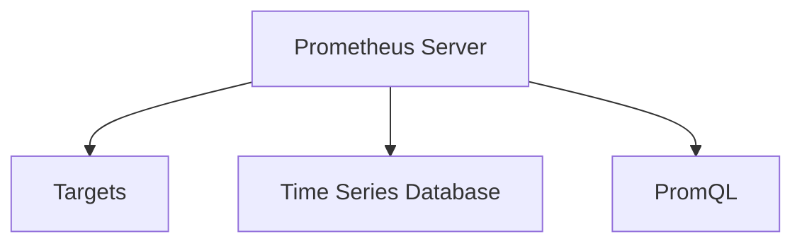
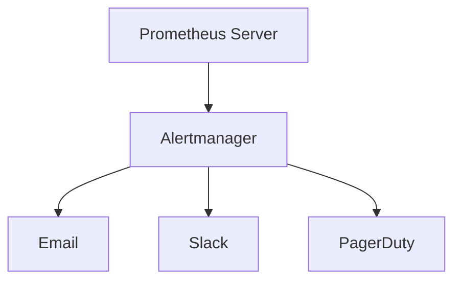

## 介绍

Prometheus 是一个开源的系统监控和警报工具包，最初由 SoundCloud 开发，现已成为云原生计算基金会（CNCF）的毕业项目。它的设计目标是提供高效、可靠的监控解决方案，特别适用于动态的微服务架构。Prometheus 的核心架构由多个组件组成，这些组件协同工作，帮助用户收集、存储和查询监控数据。

本文将详细介绍 Prometheus 的架构，帮助你理解其工作原理，并通过实际案例展示其应用场景。

## Prometheus 核心架构

Prometheus 的架构主要由以下几个核心组件组成：

1. **Prometheus Server**：负责数据采集和存储。
2. **Client Libraries**：用于在应用程序中嵌入监控代码。
3. **Exporters**：用于从第三方系统收集数据。
4. **Alertmanager**：负责处理警报。
5. **Pushgateway**：用于支持短生命周期任务的监控。

### 1. Prometheus Server

Prometheus Server 是 Prometheus 的核心组件，负责从目标系统中拉取（pull）监控数据，并将其存储在本地时间序列数据库中。它还提供了一个强大的查询语言（PromQL），用于查询和分析监控数据。



### 2. Client Libraries

Client Libraries 是用于在应用程序中嵌入监控代码的库。它们允许你定义和暴露自定义的监控指标（metrics），这些指标随后可以被 Prometheus Server 拉取。

例如，以下是一个使用 Python 客户端库的简单示例：

```python
from prometheus_client import start_http_server, Counter

# 定义一个计数器
REQUEST_COUNT = Counter('http_requests_total', 'Total HTTP Requests')

# 模拟一个HTTP请求
def handle_request():
    REQUEST_COUNT.inc()

if __name__ == '__main__':
    # 启动HTTP服务器以暴露指标
    start_http_server(8000)
    while True:
        handle_request()
```

在这个示例中，`REQUEST_COUNT` 是一个计数器，每次调用 `handle_request` 函数时，计数器都会增加。Prometheus Server 可以从 `http://localhost:8000/metrics` 拉取这些指标。

### 3. Exporters

Exporters 是用于从第三方系统收集数据的工具。它们将第三方系统的监控数据转换为 Prometheus 可以理解的格式。常见的 Exporters 包括 Node Exporter（用于监控主机系统）和 Blackbox Exporter（用于监控网络服务）。

例如，Node Exporter 会暴露诸如 CPU 使用率、内存使用率等系统指标，Prometheus Server 可以定期拉取这些指标。

### 4. Alertmanager

Alertmanager 是 Prometheus 的警报管理组件。它负责处理由 Prometheus Server 生成的警报，并根据配置的规则进行分组、去重和路由。



### 5. Pushgateway

Pushgateway 用于支持短生命周期任务的监控。由于 Prometheus 是基于拉取模型的，短生命周期任务可能无法在 Prometheus Server 拉取数据之前完成。Pushgateway 允许这些任务将数据推送到网关，Prometheus Server 随后可以从网关拉取数据。

## 实际案例

假设你有一个微服务架构的应用，其中包含多个服务实例。你希望监控每个服务的请求量、响应时间和错误率。以下是你可以采取的步骤：

1. **在每个服务中嵌入 Client Libraries**：使用 Prometheus 的客户端库暴露自定义指标。
2. **部署 Node Exporter**：在每个主机上部署 Node Exporter 以监控系统资源。
3. **配置 Prometheus Server**：设置 Prometheus Server 定期从服务和 Node Exporter 拉取数据。
4. **设置 Alertmanager**：配置警报规则，当请求量或错误率超过阈值时触发警报。
5. **使用 Pushgateway**：如果你的应用中有短生命周期任务，可以使用 Pushgateway 来监控这些任务。

## 总结

Prometheus 的架构设计使其成为一个强大而灵活的监控工具。通过理解其核心组件（如 Prometheus Server、Client Libraries、Exporters、Alertmanager 和 Pushgateway），你可以有效地监控你的应用和基础设施。

## 附加资源

- [Prometheus 官方文档](https://prometheus.io/docs/introduction/overview/)
- [Prometheus Client Libraries](https://prometheus.io/docs/instrumenting/clientlibs/)
- [Node Exporter GitHub 仓库](https://github.com/prometheus/node_exporter)

## 练习

1. 在你的本地环境中部署 Prometheus Server 和 Node Exporter，并尝试监控你的系统资源。
2. 使用 Prometheus 的客户端库在一个简单的 Python 应用中暴露自定义指标，并配置 Prometheus Server 拉取这些指标。
3. 配置 Alertmanager，当某个指标超过阈值时发送警报到你的邮箱或 Slack。

通过完成这些练习，你将更深入地理解 Prometheus 的架构和工作原理。