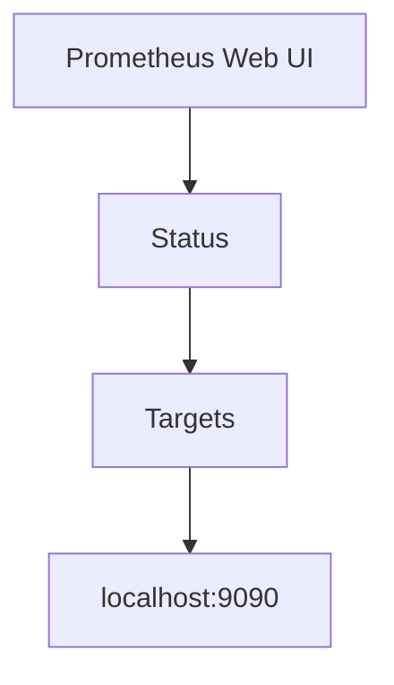

# Prometheus 安装

Prometheus 是一个开源的系统监控和警报工具包，广泛用于监控应用程序和基础设施的性能。它通过抓取目标系统的指标数据并将其存储在时间序列数据库中，提供了强大的查询语言和可视化功能。本文将逐步指导你如何在本地环境中安装和配置 Prometheus。

## 1. 安装前的准备

在开始安装之前，请确保你的系统满足以下要求：

- 操作系统：Linux、macOS 或 Windows（推荐 Linux）
- 内存：至少 2GB RAM
- 磁盘空间：至少 1GB 可用空间
- 网络：能够访问互联网以下载 Prometheus 和相关工具

:::tip
如果你使用的是 Windows 系统，建议使用 WSL（Windows Subsystem for Linux）来运行 Prometheus，以获得更好的兼容性和性能。
:::

## 2. 下载 Prometheus

首先，访问 [Prometheus 官方下载页面](https://prometheus.io/download/) 下载适合你操作系统的最新版本。本文以 Linux 为例进行说明。

```bash
# 下载 Prometheus
wget https://github.com/prometheus/prometheus/releases/download/v2.30.3/prometheus-2.30.3.linux-amd64.tar.gz

# 解压下载的文件
tar -xzf prometheus-2.30.3.linux-amd64.tar.gz

# 进入解压后的目录
cd prometheus-2.30.3.linux-amd64
```

## 3. 配置 Prometheus

Prometheus 的配置文件是 `prometheus.yml`，它定义了 Prometheus 如何抓取指标数据。解压后的目录中已经包含了一个默认的配置文件，你可以根据需要对其进行修改。

```yaml
# 默认的 prometheus.yml 配置文件
global:
  scrape_interval: 15s  # 抓取间隔时间

scrape_configs:
  - job_name: 'prometheus'
    static_configs:
      - targets: ['localhost:9090']  # Prometheus 自身的监控目标
```

:::note
`scrape_interval` 定义了 Prometheus 抓取目标系统指标数据的频率。你可以根据实际需求调整这个值。
:::

## 4. 启动 Prometheus

配置完成后，你可以通过以下命令启动 Prometheus：

```bash
# 启动 Prometheus
./prometheus --config.file=prometheus.yml
```

启动后，Prometheus 默认会在 `localhost:9090` 上运行。你可以通过浏览器访问该地址，查看 Prometheus 的 Web UI。

## 5. 验证安装

在浏览器中访问 `http://localhost:9090`，你应该能够看到 Prometheus 的 Web UI。在 "Status" -> "Targets" 页面中，你可以看到 Prometheus 正在监控的目标。



如果状态显示为 "UP"，则表示 Prometheus 已成功安装并正在运行。

## 6. 实际应用场景

假设你有一个运行在 `localhost:8080` 的应用程序，并且你已经为该应用程序配置了 Prometheus 的指标端点。你可以通过修改 `prometheus.yml` 文件来监控该应用程序：

```yaml
scrape_configs:
  - job_name: 'my_application'
    static_configs:
      - targets: ['localhost:8080']
```

重新启动 Prometheus 后，你可以在 Web UI 中看到新的监控目标，并开始收集该应用程序的指标数据。

## 7. 总结

通过本文，你已经学会了如何在本地环境中安装和配置 Prometheus。我们介绍了下载、配置、启动和验证 Prometheus 的步骤，并展示了一个实际应用场景。Prometheus 是一个功能强大的监控工具，掌握它的基本安装和配置是进一步学习和使用的基础。

## 8. 附加资源与练习

- **官方文档**: [Prometheus 官方文档](https://prometheus.io/docs/) 提供了详细的安装和配置指南。
- **练习**: 尝试在你的本地环境中监控多个应用程序，并观察 Prometheus 如何收集和展示这些应用程序的指标数据。

:::caution
在修改配置文件后，请确保重新启动 Prometheus 以使更改生效。
:::