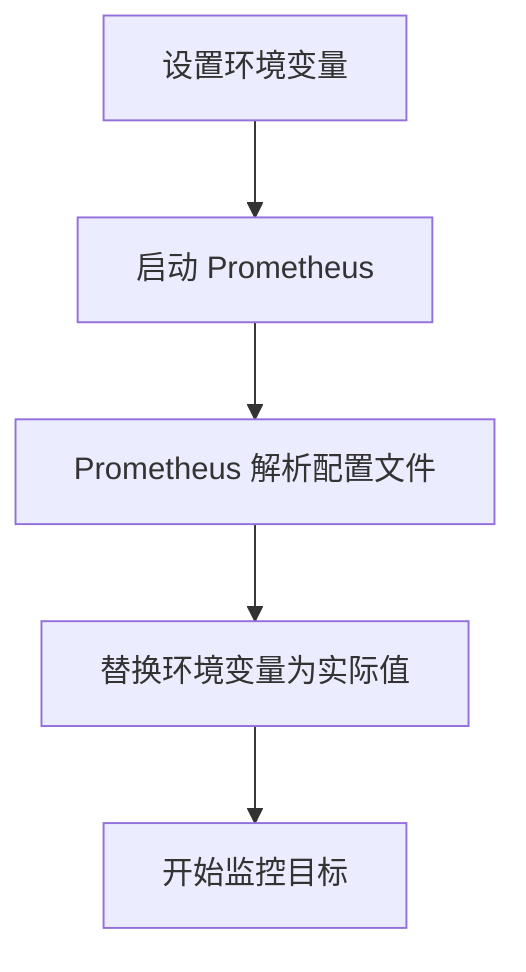

# 环境变量使用

在 Prometheus 的高级配置中，环境变量是一种强大的工具，可以帮助你动态地管理配置值。通过使用环境变量，你可以避免在配置文件中硬编码敏感信息（如密码、API 密钥等），同时也能更灵活地适应不同的运行环境（如开发、测试和生产环境）。

## 什么是环境变量？

环境变量是操作系统或运行时环境中存储的键值对。它们通常用于存储配置信息、路径、凭据等。在 Prometheus 中，环境变量可以在配置文件中引用，从而实现动态配置。

## 如何在 Prometheus 中使用环境变量？

Prometheus 支持在配置文件中使用环境变量。你可以在配置文件中通过 `${VAR_NAME}` 的语法来引用环境变量。Prometheus 会在启动时解析这些变量，并将其替换为实际的值。

### 基本语法

假设你有一个环境变量 `DATABASE_URL`，你可以在 Prometheus 的配置文件中这样引用它：

```yaml
scrape_configs:
  - job_name: 'example'
    static_configs:
      - targets: ['${DATABASE_URL}']
```

在启动 Prometheus 之前，你需要确保 `DATABASE_URL` 环境变量已经设置。例如，在 Linux 或 macOS 中，你可以通过以下命令设置环境变量：

```bash
export DATABASE_URL="localhost:9090"
```

然后启动 Prometheus，它将会自动将 `${DATABASE_URL}` 替换为 `localhost:9090`。

### 实际案例

假设你正在配置一个 Prometheus 实例来监控多个服务，而这些服务的地址可能会根据环境（开发、测试、生产）而变化。你可以使用环境变量来动态设置这些地址。

#### 开发环境

在开发环境中，你可能会这样设置环境变量：

```bash
export SERVICE_1="dev-service-1:8080"
export SERVICE_2="dev-service-2:8080"
```

然后在 Prometheus 配置文件中引用这些变量：

```yaml
scrape_configs:
  - job_name: 'service-1'
    static_configs:
      - targets: ['${SERVICE_1}']
  - job_name: 'service-2'
    static_configs:
      - targets: ['${SERVICE_2}']
```

#### 生产环境

在生产环境中，你只需要更改环境变量的值，而不需要修改配置文件：

```bash
export SERVICE_1="prod-service-1:8080"
export SERVICE_2="prod-service-2:8080"
```

这样，Prometheus 配置文件保持不变，但监控的目标会根据环境变量的变化而自动调整。

### 使用 Mermaid 图表展示环境变量的使用流程



## 注意事项

:::caution
1. **环境变量的命名**：环境变量的命名应遵循操作系统的命名规则，通常使用大写字母和下划线。
2. **环境变量的作用域**：环境变量的作用域仅限于当前终端会话。如果你希望环境变量在系统重启后仍然有效，需要将其添加到系统的环境变量配置中。
3. **默认值**：如果环境变量未设置，Prometheus 会将其替换为空字符串。为了避免这种情况，你可以在配置文件中设置默认值，例如 `${VAR_NAME:-default_value}`。
:::

## 总结

通过使用环境变量，你可以使 Prometheus 的配置更加灵活和安全。环境变量允许你在不修改配置文件的情况下，动态地调整配置值，从而适应不同的运行环境。

## 附加资源

- [Prometheus 官方文档](https://prometheus.io/docs/)
- [环境变量在 Linux 中的使用](https://www.gnu.org/software/bash/manual/bash.html#Environment)

## 练习

1. 在你的本地环境中设置一个环境变量 `PROMETHEUS_TARGET`，并将其值设置为 `localhost:9090`。
2. 修改 Prometheus 配置文件，使用 `${PROMETHEUS_TARGET}` 作为监控目标。
3. 启动 Prometheus，并验证它是否正确地解析了环境变量。

通过完成这些练习，你将更深入地理解环境变量在 Prometheus 配置中的应用。