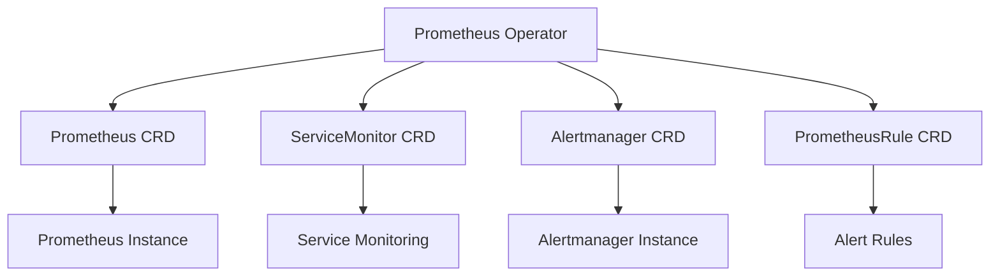

# Prometheus Operator详解

## 介绍

Prometheus Operator 是一个用于在 Kubernetes 集群中管理和部署 Prometheus 及其相关组件的工具。它通过自定义资源定义（CRD）来简化 Prometheus 的配置和管理，使得在 Kubernetes 环境中部署和扩展 Prometheus 变得更加容易。

Prometheus Operator 的核心思想是将 Prometheus 的配置和管理抽象为 Kubernetes 资源，从而利用 Kubernetes 的原生功能（如声明式配置、自动扩展、自我修复等）来管理 Prometheus。

## Prometheus Operator 的工作原理

Prometheus Operator 通过以下几个核心组件来实现其功能：

1. **Prometheus CRD**：定义了 Prometheus 实例的配置，包括存储、副本数、服务发现等。
2. **ServiceMonitor CRD**：用于定义如何监控 Kubernetes 服务。它允许你指定要监控的服务以及如何抓取这些服务的指标。
3. **Alertmanager CRD**：用于配置 Alertmanager 实例，管理告警规则和通知渠道。
4. **PrometheusRule CRD**：用于定义 Prometheus 的告警规则。

### 核心组件关系图



## 安装 Prometheus Operator

要在 Kubernetes 集群中安装 Prometheus Operator，可以使用 Helm Chart。以下是安装步骤：

1. 添加 Helm 仓库：

   ```bash
   helm repo add prometheus-community https://prometheus-community.github.io/helm-charts
   helm repo update
   ```

2. 安装 Prometheus Operator：

   ```bash
   helm install prometheus-operator prometheus-community/kube-prometheus-stack
   ```

安装完成后，Prometheus Operator 会自动创建所需的 CRD 和资源。

## 配置 Prometheus 实例

通过 Prometheus CRD，你可以定义一个 Prometheus 实例。以下是一个简单的 Prometheus 实例配置示例：

```yaml
apiVersion: monitoring.coreos.com/v1
kind: Prometheus
metadata:
  name: my-prometheus
  namespace: monitoring
spec:
  replicas: 2
  serviceAccountName: prometheus
  serviceMonitorSelector:
    matchLabels:
      team: frontend
  resources:
    requests:
      memory: "400Mi"
      cpu: "500m"
    limits:
      memory: "800Mi"
      cpu: "1000m"
```

在这个示例中，我们定义了一个名为 `my-prometheus` 的 Prometheus 实例，它有两个副本，并且只会监控带有 `team: frontend` 标签的 `ServiceMonitor`。

## 配置 ServiceMonitor

`ServiceMonitor` 用于定义如何监控 Kubernetes 服务。以下是一个 `ServiceMonitor` 的配置示例：

```yaml
apiVersion: monitoring.coreos.com/v1
kind: ServiceMonitor
metadata:
  name: frontend-service-monitor
  namespace: monitoring
  labels:
    team: frontend
spec:
  selector:
    matchLabels:
      app: frontend
  namespaceSelector:
    matchNames:
      - default
  endpoints:
    - port: web
      interval: 30s
```

在这个示例中，我们定义了一个 `ServiceMonitor`，它会监控 `default` 命名空间中带有 `app: frontend` 标签的服务，并且每 30 秒抓取一次指标。

## 配置 Alertmanager

`Alertmanager` 用于管理告警规则和通知渠道。以下是一个 `Alertmanager` 的配置示例：

```yaml
apiVersion: monitoring.coreos.com/v1
kind: Alertmanager
metadata:
  name: my-alertmanager
  namespace: monitoring
spec:
  replicas: 3
  resources:
    requests:
      memory: "400Mi"
      cpu: "500m"
    limits:
      memory: "800Mi"
      cpu: "1000m"
```

在这个示例中，我们定义了一个名为 `my-alertmanager` 的 Alertmanager 实例，它有 3 个副本，并且配置了资源请求和限制。

## 配置 PrometheusRule

`PrometheusRule` 用于定义 Prometheus 的告警规则。以下是一个 `PrometheusRule` 的配置示例：

```yaml
apiVersion: monitoring.coreos.com/v1
kind: PrometheusRule
metadata:
  name: example-rules
  namespace: monitoring
spec:
  groups:
    - name: example
      rules:
        - alert: HighRequestLatency
          expr: job:request_latency_seconds:mean5m{job="myjob"} > 0.5
          for: 10m
          labels:
            severity: page
          annotations:
            summary: High request latency
            description: "The request latency for {{ $labels.job }} is above 0.5 seconds."
```

在这个示例中，我们定义了一个名为 `HighRequestLatency` 的告警规则，当请求延迟超过 0.5 秒时触发告警。

## 实际应用场景

### 场景 1：监控微服务架构

在一个微服务架构中，每个服务都可能运行在多个 Pod 中。通过 `ServiceMonitor`，你可以轻松地监控每个服务的指标，而不需要手动配置 Prometheus 的抓取目标。

### 场景 2：自动扩展 Prometheus

在 Kubernetes 中，Prometheus Operator 可以根据负载自动扩展 Prometheus 实例。例如，当监控的数据量增加时，Prometheus Operator 可以自动增加 Prometheus 的副本数，以确保系统的稳定性。

## 总结

Prometheus Operator 是一个强大的工具，它通过 Kubernetes 的 CRD 机制简化了 Prometheus 的配置和管理。通过 Prometheus Operator，你可以轻松地在 Kubernetes 集群中部署、扩展和管理 Prometheus 及其相关组件。

## 附加资源

- [Prometheus Operator 官方文档](https://prometheus-operator.dev/)
- [Kubernetes 官方文档](https://kubernetes.io/docs/home/)
- [Helm 官方文档](https://helm.sh/docs/)

## 练习

1. 在你的 Kubernetes 集群中安装 Prometheus Operator，并配置一个 Prometheus 实例。
2. 创建一个 `ServiceMonitor` 来监控你的应用程序服务。
3. 配置一个 `PrometheusRule` 来定义告警规则，并测试告警是否能够正常触发。

通过以上练习，你将更深入地理解 Prometheus Operator 的工作原理和应用场景。