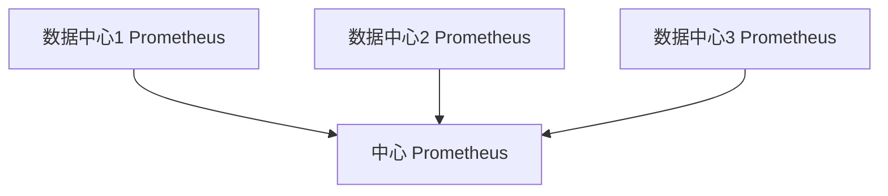

# Prometheus 联邦机制

Prometheus是一个强大的开源监控系统，广泛用于收集和存储时间序列数据。随着监控规模的扩大，单一的Prometheus实例可能无法满足需求。这时，**Prometheus联邦机制**（Federation）就派上了用场。联邦机制允许你将多个Prometheus实例的数据聚合到一个中心实例中，从而实现分布式监控。

## 什么是Prometheus联邦机制？

Prometheus联邦机制是一种将多个Prometheus实例的数据聚合到一个中心Prometheus实例的方法。通过联邦机制，中心Prometheus实例可以从其他Prometheus实例中拉取特定的时间序列数据，从而实现数据的集中管理和分析。

联邦机制的主要用途包括：
- **数据聚合**：将多个Prometheus实例的数据聚合到一个中心实例中。
- **跨区域监控**：在多个区域或数据中心部署Prometheus实例，并通过联邦机制将数据集中到一个中心实例。
- **分层监控**：在大型系统中，使用联邦机制实现分层监控，减少单个Prometheus实例的负载。

## 联邦机制的工作原理

联邦机制的核心思想是**拉取**（Pull）模式。中心Prometheus实例通过HTTP请求从其他Prometheus实例中拉取数据。这些数据可以是预先定义的时间序列，也可以是整个Prometheus实例的所有数据。

### 配置联邦机制

要配置联邦机制，你需要在中心Prometheus实例的配置文件中添加一个`scrape_configs`条目，指定从哪些Prometheus实例中拉取数据。

以下是一个简单的配置示例：

```yaml
scrape_configs:
  - job_name: 'federate'
    scrape_interval: 15s
    honor_labels: true
    metrics_path: '/federate'
    params:
      'match[]':
        - '{job="prometheus"}'
        - '{__name__=~"job:.*"}'
    static_configs:
      - targets:
        - 'source-prometheus-1:9090'
        - 'source-prometheus-2:9090'
```

在这个配置中：
- `job_name`：定义了任务的名称。
- `scrape_interval`：定义了拉取数据的间隔时间。
- `metrics_path`：指定了联邦机制的路径，通常是`/federate`。
- `params`：定义了要拉取的时间序列的匹配规则。
- `static_configs`：指定了目标Prometheus实例的地址。

### 联邦机制的实际应用

假设你有一个分布式系统，部署在多个数据中心。每个数据中心都有一个独立的Prometheus实例，用于监控该区域的资源和服务。为了全局监控，你可以在一个中心数据中心部署一个中心Prometheus实例，并通过联邦机制从其他数据中心的Prometheus实例中拉取数据。



在这个架构中，中心Prometheus实例会定期从各个数据中心的Prometheus实例中拉取数据，并将这些数据存储在本地。这样，你就可以在一个地方查看所有数据中心的监控数据。

## 联邦机制的优缺点

### 优点
- **集中管理**：通过联邦机制，你可以将多个Prometheus实例的数据集中到一个中心实例中，方便管理和分析。
- **跨区域监控**：联邦机制支持跨区域或跨数据中心的监控，适合分布式系统。
- **减少负载**：通过分层监控，联邦机制可以减少单个Prometheus实例的负载。

### 缺点
- **延迟**：由于数据需要从多个实例中拉取，可能会引入一定的延迟。
- **复杂性**：配置和管理多个Prometheus实例可能会增加系统的复杂性。

## 总结

Prometheus联邦机制是一个强大的工具，适用于需要集中管理和分析多个Prometheus实例数据的场景。通过联邦机制，你可以实现跨区域、跨数据中心的监控，并减少单个Prometheus实例的负载。然而，联邦机制也带来了一定的复杂性和延迟，因此在设计监控架构时需要权衡利弊。

## 附加资源与练习

- **官方文档**：阅读[Prometheus官方文档](https://prometheus.io/docs/prometheus/latest/federation/)以了解更多关于联邦机制的详细信息。
- **练习**：尝试在你的本地环境中配置一个简单的联邦机制，将两个Prometheus实例的数据聚合到一个中心实例中。

:::tip
在配置联邦机制时，确保目标Prometheus实例的`/federate`端点是可访问的，并且防火墙规则允许中心Prometheus实例访问这些端点。
:::