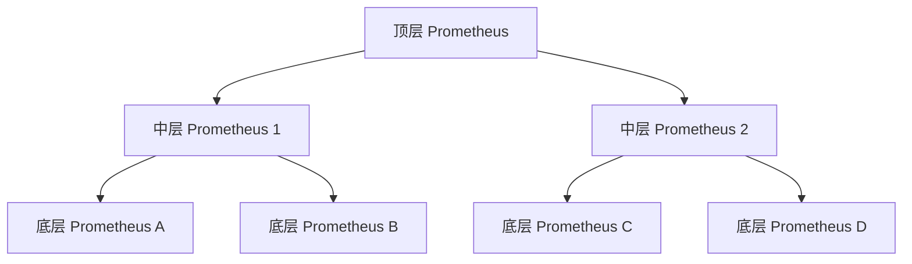

# 分层联邦设计

Prometheus 是一个强大的监控系统，但在大规模分布式环境中，单一 Prometheus 实例可能无法满足需求。为了解决这一问题，Prometheus 提供了联邦（Federation）功能，允许将多个 Prometheus 实例的数据聚合到一个中心实例中。而**分层联邦设计**则进一步扩展了这一功能，通过多层次的联邦结构实现更高效的数据收集和管理。

## 什么是分层联邦设计？

分层联邦设计是一种将多个 Prometheus 实例组织成层次结构的联邦模式。在这种设计中，底层的 Prometheus 实例负责收集特定区域或服务的监控数据，而上层的 Prometheus 实例则从这些底层实例中拉取聚合数据。这种分层结构不仅提高了数据的可管理性，还能有效减少中心实例的负载。

:::note
分层联邦设计的核心思想是**分而治之**：通过将数据收集任务分散到多个实例中，减轻中心实例的压力，同时保持数据的全局可见性。
:::

## 分层联邦的工作原理

在分层联邦设计中，Prometheus 实例被分为多个层级：

1. **底层实例**：负责收集特定区域或服务的详细监控数据。
2. **中层实例**：从多个底层实例中拉取聚合数据，并进一步汇总。
3. **顶层实例**：从中层实例中拉取全局聚合数据，提供全局视图。



### 配置示例

以下是一个简单的分层联邦配置示例。假设我们有一个顶层 Prometheus 实例和两个中层 Prometheus 实例，每个中层实例分别从两个底层实例中拉取数据。

#### 顶层 Prometheus 配置

```yaml
scrape_configs:
  - job_name: 'federation'
    honor_labels: true
    metrics_path: '/federate'
    params:
      'match[]':
        - '{job="prometheus"}'
    static_configs:
      - targets:
        - 'mid-tier-prometheus-1:9090'
        - 'mid-tier-prometheus-2:9090'
```

#### 中层 Prometheus 配置

```yaml
scrape_configs:
  - job_name: 'federation'
    honor_labels: true
    metrics_path: '/federate'
    params:
      'match[]':
        - '{job="node_exporter"}'
    static_configs:
      - targets:
        - 'low-tier-prometheus-A:9090'
        - 'low-tier-prometheus-B:9090'
```

:::tip
在配置联邦时，确保 `honor_labels: true` 选项被启用，以避免标签冲突。
:::

## 分层联邦的实际应用场景

### 场景 1：多区域监控

假设你有一个跨多个地理区域的分布式系统，每个区域都有自己的 Prometheus 实例来监控本地服务。通过分层联邦设计，你可以将每个区域的监控数据汇总到一个全局 Prometheus 实例中，从而获得整个系统的全局视图。

### 场景 2：服务分层监控

在一个微服务架构中，不同的服务可能由不同的团队负责。每个团队可以运行自己的 Prometheus 实例来监控其服务。通过分层联邦设计，运维团队可以从这些实例中拉取关键指标，而不需要直接访问每个服务的详细数据。

## 分层联邦的优势

1. **负载均衡**：通过将数据收集任务分散到多个实例中，减轻了中心实例的负载。
2. **数据隔离**：每个团队或区域可以独立管理自己的监控数据，同时保持全局可见性。
3. **扩展性**：分层设计使得系统更容易扩展，以适应不断增长的监控需求。

## 总结

分层联邦设计是 Prometheus 在大规模分布式环境中实现高效监控的重要工具。通过将监控任务分散到多个层级，它不仅提高了系统的可扩展性，还确保了数据的全局可见性。对于初学者来说，理解分层联邦设计是掌握 Prometheus 高级功能的关键一步。

## 附加资源与练习

- **练习**：尝试在一个本地环境中配置一个简单的分层联邦结构，包含一个顶层实例和两个底层实例。
- **资源**：
  - [Prometheus 官方文档](https://prometheus.io/docs/prometheus/latest/federation/)
  - [Prometheus Federation 实战指南](https://www.robustperception.io/using-federation-to-monitor-prometheus/)

通过实践和深入学习，你将能够更好地掌握分层联邦设计，并将其应用到实际的监控场景中。