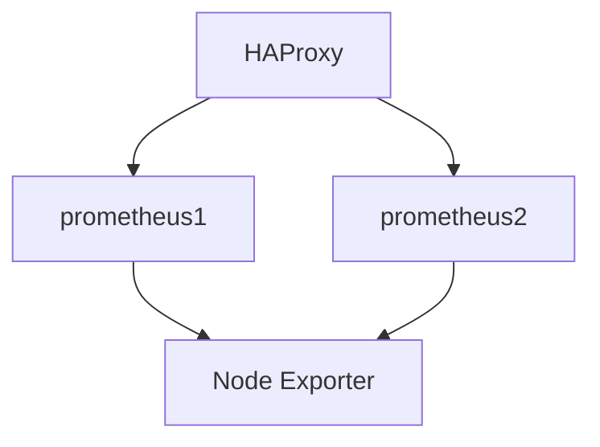

# 故障转移配置

在 Prometheus 联邦与高可用环境中，故障转移（Failover）是一种关键机制，用于确保当某个 Prometheus 实例或组件发生故障时，系统能够自动切换到备用实例，从而避免监控数据丢失或服务中断。本文将详细介绍如何配置故障转移，并通过实际案例帮助初学者理解其应用场景。

## 什么是故障转移？

故障转移是指当主系统或服务发生故障时，自动或手动切换到备用系统的过程。在 Prometheus 中，故障转移通常用于确保高可用性（High Availability, HA），即当某个 Prometheus 实例不可用时，备用实例能够接管其工作，继续收集和存储监控数据。

## 为什么需要故障转移？

在分布式系统中，单点故障（Single Point of Failure, SPOF）是一个常见问题。如果 Prometheus 实例发生故障，可能会导致监控数据丢失或服务中断。通过配置故障转移，可以避免这种情况，确保系统的稳定性和可靠性。

## 配置故障转移的步骤

### 1. 配置 Prometheus 高可用

在 Prometheus 中，高可用通常通过运行多个 Prometheus 实例来实现。这些实例可以同时收集相同的监控数据，并通过联邦（Federation）机制共享数据。

```yaml
global:
  scrape_interval: 15s

scrape_configs:
  - job_name: 'node_exporter'
    static_configs:
      - targets: ['node1:9100', 'node2:9100', 'node3:9100']
```

### 2. 配置 Prometheus 联邦

联邦允许 Prometheus 实例从其他 Prometheus 实例中拉取数据。通过配置联邦，可以实现数据的冗余存储和故障转移。

```yaml
scrape_configs:
  - job_name: 'federate'
    scrape_interval: 15s
    honor_labels: true
    metrics_path: '/federate'
    params:
      'match[]':
        - '{job="node_exporter"}'
    static_configs:
      - targets:
        - 'prometheus1:9090'
        - 'prometheus2:9090'
```

### 3. 配置故障转移

故障转移可以通过多种方式实现，例如使用负载均衡器（如 HAProxy 或 Nginx）或服务发现（如 Consul 或 etcd）。以下是一个使用 HAProxy 的示例配置：

```haproxy
frontend prometheus_frontend
    bind *:9090
    default_backend prometheus_backend

backend prometheus_backend
    balance roundrobin
    server prometheus1 prometheus1:9090 check
    server prometheus2 prometheus2:9090 check backup
```

在这个配置中，`prometheus1` 是主实例，`prometheus2` 是备用实例。当 `prometheus1` 不可用时，HAProxy 会自动将流量切换到 `prometheus2`。

### 4. 测试故障转移

为了确保故障转移配置正常工作，可以手动停止 `prometheus1` 并观察系统行为。如果配置正确，`prometheus2` 应该能够接管工作，继续收集和存储监控数据。

## 实际案例

假设你正在监控一个由多个节点组成的 Kubernetes 集群。你配置了两个 Prometheus 实例 `prometheus1` 和 `prometheus2`，并通过联邦机制共享数据。为了确保高可用性，你使用 HAProxy 配置了故障转移。



在这个案例中，如果 `prometheus1` 发生故障，HAProxy 会自动将流量切换到 `prometheus2`，确保监控数据不会丢失。

## 总结

故障转移是 Prometheus 联邦与高可用环境中不可或缺的一部分。通过配置故障转移，可以确保当某个 Prometheus 实例发生故障时，系统能够自动切换到备用实例，从而避免监控数据丢失或服务中断。本文介绍了如何配置故障转移，并通过实际案例展示了其应用场景。

## 附加资源与练习

- **练习 1**: 尝试在自己的环境中配置 Prometheus 高可用和故障转移，并测试其效果。
- **练习 2**: 探索其他故障转移机制，如使用 Consul 或 etcd 进行服务发现。
- **资源**: 阅读 [Prometheus 官方文档](https://prometheus.io/docs/) 以了解更多关于高可用和联邦的配置选项。

通过本文的学习，你应该能够理解并配置 Prometheus 中的故障转移机制，确保监控系统的高可用性和稳定性。