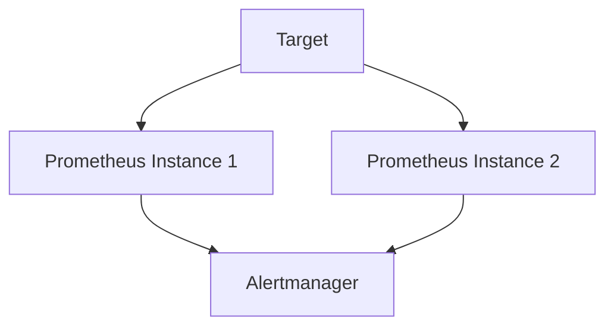

# 数据一致性保障

在 Prometheus 联邦与高可用架构中，**数据一致性**是一个至关重要的概念。它确保在分布式环境中，多个 Prometheus 实例之间的数据是同步且准确的。这对于监控系统的可靠性和准确性至关重要。本文将逐步讲解数据一致性的概念、实现方式以及实际应用场景。

## 什么是数据一致性？

数据一致性是指在分布式系统中，多个节点或实例之间的数据保持一致的状态。在 Prometheus 联邦架构中，多个 Prometheus 实例可能同时收集和存储监控数据。如果这些实例之间的数据不一致，可能会导致监控数据的错误解读，进而影响系统的稳定性和性能。

## 数据一致性的挑战

在分布式系统中，数据一致性面临以下挑战：

1. **网络延迟**：不同节点之间的网络通信可能存在延迟，导致数据同步不及时。
2. **节点故障**：某个节点可能因为硬件或软件故障而无法正常工作，导致数据丢失或不一致。
3. **时钟同步**：不同节点的系统时钟可能存在偏差，导致时间序列数据的时间戳不一致。

## Prometheus 中的数据一致性保障

Prometheus 通过以下几种机制来保障数据一致性：

### 1. 联邦架构

Prometheus 联邦架构允许将多个 Prometheus 实例的数据聚合到一个中心 Prometheus 实例中。通过这种方式，可以确保所有实例的数据最终一致。

```yaml
scrape_configs:
  - job_name: 'federate'
    honor_labels: true
    metrics_path: '/federate'
    params:
      'match[]':
        - '{job="prometheus"}'
    static_configs:
      - targets:
        - 'source-prometheus-1:9090'
        - 'source-prometheus-2:9090'
```

在上面的配置中，`source-prometheus-1` 和 `source-prometheus-2` 是两个源 Prometheus 实例，它们的数据将被聚合到中心 Prometheus 实例中。

### 2. 高可用性

Prometheus 高可用性（HA）通过运行多个相同的 Prometheus 实例来实现。这些实例同时收集和存储相同的数据，确保即使某个实例发生故障，其他实例仍然可以提供准确的数据。



在上面的图表中，两个 Prometheus 实例同时从同一个目标收集数据，并将警报发送到同一个 Alertmanager。

### 3. 数据持久化

Prometheus 通过将数据持久化到本地磁盘来保障数据的可靠性。即使 Prometheus 实例重启，数据也不会丢失。

```bash
# 查看 Prometheus 数据目录
ls /var/lib/prometheus/data
```

### 4. 时钟同步

为了确保时间序列数据的时间戳一致，Prometheus 依赖于节点的系统时钟。因此，确保所有节点的时钟同步是非常重要的。可以使用 NTP（网络时间协议）来同步系统时钟。

```bash
# 安装并配置 NTP
sudo apt-get install ntp
sudo systemctl start ntp
sudo systemctl enable ntp
```

## 实际应用场景

### 场景 1：多数据中心监控

在一个拥有多个数据中心的企业中，每个数据中心可能运行一个独立的 Prometheus 实例。通过联邦架构，可以将所有数据中心的数据聚合到一个中心 Prometheus 实例中，确保全局数据的一致性。

### 场景 2：高可用性部署

在一个高可用性部署中，运行多个 Prometheus 实例来监控同一个目标。即使某个实例发生故障，其他实例仍然可以提供准确的监控数据，确保系统的稳定性。

## 总结

数据一致性是 Prometheus 联邦与高可用架构中的关键概念。通过联邦架构、高可用性、数据持久化和时钟同步等机制，Prometheus 能够确保在分布式环境中的数据一致性和可靠性。理解这些机制对于构建可靠的监控系统至关重要。

## 附加资源与练习

- **练习 1**：配置一个简单的 Prometheus 联邦架构，将两个 Prometheus 实例的数据聚合到一个中心实例中。
- **练习 2**：在一个高可用性部署中，模拟一个 Prometheus 实例的故障，观察其他实例的行为。
- **资源**：阅读 Prometheus 官方文档，了解更多关于联邦架构和高可用性的详细信息。

通过本文的学习，你应该对 Prometheus 中的数据一致性保障有了更深入的理解。继续探索和实践，你将能够构建更加可靠和高效的监控系统。