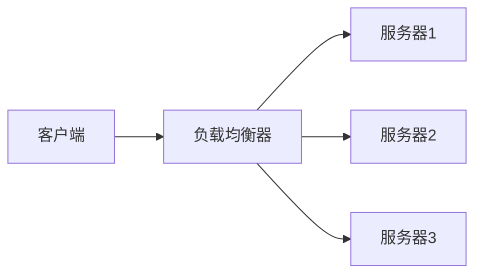
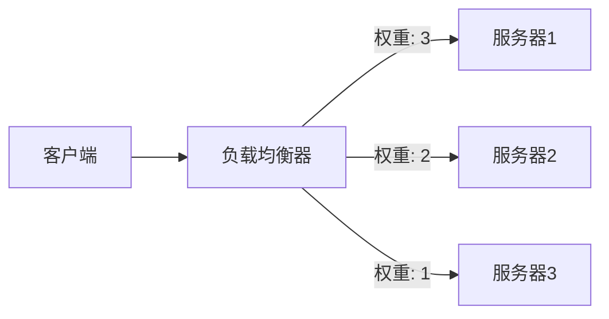
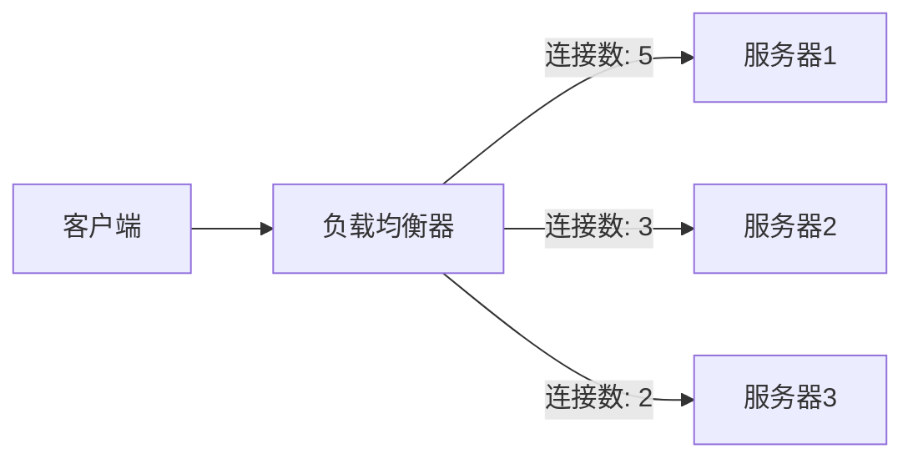
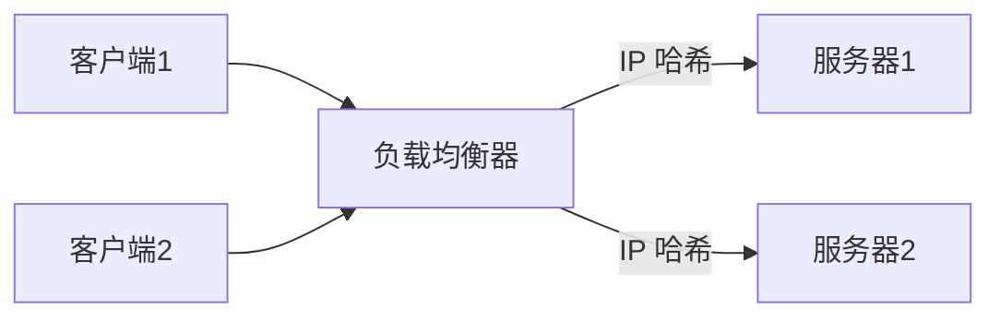

# 负载均衡策略

在现代分布式系统中，负载均衡是确保系统高可用性和性能的关键技术之一。本文将详细介绍负载均衡策略的概念、实现方式及其在 Prometheus 联邦与高可用中的应用。

## 什么是负载均衡？

负载均衡是一种将工作负载分配到多个计算资源（如服务器、数据库或其他服务）的技术。通过负载均衡，系统可以更高效地处理请求，避免单个资源过载，从而提高系统的整体性能和可靠性。

## 负载均衡策略的类型

负载均衡策略决定了如何将请求分配到不同的资源。以下是几种常见的负载均衡策略：

### 1. 轮询（Round Robin）

轮询是最简单的负载均衡策略之一。它按顺序将请求分配给每个资源，确保每个资源都能均匀地处理请求。



### 2. 加权轮询（Weighted Round Robin）

加权轮询在轮询的基础上引入了权重概念。权重较高的资源会处理更多的请求。这种策略适用于资源性能不均等的场景。



### 3. 最少连接（Least Connections）

最少连接策略将请求分配给当前连接数最少的资源。这种策略适用于处理时间较长的请求，可以有效避免资源过载。



### 4. IP 哈希（IP Hash）

IP 哈希策略根据客户端的 IP 地址将请求分配到特定的资源。这种策略可以确保同一客户端的请求总是被分配到同一个资源，适用于需要会话保持的场景。



## 实际案例：Prometheus 联邦中的负载均衡

在 Prometheus 联邦中，负载均衡策略可以用于将查询请求分配到多个 Prometheus 实例。以下是一个简单的配置示例：

```yaml
scrape_configs:
  - job_name: 'federate'
    honor_labels: true
    metrics_path: '/federate'
    params:
      'match[]':
        - '{job="prometheus"}'
    static_configs:
      - targets:
        - 'prometheus1:9090'
        - 'prometheus2:9090'
        - 'prometheus3:9090'
```

在这个配置中，Prometheus 会将查询请求轮询分配到 `prometheus1`、`prometheus2` 和 `prometheus3` 三个实例。

## 总结

负载均衡策略是分布式系统中不可或缺的一部分。通过合理选择和应用负载均衡策略，可以显著提高系统的性能和可靠性。本文介绍了常见的负载均衡策略及其在 Prometheus 联邦中的应用，希望能帮助你更好地理解和应用这些技术。

## 附加资源与练习

- **练习**：尝试在本地环境中配置一个简单的负载均衡器，并使用不同的负载均衡策略进行测试。
- **资源**：阅读 [Prometheus 官方文档](https://prometheus.io/docs/) 了解更多关于联邦和高可用的内容。

:::tip
在实际生产环境中，选择合适的负载均衡策略需要根据具体的业务需求和系统架构进行权衡。建议在测试环境中进行充分的验证和调整。
:::