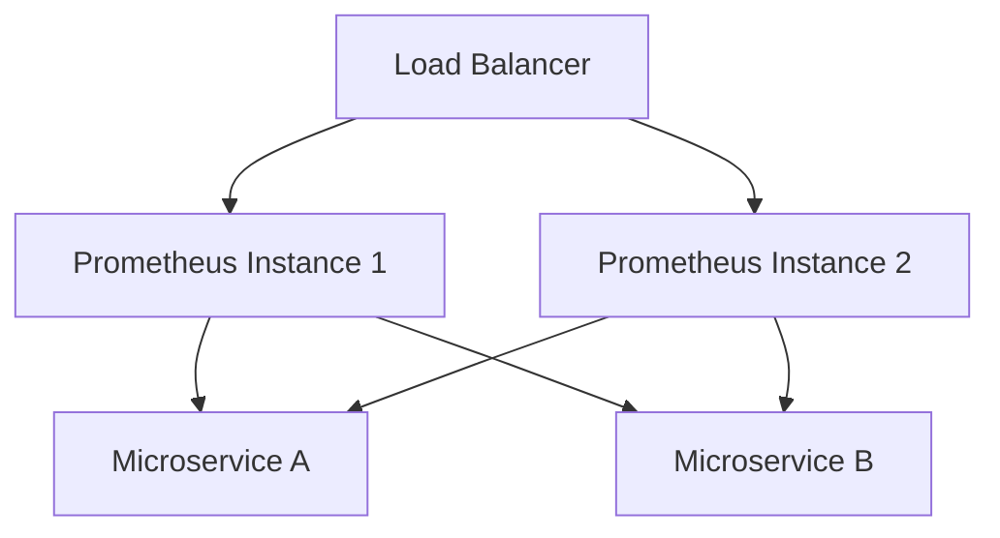

# 大规模部署案例

在现代分布式系统中，监控是确保系统稳定性和性能的关键。Prometheus 作为一个开源的监控和告警工具，广泛应用于各种规模的环境中。然而，当系统规模变得非常庞大时，单一的 Prometheus 实例可能无法满足需求。这时，Prometheus 联邦（Federation）和高可用（High Availability, HA）部署就显得尤为重要。

## 什么是 Prometheus 联邦与高可用？

### Prometheus 联邦

Prometheus 联邦允许你将多个 Prometheus 实例的数据聚合到一个中心化的 Prometheus 实例中。这种方式特别适用于大规模分布式系统，其中每个子系统都有自己的 Prometheus 实例来监控其内部状态。通过联邦，你可以将这些分散的数据集中到一个地方，进行全局分析和告警。

### 高可用部署

高可用部署是指在系统中部署多个 Prometheus 实例，以确保即使某个实例发生故障，监控系统仍然能够正常运行。通常，高可用部署会结合负载均衡和自动故障转移机制，以确保系统的持续可用性。

## 大规模部署案例

### 案例背景

假设我们有一个大型的电子商务平台，该平台由多个微服务组成，每个微服务都有自己的 Prometheus 实例来监控其内部状态。随着业务的增长，监控数据的规模和复杂性也在不断增加。为了应对这一挑战，我们需要实施 Prometheus 联邦和高可用部署。

### 实施步骤

#### 1. 部署多个 Prometheus 实例

首先，我们需要在每个微服务中部署一个 Prometheus 实例。这些实例将负责收集和存储各自微服务的监控数据。

```yaml
# prometheus-microservice-a.yml
global:
  scrape_interval: 15s

scrape_configs:
  - job_name: 'microservice-a'
    static_configs:
      - targets: ['localhost:9090']
```

#### 2. 配置联邦

接下来，我们需要配置一个中心化的 Prometheus 实例，用于聚合所有微服务的监控数据。这个中心化的实例将通过联邦机制从各个微服务的 Prometheus 实例中拉取数据。

```yaml
# prometheus-federation.yml
global:
  scrape_interval: 15s

scrape_configs:
  - job_name: 'federate'
    honor_labels: true
    metrics_path: '/federate'
    params:
      'match[]':
        - '{job="microservice-a"}'
        - '{job="microservice-b"}'
    static_configs:
      - targets:
          - 'microservice-a-prometheus:9090'
          - 'microservice-b-prometheus:9090'
```

#### 3. 实现高可用

为了确保监控系统的高可用性，我们需要部署多个中心化的 Prometheus 实例，并使用负载均衡器来分发请求。此外，我们还需要配置自动故障转移机制，以确保在某个实例发生故障时，系统能够自动切换到备用实例。



### 实际应用场景

在一个实际的电子商务平台中，Prometheus 联邦和高可用部署可以帮助我们实现以下目标：

1. **全局监控**：通过联邦机制，我们可以将所有微服务的监控数据集中到一个地方，进行全局分析和告警。
2. **故障隔离**：高可用部署确保了即使某个 Prometheus 实例发生故障，监控系统仍然能够正常运行，从而避免了单点故障。
3. **扩展性**：随着业务的增长，我们可以轻松地添加更多的 Prometheus 实例，以满足不断增长的监控需求。

## 总结

Prometheus 联邦和高可用部署是应对大规模分布式系统监控挑战的有效解决方案。通过联邦机制，我们可以将分散的监控数据集中到一个地方，进行全局分析；通过高可用部署，我们可以确保监控系统的持续可用性。在实际应用中，这些技术可以帮助我们构建一个稳定、可靠的监控系统。

## 附加资源与练习

- **练习**：尝试在一个小型分布式系统中部署 Prometheus 联邦和高可用，并观察其效果。
- **资源**：阅读 Prometheus 官方文档，了解更多关于联邦和高可用的配置选项和最佳实践。

:::tip
提示：在实际部署中，建议使用自动化工具（如 Ansible 或 Terraform）来管理 Prometheus 实例的部署和配置，以提高效率和一致性。
:::