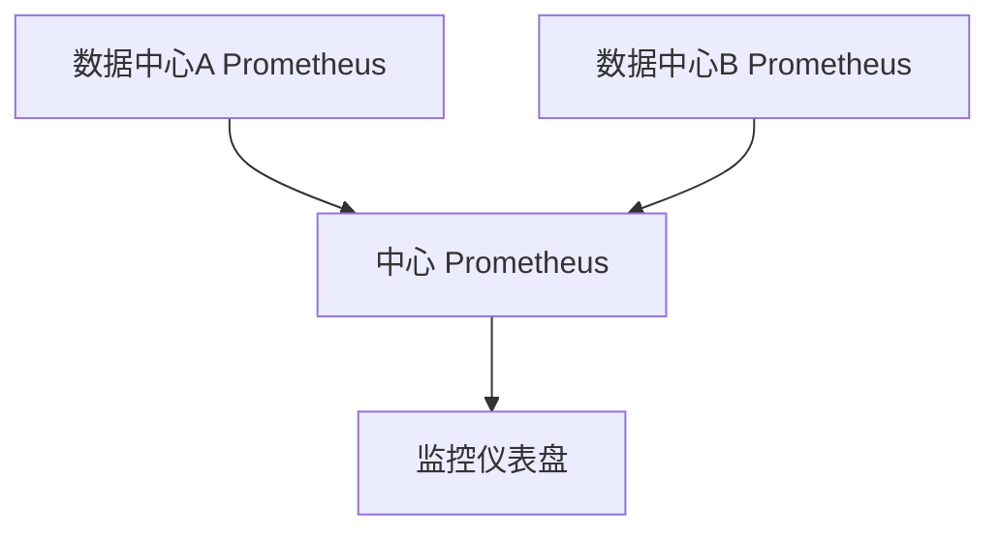

# 跨数据中心监控

在现代分布式系统中，跨数据中心的监控是一个至关重要的需求。随着业务规模的扩大，许多企业需要在多个数据中心部署应用程序和服务。为了确保这些服务的可用性和性能，监控系统必须能够跨越多个数据中心收集和分析数据。本文将介绍如何使用 Prometheus 实现跨数据中心的监控，并确保高可用性和数据一致性。

## 什么是跨数据中心监控？

跨数据中心监控是指在多个地理位置分散的数据中心之间收集、存储和分析监控数据的过程。这种监控方式可以帮助企业全面了解其全球基础设施的运行状况，及时发现和解决问题，确保服务的高可用性。

### 为什么需要跨数据中心监控？

1. **高可用性**：通过跨数据中心监控，可以确保即使一个数据中心出现故障，其他数据中心的监控系统仍然可以正常工作。
2. **数据一致性**：跨数据中心监控可以确保所有数据中心的数据一致，避免因数据不一致导致的误判。
3. **全局视角**：跨数据中心监控提供了全局视角，帮助企业全面了解其全球基础设施的运行状况。

## Prometheus 联邦与跨数据中心监控

Prometheus 是一个开源的监控和警报工具，广泛用于监控分布式系统。Prometheus 的联邦（Federation）功能允许将多个 Prometheus 实例的数据聚合到一个中心 Prometheus 实例中，从而实现跨数据中心的监控。

### Prometheus 联邦的工作原理

Prometheus 联邦通过从多个 Prometheus 实例中抓取数据，并将这些数据聚合到一个中心 Prometheus 实例中。中心 Prometheus 实例可以进一步对这些数据进行分析和警报。



### 配置 Prometheus 联邦

以下是一个简单的 Prometheus 联邦配置示例：

```yaml
scrape_configs:
  - job_name: 'federate'
    scrape_interval: 15s
    honor_labels: true
    metrics_path: '/federate'
    params:
      'match[]':
        - '{job="prometheus"}'
    static_configs:
      - targets:
        - 'prometheus-dc1:9090'
        - 'prometheus-dc2:9090'
```

在这个配置中，`prometheus-dc1` 和 `prometheus-dc2` 是两个数据中心的 Prometheus 实例。中心 Prometheus 实例会从这两个实例中抓取数据。

### 实际案例

假设我们有两个数据中心，分别位于纽约和伦敦。我们需要监控这两个数据中心的应用程序性能。我们可以分别在纽约和伦敦部署 Prometheus 实例，然后在中心位置（例如法兰克福）部署一个中心 Prometheus 实例，用于聚合数据。

1. **纽约数据中心 Prometheus 配置**：

```yaml
scrape_configs:
  - job_name: 'ny-app'
    static_configs:
      - targets: ['ny-app1:9090', 'ny-app2:9090']
```

2. **伦敦数据中心 Prometheus 配置**：

```yaml
scrape_configs:
  - job_name: 'ldn-app'
    static_configs:
      - targets: ['ldn-app1:9090', 'ldn-app2:9090']
```

3. **法兰克福中心 Prometheus 配置**：

```yaml
scrape_configs:
  - job_name: 'federate'
    scrape_interval: 15s
    honor_labels: true
    metrics_path: '/federate'
    params:
      'match[]':
        - '{job="ny-app"}'
        - '{job="ldn-app"}'
    static_configs:
      - targets:
        - 'ny-prometheus:9090'
        - 'ldn-prometheus:9090'
```

通过这种配置，法兰克福的中心 Prometheus 实例可以实时监控纽约和伦敦数据中心的应用程序性能。

## 总结

跨数据中心监控是确保分布式系统高可用性和数据一致性的关键。通过 Prometheus 的联邦功能，我们可以轻松实现跨数据中心的监控。本文介绍了 Prometheus 联邦的工作原理、配置方法以及一个实际案例，帮助你理解如何在实际应用中实现跨数据中心监控。

### 附加资源

- [Prometheus 官方文档](https://prometheus.io/docs/)
- [Prometheus 联邦配置指南](https://prometheus.io/docs/prometheus/latest/federation/)

### 练习

1. 尝试在两个不同的数据中心部署 Prometheus 实例，并配置联邦功能。
2. 使用 Grafana 创建一个监控仪表盘，展示跨数据中心的监控数据。

:::tip
在配置 Prometheus 联邦时，确保网络连接稳定，以避免数据抓取失败。
:::