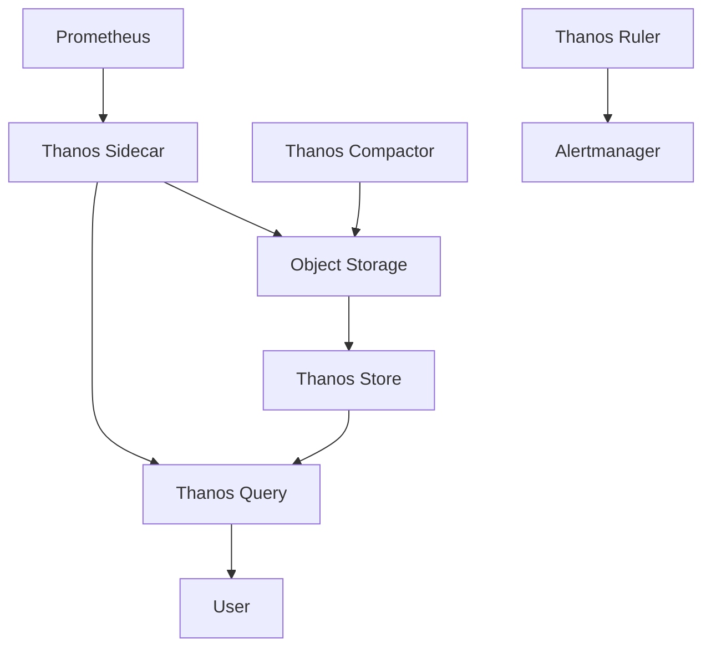

# Thanos组件详解

Thanos 是一个开源的、高度可扩展的监控系统，旨在解决 Prometheus 的长期存储和高可用性问题。它通过引入多个组件，扩展了 Prometheus 的功能，使其能够处理大规模分布式环境中的监控需求。本文将详细介绍 Thanos 的核心组件及其工作原理。

## 1. Thanos 简介

Thanos 的核心目标是为 Prometheus 提供全局视图、长期存储和高可用性。它通过以下方式实现这些目标：

- **全局查询**：Thanos 允许跨多个 Prometheus 实例进行查询，提供统一的全局视图。
- **长期存储**：Thanos 将 Prometheus 的数据存储在对象存储（如 S3、GCS）中，支持长期保留。
- **高可用性**：通过冗余和分布式架构，Thanos 确保监控系统的高可用性。

## 2. Thanos 核心组件

Thanos 由多个组件组成，每个组件都有特定的功能。以下是 Thanos 的主要组件及其作用：

### 2.1 Thanos Sidecar

Thanos Sidecar 是与 Prometheus 实例一起运行的组件，负责将 Prometheus 的数据上传到对象存储，并允许 Thanos Query 查询 Prometheus 的数据。

```yaml
# 示例：Thanos Sidecar 配置
sidecar:
  prometheus_url: "http://localhost:9090"
  objstore_config:
    type: S3
    config:
      bucket: "my-thanos-bucket"
      endpoint: "s3.amazonaws.com"
```

### 2.2 Thanos Query

Thanos Query 是 Thanos 的查询组件，它允许用户跨多个 Prometheus 实例和对象存储进行查询。Thanos Query 提供了一个统一的查询接口，用户可以通过它获取全局的监控数据。

```yaml
# 示例：Thanos Query 配置
query:
  http_address: "0.0.0.0:10902"
  store:
    - "thanos-sidecar:10901"
    - "thanos-store:10901"
```

### 2.3 Thanos Store

Thanos Store 负责从对象存储中读取历史数据，并将其提供给 Thanos Query。它允许用户查询长期存储的监控数据。

```yaml
# 示例：Thanos Store 配置
store:
  data_dir: "/var/thanos/store"
  objstore_config:
    type: S3
    config:
      bucket: "my-thanos-bucket"
      endpoint: "s3.amazonaws.com"
```

### 2.4 Thanos Compactor

Thanos Compactor 负责压缩和降采样存储在对象存储中的数据。它通过减少数据量来提高查询性能，并优化存储成本。

```yaml
# 示例：Thanos Compactor 配置
compactor:
  data_dir: "/var/thanos/compactor"
  objstore_config:
    type: S3
    config:
      bucket: "my-thanos-bucket"
      endpoint: "s3.amazonaws.com"
```

### 2.5 Thanos Ruler

Thanos Ruler 负责评估 Prometheus 的告警规则，并将告警发送到 Alertmanager。它支持跨多个 Prometheus 实例的全局告警规则。

```yaml
# 示例：Thanos Ruler 配置
ruler:
  alertmanagers:
    - "http://alertmanager:9093"
  rule_files:
    - "/etc/thanos/rules/*.yaml"
```

## 3. Thanos 架构图

以下是一个简单的 Thanos 架构图，展示了各个组件之间的关系：



## 4. 实际应用场景

### 4.1 跨区域监控

在一个跨多个区域的分布式系统中，每个区域可能运行一个独立的 Prometheus 实例。通过 Thanos，可以将这些 Prometheus 实例的数据统一存储和查询，提供全局的监控视图。

### 4.2 长期数据存储

对于需要长期保留监控数据的场景，Thanos 可以将 Prometheus 的数据存储在对象存储中，并通过 Thanos Store 提供查询服务。这使得用户可以查询数月甚至数年前的监控数据。

### 4.3 高可用性

通过 Thanos 的冗余架构，即使某个 Prometheus 实例或 Thanos 组件发生故障，监控系统仍然可以正常运行。Thanos Query 可以从其他实例或对象存储中获取数据，确保监控系统的高可用性。

## 5. 总结

Thanos 是一个强大的工具，能够显著提升 Prometheus 的扩展性和高可用性。通过 Thanos Sidecar、Query、Store、Compactor 和 Ruler 等组件，Thanos 提供了全局查询、长期存储和高可用性等功能。对于需要处理大规模监控数据的场景，Thanos 是一个不可或缺的工具。

## 6. 附加资源与练习

- **官方文档**：[Thanos 官方文档](https://thanos.io/)
- **练习**：尝试在一个本地环境中部署 Thanos，并配置 Thanos Sidecar 和 Query 组件，体验跨 Prometheus 实例的查询功能。
- **进一步学习**：了解如何将 Thanos 与 Kubernetes 集成，实现容器化环境中的监控。

:::tip
提示：在部署 Thanos 时，建议从一个小规模的测试环境开始，逐步扩展到生产环境。
:::