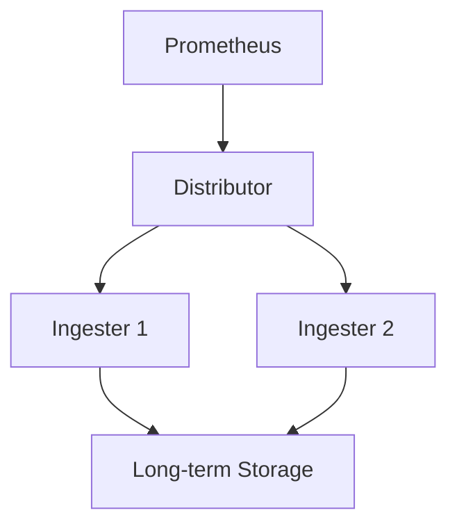
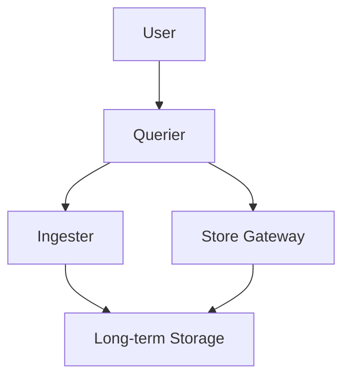

# Cortex架构

Cortex是一个开源的、水平可扩展的Prometheus兼容系统，旨在为大规模监控提供高可用性和持久化存储。它通过将Prometheus的数据存储和查询功能解耦，使得用户能够在分布式环境中高效地管理和查询监控数据。

## 什么是Cortex？

Cortex是一个基于Prometheus的分布式系统，它允许用户将多个Prometheus实例的数据集中存储，并提供统一的查询接口。Cortex的核心目标是解决Prometheus在大规模部署中的单点故障和存储限制问题。

### Cortex的主要组件

Cortex由以下几个主要组件组成：

1. **Distributor**：负责接收来自Prometheus的写入请求，并将数据分发到多个Ingester实例。
2. **Ingester**：负责将接收到的数据写入长期存储（如S3、GCS等）。
3. **Querier**：负责处理查询请求，从Ingester或长期存储中获取数据并返回给用户。
4. **Store Gateway**：负责从长期存储中读取数据，供Querier使用。
5. **Ruler**：负责执行Prometheus的告警规则，并将结果写入长期存储。
6. **Compactor**：负责压缩和合并长期存储中的数据，以提高查询性能。

## Cortex的工作原理

### 数据写入流程

1. Prometheus将数据发送到Cortex的Distributor。
2. Distributor将数据分发到多个Ingester实例。
3. Ingester将数据写入长期存储。



### 数据查询流程

1. 用户向Cortex的Querier发送查询请求。
2. Querier从Ingester或Store Gateway中获取数据。
3. Querier将查询结果返回给用户。



## 实际案例

假设你有一个大规模的Kubernetes集群，其中运行着数百个Prometheus实例。每个实例都监控着不同的服务。为了集中管理和查询这些监控数据，你可以使用Cortex。

### 配置Cortex

首先，你需要配置Cortex的各个组件。以下是一个简单的配置文件示例：

```yaml
distributor:
  replication_factor: 3

ingester:
  lifecycler:
    ring:
      replication_factor: 3

querier:
  store_gateway_addresses: "store-gateway:9095"

store_gateway:
  sharding_enabled: true
```

### 查询数据

配置完成后，你可以通过Cortex的API查询数据。以下是一个查询示例：

```bash
curl -G 'http://cortex-query:9095/api/v1/query' --data-urlencode 'query=up{job="prometheus"}'
```

### 输出示例

```json
{
  "status": "success",
  "data": {
    "resultType": "vector",
    "result": [
      {
        "metric": {
          "__name__": "up",
          "job": "prometheus",
          "instance": "localhost:9090"
        },
        "value": [
          1633024800,
          "1"
        ]
      }
    ]
  }
}
```

## 总结

Cortex通过将Prometheus的数据存储和查询功能解耦，提供了一个高可用、水平可扩展的监控解决方案。它适用于大规模部署，能够有效解决单点故障和存储限制问题。

:::tip
如果你对Cortex感兴趣，可以访问其[官方文档](https://cortexmetrics.io/docs/)以获取更多信息。
:::

## 附加资源

- [Cortex官方文档](https://cortexmetrics.io/docs/)
- [Prometheus官方文档](https://prometheus.io/docs/)
- [Kubernetes监控最佳实践](https://kubernetes.io/docs/concepts/cluster-administration/monitoring/)

## 练习

1. 尝试在本地环境中部署一个简单的Cortex集群。
2. 配置Prometheus将数据发送到Cortex，并查询这些数据。
3. 探索Cortex的告警功能，配置一个简单的告警规则。

通过以上步骤，你将能够更好地理解Cortex的工作原理及其在实际中的应用。