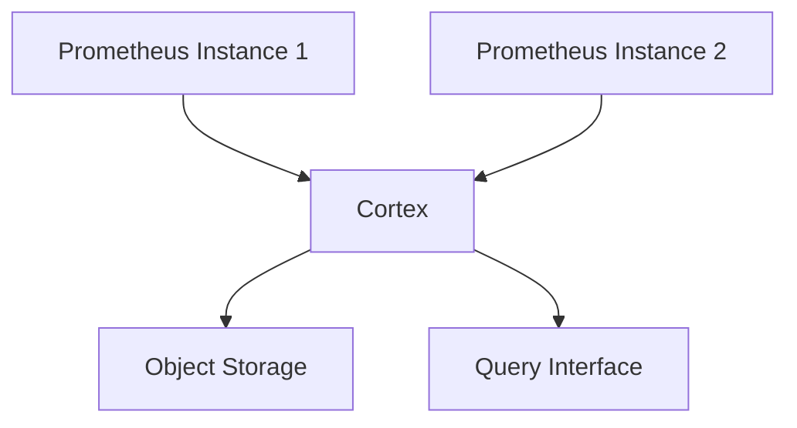

# Cortex部署设置

Cortex是一个开源的、水平可扩展的Prometheus联邦系统，旨在为大规模监控提供高可用性和持久性存储。它通过将Prometheus的数据存储和查询功能解耦，使得用户可以在多个Prometheus实例之间共享数据，并实现高可用性。

## 介绍

Cortex的核心功能包括：
- **联邦**：将多个Prometheus实例的数据聚合到一个中心化的存储中。
- **高可用性**：通过分布式架构确保系统的稳定性和可靠性。
- **持久性存储**：将Prometheus的数据存储在长期存储中，如对象存储（如S3、GCS）。

在本指南中，我们将逐步介绍如何设置和部署Cortex，并展示其在实际应用中的使用场景。

## 部署步骤

### 1. 安装Cortex

首先，您需要下载并安装Cortex。您可以从Cortex的GitHub仓库中获取最新的二进制文件。

```bash
wget https://github.com/cortexproject/cortex/releases/download/v1.10.0/cortex-linux-amd64
chmod +x cortex-linux-amd64
```

### 2. 配置Cortex

Cortex的配置文件通常是一个YAML文件，您可以根据需要进行自定义。以下是一个简单的配置文件示例：

```yaml
# cortex.yaml
target: all
auth_enabled: false

server:
  http_listen_port: 9009

ingester:
  lifecycler:
    ring:
      kvstore:
        store: inmemory
      replication_factor: 1

storage:
  engine: blocks
  blocks_storage:
    backend: s3
    s3:
      endpoint: s3.amazonaws.com
      bucket_name: my-cortex-bucket
      access_key_id: YOUR_ACCESS_KEY
      secret_access_key: YOUR_SECRET_KEY
```

### 3. 启动Cortex

使用以下命令启动Cortex：

```bash
./cortex-linux-amd64 -config.file=cortex.yaml
```

### 4. 配置Prometheus

为了让Prometheus将数据发送到Cortex，您需要在Prometheus的配置文件中添加远程写入配置：

```yaml
# prometheus.yaml
remote_write:
  - url: "http://localhost:9009/api/v1/push"
```

### 5. 验证部署

启动Prometheus后，您可以通过Cortex的API查询数据，确保数据已成功写入：

```bash
curl -G 'http://localhost:9009/api/v1/query' --data-urlencode 'query=up'
```

## 实际案例

假设您有一个由多个Prometheus实例组成的监控系统，每个实例负责监控不同的区域。通过部署Cortex，您可以将这些实例的数据聚合到一个中心化的存储中，并通过统一的查询接口访问所有数据。



## 总结

通过本指南，您已经学会了如何设置和部署Cortex，并了解了其在大规模监控系统中的实际应用。Cortex不仅提供了高可用性和持久性存储，还简化了多个Prometheus实例之间的数据管理。

## 附加资源

- [Cortex官方文档](https://cortexmetrics.io/docs/)
- [Prometheus官方文档](https://prometheus.io/docs/)
- [Cortex GitHub仓库](https://github.com/cortexproject/cortex)

## 练习

1. 尝试在不同的环境中部署Cortex，并配置多个Prometheus实例向其发送数据。
2. 使用Cortex的查询接口，编写一个查询语句，获取所有Prometheus实例的`up`指标。
3. 探索Cortex的其他功能，如多租户支持和长期存储配置。

:::tip
如果您在部署过程中遇到问题，可以参考Cortex的官方文档或社区论坛获取帮助。
:::