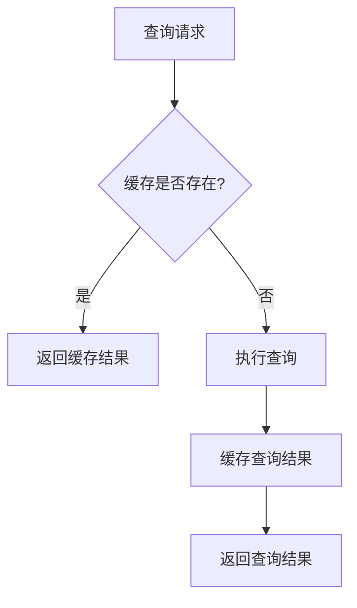
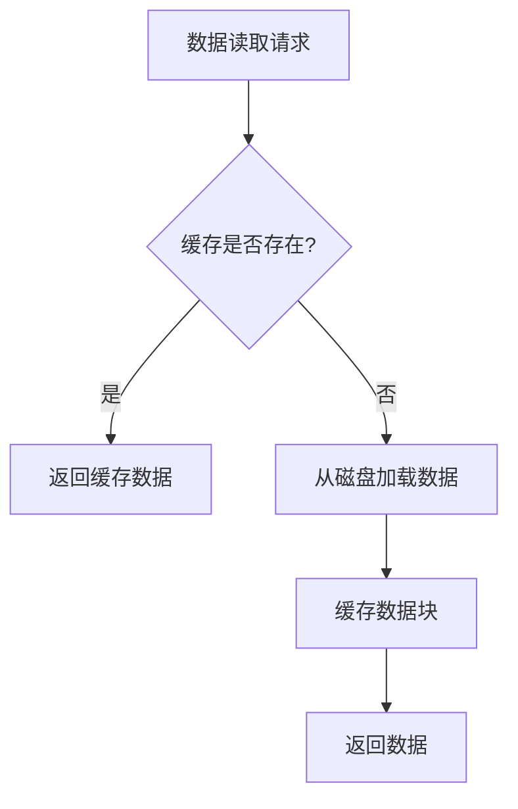

# Prometheus 缓存机制

Prometheus 是一个开源的监控和告警工具，广泛用于收集和存储时间序列数据。为了提升查询性能，Prometheus 引入了缓存机制。本文将详细介绍 Prometheus 的缓存机制，帮助初学者理解其工作原理以及如何在实际场景中应用。

## 什么是Prometheus缓存机制？

Prometheus 的缓存机制主要用于优化查询性能。当 Prometheus 执行查询时，它会将查询结果缓存起来，以便在后续相同的查询中直接使用缓存数据，而不需要重新计算。这种机制可以显著减少查询时间，尤其是在处理大规模数据时。

### 缓存的作用

- **提升查询性能**：通过缓存查询结果，减少重复计算的开销。
- **降低系统负载**：减少对后端存储的访问频率，降低系统负载。
- **提高响应速度**：缓存命中时，查询结果可以快速返回，提高用户体验。

## Prometheus 缓存机制的工作原理

Prometheus 的缓存机制主要分为两个部分：**查询缓存**和**数据块缓存**。

### 查询缓存

查询缓存是指 Prometheus 在执行查询时，将查询结果缓存起来。当相同的查询再次发生时，Prometheus 会直接从缓存中返回结果，而不需要重新计算。

#### 查询缓存的工作流程

1. **查询请求**：用户发起一个查询请求。
2. **缓存检查**：Prometheus 检查缓存中是否存在该查询的结果。
3. **缓存命中**：如果缓存中存在结果，则直接返回缓存数据。
4. **缓存未命中**：如果缓存中不存在结果，则执行查询并将结果缓存起来。



### 数据块缓存

数据块缓存是指 Prometheus 在读取时间序列数据时，将数据块缓存到内存中。当需要访问相同的数据块时，Prometheus 可以直接从内存中读取，而不需要再次从磁盘中加载。

#### 数据块缓存的工作流程

1. **数据读取请求**：Prometheus 需要读取某个时间范围的数据。
2. **缓存检查**：检查内存中是否存在该数据块。
3. **缓存命中**：如果内存中存在数据块，则直接返回。
4. **缓存未命中**：如果内存中不存在数据块，则从磁盘中加载数据并缓存到内存中。



## 实际应用场景

### 场景1：频繁查询相同的时间范围

假设你有一个监控系统，需要频繁查询过去1小时内的CPU使用率。如果没有缓存机制，每次查询都需要重新计算，这将导致系统负载增加。通过启用查询缓存，Prometheus 可以在第一次查询后将结果缓存起来，后续查询可以直接使用缓存数据，从而显著提升查询性能。

### 场景2：大规模数据查询

在处理大规模数据时，数据块缓存可以显著减少磁盘I/O操作。例如，当你需要查询过去7天的数据时，Prometheus 会将数据块缓存到内存中。如果后续查询需要访问相同的数据块，Prometheus 可以直接从内存中读取，而不需要再次从磁盘中加载。

## 代码示例

以下是一个简单的Prometheus查询示例，展示了如何通过缓存机制优化查询性能。

```promql
# 查询过去1小时内的CPU使用率
rate(node_cpu_seconds_total[1h])
```

在这个查询中，Prometheus 会首先检查缓存中是否存在该查询的结果。如果存在，则直接返回缓存数据；如果不存在，则执行查询并将结果缓存起来。

## 总结

Prometheus 的缓存机制通过查询缓存和数据块缓存，显著提升了查询性能并降低了系统负载。理解并合理利用缓存机制，可以帮助你在实际应用中优化监控系统的性能。

### 附加资源

- [Prometheus官方文档](https://prometheus.io/docs/)
- [Prometheus查询语言（PromQL）指南](https://prometheus.io/docs/prometheus/latest/querying/basics/)

### 练习

1. 尝试在Prometheus中执行一个查询，并观察缓存机制的效果。
2. 修改Prometheus的配置，调整缓存大小，观察对查询性能的影响。
