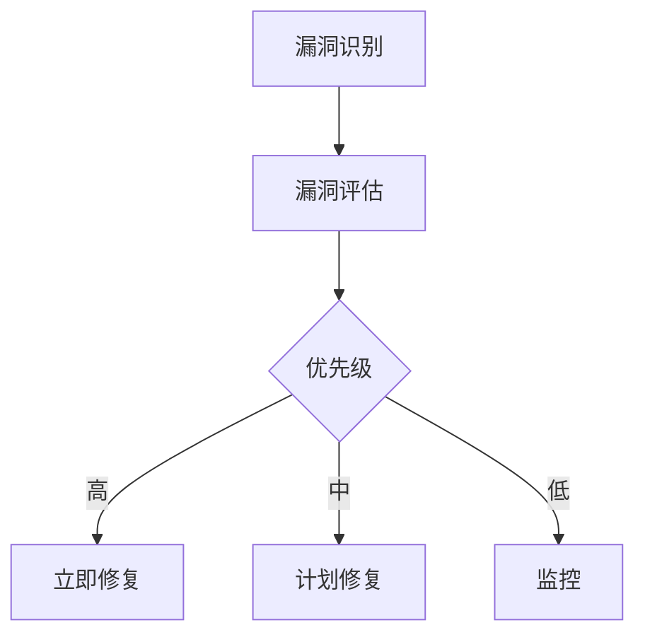

# 漏洞管理

在现代软件开发和安全运维中，**漏洞管理**是一个至关重要的环节。它涉及识别、评估、修复和监控系统中的安全漏洞，以确保系统的安全性和稳定性。本文将逐步讲解漏洞管理的基本概念、流程以及实际应用场景，帮助你全面理解这一主题。

## 什么是漏洞管理？

**漏洞管理**是指通过系统化的方法识别、评估、修复和监控软件或系统中的安全漏洞的过程。漏洞可能存在于操作系统、应用程序、网络设备或配置中，攻击者可以利用这些漏洞对系统进行攻击。因此，漏洞管理是确保系统安全的关键步骤。

:::note
漏洞管理的目标不仅仅是修复已知漏洞，还包括预防未来可能出现的漏洞。
:::

## 漏洞管理的基本流程

漏洞管理通常包括以下几个步骤：

1. **漏洞识别**：通过扫描工具或手动检查，发现系统中存在的漏洞。
2. **漏洞评估**：对发现的漏洞进行分类和优先级排序，确定哪些漏洞需要立即修复。
3. **漏洞修复**：根据评估结果，采取适当的措施修复漏洞。
4. **漏洞监控**：持续监控系统，确保漏洞修复后不会再次出现，并及时发现新的漏洞。

### 1. 漏洞识别

漏洞识别是漏洞管理的第一步。通常使用自动化工具（如 [Prometheus](https://prometheus.io/) 或 [OpenVAS](https://www.openvas.org/)）来扫描系统中的漏洞。这些工具可以检测出系统中已知的漏洞，并生成报告。

```bash
# 示例：使用 Prometheus 进行漏洞扫描
prometheus scan --target 192.168.1.1
```

**输出示例：**

```
Scanning target: 192.168.1.1
Found 3 vulnerabilities:
1. CVE-2023-1234 (High)
2. CVE-2023-5678 (Medium)
3. CVE-2023-9101 (Low)
```

### 2. 漏洞评估

在识别出漏洞后，下一步是对这些漏洞进行评估。评估的标准通常包括漏洞的严重性、利用难度以及对系统的影响。根据评估结果，漏洞会被分为高、中、低三个优先级。



### 3. 漏洞修复

根据漏洞的优先级，制定修复计划。对于高优先级的漏洞，应立即采取措施进行修复。修复措施可能包括应用补丁、修改配置或升级软件版本。

```bash
# 示例：应用补丁修复漏洞
sudo apt-get update
sudo apt-get upgrade
```

### 4. 漏洞监控

修复漏洞后，需要持续监控系统，确保漏洞不会再次出现。同时，定期进行漏洞扫描，及时发现新的漏洞。

```bash
# 示例：定期扫描系统
prometheus scan --target 192.168.1.1 --schedule daily
```

## 实际应用场景

### 案例：Web 应用程序的漏洞管理

假设你负责管理一个 Web 应用程序，该应用程序运行在一个 Linux 服务器上。你使用 Prometheus 进行漏洞扫描，发现了一个高危漏洞（CVE-2023-1234）。以下是你的处理步骤：

1. **漏洞识别**：使用 Prometheus 扫描服务器，发现 CVE-2023-1234。
2. **漏洞评估**：评估该漏洞的严重性为高，需要立即修复。
3. **漏洞修复**：应用补丁修复漏洞。
4. **漏洞监控**：定期扫描服务器，确保漏洞修复后不会再次出现。

:::tip
在实际应用中，漏洞管理通常与 CI/CD 流程集成，确保每次代码更新后都会自动进行漏洞扫描。
:::

## 总结

漏洞管理是确保系统安全的重要环节。通过系统化的漏洞识别、评估、修复和监控，可以有效降低系统被攻击的风险。对于初学者来说，掌握漏洞管理的基本流程和工具是迈向安全运维的第一步。

## 附加资源与练习

- **资源**：
  - [Prometheus 官方文档](https://prometheus.io/docs/)
  - [OpenVAS 官方文档](https://www.openvas.org/)
- **练习**：
  - 使用 Prometheus 扫描你的本地开发环境，识别并修复发现的漏洞。
  - 尝试将漏洞扫描集成到你的 CI/CD 流程中，确保每次代码更新后自动进行漏洞扫描。

通过本文的学习，你应该对漏洞管理有了初步的了解。接下来，尝试在实际项目中应用这些知识，逐步提升你的安全运维能力。