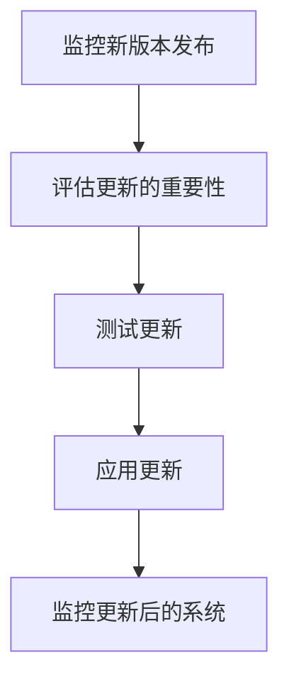

# 安全更新策略

在管理 Prometheus 监控系统时，确保系统的安全性至关重要。安全更新策略是指通过定期更新 Prometheus 及其相关组件，以修复已知漏洞、增强系统安全性并保持系统稳定性的方法。本文将详细介绍如何制定和实施有效的安全更新策略，帮助初学者更好地管理 Prometheus 系统。

## 什么是安全更新策略？

安全更新策略是一种系统化的方法，用于确保软件和系统始终运行在最新、最安全的版本上。对于 Prometheus 来说，这包括定期检查新版本、评估安全补丁的重要性，并在适当的时候应用这些更新。

:::note
安全更新不仅仅是修复漏洞，还包括性能改进和新功能的引入。因此，定期更新是保持系统健康的关键。
:::

## 为什么需要安全更新策略？

1. **修复安全漏洞**：新版本通常包含对已知安全漏洞的修复。
2. **增强系统稳定性**：更新可以解决旧版本中的错误和不稳定性问题。
3. **引入新功能**：更新可能带来新的功能和改进，提升系统的整体性能。
4. **保持兼容性**：随着依赖项和环境的更新，保持 Prometheus 的兼容性非常重要。

## 制定安全更新策略的步骤

### 1. 监控新版本发布

首先，您需要密切关注 Prometheus 的官方发布渠道，如 GitHub 仓库、官方博客或邮件列表。这些渠道会定期发布新版本和安全公告。

### 2. 评估更新的重要性

每次新版本发布时，您需要评估更新的重要性。通常，安全更新会被标记为“关键”或“重要”，而其他更新可能只是功能改进或错误修复。

:::tip
使用 Prometheus 的官方文档和发布说明来了解每个更新的具体内容。
:::

### 3. 测试更新

在生产环境中应用更新之前，建议在测试环境中进行验证。这可以帮助您发现潜在的兼容性问题或新引入的错误。

```bash
# 在测试环境中下载并安装最新版本的 Prometheus
wget https://github.com/prometheus/prometheus/releases/download/v2.30.0/prometheus-2.30.0.linux-amd64.tar.gz
tar -xzf prometheus-2.30.0.linux-amd64.tar.gz
cd prometheus-2.30.0.linux-amd64
./prometheus --config.file=prometheus.yml
```

### 4. 应用更新

一旦在测试环境中验证通过，您可以将更新应用到生产环境中。确保在更新过程中备份所有关键数据，并制定回滚计划以防万一。

```bash
# 在生产环境中停止 Prometheus 服务
systemctl stop prometheus

# 下载并安装最新版本
wget https://github.com/prometheus/prometheus/releases/download/v2.30.0/prometheus-2.30.0.linux-amd64.tar.gz
tar -xzf prometheus-2.30.0.linux-amd64.tar.gz
cd prometheus-2.30.0.linux-amd64

# 启动 Prometheus 服务
systemctl start prometheus
```

### 5. 监控更新后的系统

更新完成后，密切监控系统的运行状态，确保没有引入新的问题。使用 Prometheus 自身的监控功能来跟踪系统性能和健康状况。



## 实际案例

假设您正在运行 Prometheus 2.28.1 版本，并且官方发布了 2.30.0 版本，其中包含一个关键的安全补丁。以下是您可能采取的步骤：

1. **监控新版本发布**：通过 GitHub 仓库了解到 2.30.0 版本的发布。
2. **评估更新的重要性**：阅读发布说明，发现该版本修复了一个可能导致数据泄露的漏洞。
3. **测试更新**：在测试环境中安装 2.30.0 版本，并运行一段时间以确保稳定性。
4. **应用更新**：在生产环境中停止 Prometheus 服务，安装新版本，并重新启动服务。
5. **监控更新后的系统**：使用 Prometheus 的监控功能检查系统是否正常运行。

## 总结

制定和实施有效的安全更新策略是确保 Prometheus 系统安全、稳定和高效运行的关键。通过定期监控新版本发布、评估更新的重要性、测试更新并最终应用到生产环境中，您可以最大限度地减少安全风险并保持系统的健康状态。

:::caution
请记住，更新过程中可能会遇到意外问题，因此始终备份数据并制定回滚计划。
:::

## 附加资源

- [Prometheus 官方文档](https://prometheus.io/docs/)
- [Prometheus GitHub 仓库](https://github.com/prometheus/prometheus)
- [Prometheus 发布说明](https://github.com/prometheus/prometheus/releases)

## 练习

1. 在测试环境中安装最新版本的 Prometheus，并验证其功能。
2. 编写一个脚本，自动检查 Prometheus 的新版本并发送通知。
3. 模拟一次更新过程，包括备份、更新和回滚操作。

通过以上步骤和练习，您将能够更好地理解和实施 Prometheus 的安全更新策略。