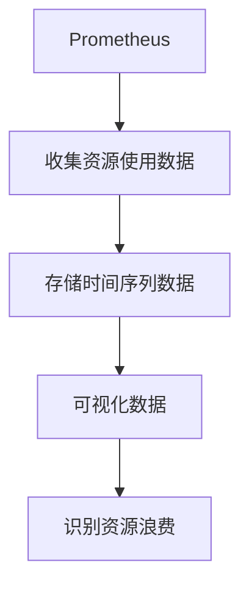

# 成本优化监控

在现代云原生环境中，成本优化是一个至关重要的主题。随着应用程序规模的扩大，资源的使用效率直接影响到企业的运营成本。通过监控资源使用情况，我们可以识别出资源浪费的地方，并采取相应的优化措施。本文将介绍如何使用 Prometheus 实现成本优化监控，帮助初学者掌握这一关键技能。

## 什么是成本优化监控？

成本优化监控是指通过监控和分析资源使用情况，识别出资源浪费或使用效率低下的地方，从而采取优化措施，降低运营成本。在云原生环境中，资源的使用通常是按需分配的，因此监控资源的使用情况对于成本控制至关重要。

## Prometheus 与成本优化监控

Prometheus 是一个开源的监控和告警工具，广泛用于云原生环境中。它通过收集和存储时间序列数据，帮助用户监控系统的性能和资源使用情况。通过 Prometheus，我们可以监控 CPU、内存、存储等资源的使用情况，并设置告警规则，及时发现资源浪费的问题。

### 安装 Prometheus

首先，我们需要在 Kubernetes 集群中安装 Prometheus。可以使用 Helm 来简化安装过程：

```bash
helm repo add prometheus-community https://prometheus-community.github.io/helm-charts
helm repo update
helm install prometheus prometheus-community/prometheus
```

### 配置 Prometheus 监控资源使用情况

安装完成后，我们需要配置 Prometheus 来监控 Kubernetes 集群中的资源使用情况。可以通过以下步骤实现：

1. **创建 ServiceMonitor**：ServiceMonitor 是 Prometheus Operator 中的一个自定义资源，用于定义如何监控 Kubernetes 服务。

```yaml
apiVersion: monitoring.coreos.com/v1
kind: ServiceMonitor
metadata:
  name: resource-usage-monitor
  namespace: monitoring
spec:
  selector:
    matchLabels:
      app: resource-usage
  endpoints:
    - port: metrics
      interval: 30s
```

2. **部署资源使用情况导出器**：我们可以使用 `kube-state-metrics` 来导出 Kubernetes 集群中的资源使用情况。

```bash
helm repo add bitnami https://charts.bitnami.com/bitnami
helm install kube-state-metrics bitnami/kube-state-metrics
```

### 监控资源使用情况

配置完成后，Prometheus 将开始收集资源使用情况的数据。我们可以通过 Prometheus 的 Web UI 或 Grafana 来查看这些数据。



### 设置告警规则

为了及时发现资源浪费的问题，我们可以设置告警规则。例如，当某个 Pod 的 CPU 使用率超过 80% 时，触发告警。

```yaml
groups:
- name: resource-usage-alerts
  rules:
  - alert: HighCPUUsage
    expr: sum(rate(container_cpu_usage_seconds_total{namespace="default"}[5m])) by (pod) > 0.8
    for: 5m
    labels:
      severity: critical
    annotations:
      summary: "High CPU usage detected"
      description: "Pod {{ $labels.pod }} has high CPU usage (current value: {{ $value }})."
```

## 实际案例

假设我们有一个运行在 Kubernetes 集群中的微服务应用。通过 Prometheus 监控，我们发现某个服务的 CPU 使用率持续高于 80%。经过分析，我们发现这是由于该服务的请求量过大，导致资源使用效率低下。通过增加该服务的副本数，我们成功降低了单个 Pod 的 CPU 使用率，从而优化了资源使用，降低了成本。

## 总结

成本优化监控是云原生环境中不可或缺的一部分。通过 Prometheus，我们可以有效地监控资源使用情况，识别出资源浪费的问题，并采取相应的优化措施。本文介绍了如何安装和配置 Prometheus，以及如何设置告警规则来监控资源使用情况。希望这些内容能帮助初学者掌握成本优化监控的基本技能。

## 附加资源

- [Prometheus 官方文档](https://prometheus.io/docs/)
- [Kubernetes 资源管理指南](https://kubernetes.io/docs/concepts/configuration/manage-resources-containers/)
- [Grafana 可视化工具](https://grafana.com/)

## 练习

1. 在你的 Kubernetes 集群中安装 Prometheus，并配置监控资源使用情况。
2. 设置一个告警规则，当某个命名空间的内存使用率超过 70% 时触发告警。
3. 使用 Grafana 创建一个仪表盘，展示集群中各个 Pod 的 CPU 和内存使用情况。

通过完成这些练习，你将更深入地理解成本优化监控的实际应用。