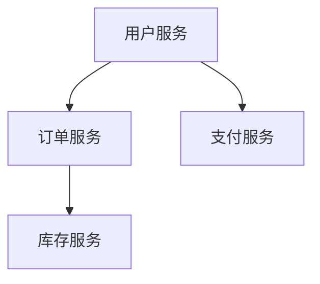

# 云原生最佳实践

## 介绍

云原生（Cloud Native）是一种构建和运行应用程序的方法，旨在充分利用云计算的优势。它通过容器化、微服务架构、持续交付和自动化运维等技术，帮助开发者更高效地构建、部署和管理应用程序。本文将介绍云原生的核心概念和最佳实践，帮助初学者快速入门。

## 核心概念

### 1. 容器化

容器化是云原生的基础技术之一。容器将应用程序及其依赖项打包在一起，确保在不同环境中运行的一致性。Docker 是最常用的容器化工具。

#### 示例：创建一个简单的 Docker 容器

```bash
# Dockerfile
FROM node:14
WORKDIR /app
COPY package.json .
RUN npm install
COPY . .
CMD ["node", "app.js"]
```

```bash
# 构建并运行容器
docker build -t my-node-app .
docker run -p 3000:3000 my-node-app
```

:::tip
容器化不仅适用于开发环境，还可以用于生产环境，确保应用程序在不同环境中表现一致。
:::

### 2. 微服务架构

微服务架构将应用程序拆分为多个小型、独立的服务，每个服务负责特定的功能。这种架构提高了系统的灵活性和可维护性。

#### 示例：微服务架构



:::note
微服务架构的优势在于每个服务可以独立开发、部署和扩展，但也增加了系统的复杂性。
:::

### 3. 持续交付

持续交付（Continuous Delivery, CD）是一种软件开发实践，旨在通过自动化流程快速、可靠地交付软件。它通常与持续集成（Continuous Integration, CI）结合使用。

#### 示例：使用 Jenkins 实现持续交付

```groovy
pipeline {
    agent any
    stages {
        stage('Build') {
            steps {
                sh 'mvn clean package'
            }
        }
        stage('Test') {
            steps {
                sh 'mvn test'
            }
        }
        stage('Deploy') {
            steps {
                sh 'mvn deploy'
            }
        }
    }
}
```

:::caution
持续交付需要良好的测试覆盖率和自动化部署流程，以确保每次交付的软件都是可靠的。
:::

### 4. 自动化运维

自动化运维（DevOps）通过自动化工具和流程，提高开发和运维团队的协作效率。常见的工具包括 Kubernetes、Prometheus 和 Terraform。

#### 示例：使用 Kubernetes 部署应用

```yaml
apiVersion: apps/v1
kind: Deployment
metadata:
  name: my-app
spec:
  replicas: 3
  selector:
    matchLabels:
      app: my-app
  template:
    metadata:
      labels:
        app: my-app
    spec:
      containers:
      - name: my-app
        image: my-node-app:latest
        ports:
        - containerPort: 3000
```

:::warning
自动化运维需要团队具备一定的技术能力，并且需要持续优化和调整自动化流程。
:::

## 实际案例

### 案例：电商平台的云原生转型

某电商平台通过采用云原生技术，实现了从单体架构到微服务架构的转型。他们使用 Docker 进行容器化，Kubernetes 进行容器编排，Jenkins 实现持续交付，Prometheus 进行监控和告警。转型后，平台的部署速度提高了 50%，系统的稳定性和可扩展性也得到了显著提升。

## 总结

云原生技术通过容器化、微服务架构、持续交付和自动化运维等实践，帮助开发者更高效地构建和管理应用程序。初学者可以从容器化和微服务入手，逐步掌握持续交付和自动化运维的技能。

## 附加资源

- [Docker 官方文档](https://docs.docker.com/)
- [Kubernetes 官方文档](https://kubernetes.io/docs/home/)
- [Jenkins 官方文档](https://www.jenkins.io/doc/)
- [Prometheus 官方文档](https://prometheus.io/docs/)

## 练习

1. 使用 Docker 创建一个简单的 Node.js 应用容器，并运行它。
2. 设计一个微服务架构，包含用户服务、订单服务和支付服务。
3. 使用 Jenkins 创建一个简单的 CI/CD 流水线，实现代码的自动构建和部署。
4. 使用 Kubernetes 部署一个简单的应用，并尝试扩展副本数。

通过以上练习，你将更好地理解云原生的核心概念和最佳实践。