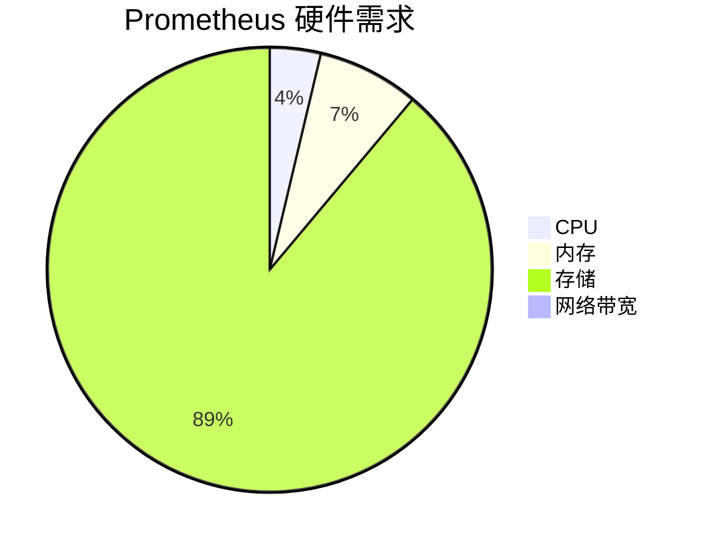

# 硬件需求评估

在部署 Prometheus 时，硬件需求评估是一个至关重要的步骤。正确的硬件配置可以确保 Prometheus 在高负载下稳定运行，同时避免资源浪费。本文将逐步讲解如何评估 Prometheus 的硬件需求，并提供实际案例帮助你更好地理解这一概念。

## 介绍

Prometheus 是一个开源的监控和告警工具，广泛用于监控分布式系统的性能。为了确保 Prometheus 能够高效地处理大量的监控数据，我们需要根据实际需求评估硬件配置。硬件需求评估主要包括 CPU、内存、存储和网络带宽等方面。

## 硬件需求评估的关键因素

### 1. CPU

Prometheus 的 CPU 需求主要取决于以下几个因素：

- **抓取频率**：抓取频率越高，CPU 使用率越高。
- **规则评估频率**：规则评估频率越高，CPU 使用率越高。
- **数据压缩**：Prometheus 会对数据进行压缩，这也会消耗一定的 CPU 资源。

:::tip
建议使用多核 CPU，以便 Prometheus 能够并行处理多个任务。
:::

### 2. 内存

Prometheus 的内存需求主要取决于以下几个因素：

- **时间序列的数量**：时间序列越多，内存使用率越高。
- **抓取频率**：抓取频率越高，内存使用率越高。
- **规则评估频率**：规则评估频率越高，内存使用率越高。

:::caution
如果内存不足，Prometheus 可能会频繁进行垃圾回收，导致性能下降。
:::

### 3. 存储

Prometheus 的存储需求主要取决于以下几个因素：

- **时间序列的数量**：时间序列越多，存储需求越大。
- **数据保留时间**：数据保留时间越长，存储需求越大。
- **抓取频率**：抓取频率越高，存储需求越大。

:::note
建议使用 SSD 硬盘，以提高数据读写速度。
:::

### 4. 网络带宽

Prometheus 的网络带宽需求主要取决于以下几个因素：

- **抓取频率**：抓取频率越高，网络带宽需求越大。
- **数据量**：每次抓取的数据量越大，网络带宽需求越大。

:::warning
如果网络带宽不足，可能会导致抓取延迟或数据丢失。
:::

## 实际案例

假设我们有一个包含 1000 个节点的 Kubernetes 集群，每个节点有 10 个 Pod，每个 Pod 有 5 个时间序列。我们需要评估 Prometheus 的硬件需求。

### 1. 计算时间序列的数量

每个 Pod 有 5 个时间序列，每个节点有 10 个 Pod，因此每个节点有 50 个时间序列。整个集群有 1000 个节点，因此总时间序列数量为：

```
1000 节点 * 10 Pod/节点 * 5 时间序列/Pod = 50,000 时间序列
```

### 2. 评估 CPU 需求

假设我们每 15 秒抓取一次数据，并且每 30 秒评估一次规则。根据经验，每个时间序列大约需要 0.001 个 CPU 核心。因此，CPU 需求为：

```
50,000 时间序列 * 0.001 CPU/时间序列 = 50 CPU 核心
```

### 3. 评估内存需求

每个时间序列大约需要 2 KB 的内存。因此，内存需求为：

```
50,000 时间序列 * 2 KB/时间序列 = 100,000 KB = 100 MB
```

### 4. 评估存储需求

假设我们保留数据 30 天，并且每 15 秒抓取一次数据。每个时间序列每 15 秒产生 16 字节的数据。因此，存储需求为：

```
50,000 时间序列 * 16 字节/时间序列 * (30 天 * 24 小时/天 * 60 分钟/小时 * 60 秒/分钟) / 15 秒 = 1.2 TB
```

### 5. 评估网络带宽需求

假设每次抓取的数据量为 1 KB，每 15 秒抓取一次数据。因此，网络带宽需求为：

```
50,000 时间序列 * 1 KB/时间序列 / 15 秒 = 3.33 MB/s
```

## 总结

通过以上步骤，我们可以评估 Prometheus 的硬件需求。在实际部署中，还需要根据具体情况进行调整。例如，如果抓取频率增加，硬件需求也会相应增加。

## 附加资源

- [Prometheus 官方文档](https://prometheus.io/docs/)
- [Prometheus 硬件需求指南](https://prometheus.io/docs/practices/hardware/)

## 练习

1. 假设你有一个包含 500 个节点的 Kubernetes 集群，每个节点有 20 个 Pod，每个 Pod 有 10 个时间序列。请评估 Prometheus 的硬件需求。
2. 如果你将抓取频率提高到每 5 秒一次，硬件需求会如何变化？



通过以上内容，你应该能够理解如何评估 Prometheus 的硬件需求，并在实际部署中应用这些知识。