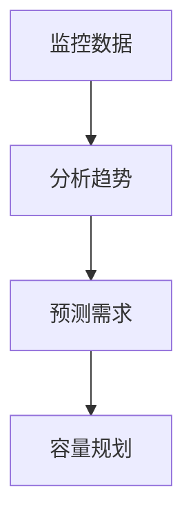

# 监控文化构建

在现代软件开发和运维中，监控不仅仅是工具的使用，更是一种文化的体现。监控文化（Monitoring Culture）是指团队在开发和运维过程中，将监控视为核心实践，并通过协作、学习和改进来持续优化系统的可靠性和性能。本文将逐步讲解如何构建监控文化，并通过实际案例展示其重要性。

## 什么是监控文化？

监控文化是一种团队协作和持续改进的文化，它强调以下几点：

1. **透明性**：系统的状态和性能对所有人可见。
2. **责任共担**：开发和运维团队共同负责系统的健康。
3. **持续学习**：通过监控数据发现问题并从中学习。
4. **自动化**：将监控和告警自动化，减少人为干预。

监控文化的核心在于将监控从“事后补救”转变为“事前预防”，并通过数据驱动的方式持续优化系统。

## 构建监控文化的步骤

### 1. 明确监控目标

在开始构建监控文化之前，团队需要明确监控的目标。常见的监控目标包括：

- **系统可用性**：确保系统始终可用。
- **性能优化**：识别性能瓶颈并优化。
- **故障排查**：快速定位和修复问题。
- **容量规划**：预测资源需求并提前规划。

:::tip
**提示**：与团队一起讨论并确定监控的优先级，确保监控目标与业务目标一致。
:::

### 2. 选择合适的工具

Prometheus 是一个强大的开源监控工具，特别适合云原生环境。它提供了灵活的查询语言（PromQL）和丰富的集成能力。以下是一个简单的 Prometheus 配置示例：

```yaml
global:
  scrape_interval: 15s

scrape_configs:
  - job_name: 'node_exporter'
    static_configs:
      - targets: ['localhost:9100']
```

:::note
**注意**：Prometheus 的配置需要根据实际环境进行调整，确保监控目标正确配置。
:::

### 3. 建立监控指标

监控指标是监控文化的核心。常见的监控指标包括：

- **CPU 使用率**：`rate(node_cpu_seconds_total[1m])`
- **内存使用率**：`node_memory_MemAvailable_bytes / node_memory_MemTotal_bytes`
- **请求延迟**：`histogram_quantile(0.99, rate(http_request_duration_seconds_bucket[1m]))`

:::caution
**警告**：不要过度监控，选择对业务最重要的指标进行监控。
:::

### 4. 自动化告警

告警是监控文化的重要组成部分。通过 Prometheus 的 Alertmanager，可以配置自动化告警规则。以下是一个告警规则示例：

```yaml
groups:
- name: example
  rules:
  - alert: HighCPUUsage
    expr: rate(node_cpu_seconds_total{mode="system"}[1m]) > 0.8
    for: 5m
    labels:
      severity: critical
    annotations:
      summary: "High CPU usage detected"
      description: "CPU usage is above 80% for 5 minutes."
```

:::warning
**警告**：确保告警规则合理，避免告警疲劳。
:::

### 5. 数据驱动的决策

监控数据不仅用于发现问题，还可以用于指导决策。例如，通过分析历史数据，可以预测未来的资源需求，并进行容量规划。



### 6. 持续改进

监控文化是一个持续改进的过程。团队应定期回顾监控数据，分析问题根源，并采取措施防止问题再次发生。

## 实际案例

### 案例：电商平台的监控文化

某电商平台在高峰期经常出现性能瓶颈。通过构建监控文化，团队采取了以下措施：

1. **明确目标**：确保系统在高峰期的高可用性。
2. **选择工具**：使用 Prometheus 监控系统性能。
3. **建立指标**：监控 CPU、内存、请求延迟等关键指标。
4. **自动化告警**：配置告警规则，及时发现性能瓶颈。
5. **数据驱动决策**：通过分析历史数据，优化资源分配。
6. **持续改进**：定期回顾监控数据，优化系统架构。

通过这些措施，该电商平台成功提升了系统的稳定性和性能。

## 总结

构建监控文化是一个长期的过程，需要团队的共同努力。通过明确目标、选择合适的工具、建立监控指标、自动化告警、数据驱动的决策和持续改进，团队可以充分利用监控工具，提升系统的可靠性和性能。

## 附加资源

- [Prometheus 官方文档](https://prometheus.io/docs/)
- [监控文化的最佳实践](https://landing.google.com/sre/sre-book/chapters/monitoring-distributed-systems/)
- [Prometheus 实战指南](https://github.com/yolossn/Prometheus-Basics)

## 练习

1. 配置一个简单的 Prometheus 监控任务，监控本地主机的 CPU 使用率。
2. 编写一个告警规则，当 CPU 使用率超过 80% 时触发告警。
3. 分析历史监控数据，预测未来的资源需求。

通过以上练习，您将更好地理解监控文化的构建过程。