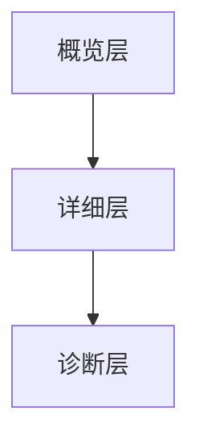

## 介绍

在 Prometheus 监控系统中，仪表盘是展示监控数据的关键工具。一个好的仪表盘不仅能够清晰地展示系统的运行状态，还能帮助运维人员快速发现和解决问题。本文将介绍 Prometheus 仪表盘设计的基本原则，帮助初学者创建高效、易用的监控仪表盘。

## 仪表盘设计原则

### 1. 简洁明了

仪表盘的设计应尽量简洁，避免过多的信息堆积。每个图表和指标都应该有其明确的目的，避免无关信息干扰。

:::tip
**提示**：使用 Prometheus 的 `rate()` 函数来计算速率，而不是直接展示原始数据，可以使图表更加清晰。
:::

```promql
rate(http_requests_total[5m])
```

### 2. 层次分明

仪表盘应按照不同的层次来组织信息。通常可以分为以下几个层次：

- **概览层**：展示系统的整体状态，如 CPU 使用率、内存使用率等。
- **详细层**：展示某个特定组件或服务的详细状态，如某个微服务的请求延迟。
- **诊断层**：用于深入分析问题的详细信息，如某个特定请求的详细日志。



### 3. 一致性

仪表盘中的图表和指标应保持一致的设计风格和单位。例如，所有的时间序列图表都应使用相同的时间范围和单位。

:::caution
**注意**：确保所有图表的时间范围一致，避免混淆。
:::

### 4. 可操作性

仪表盘不仅用于展示数据，还应具备一定的可操作性。例如，可以通过点击图表中的某个点来查看该时间点的详细数据。

```promql
histogram_quantile(0.95, sum(rate(http_request_duration_seconds_bucket[5m])) by (le))
```

### 5. 实时性

仪表盘应尽量展示实时数据，以便及时发现和解决问题。Prometheus 的 `scrape_interval` 设置应合理，以确保数据的实时性。

:::warning
**警告**：过短的 `scrape_interval` 可能会导致 Prometheus 服务器负载过高。
:::

## 实际案例

假设我们有一个微服务架构的电商网站，我们需要监控以下几个关键指标：

1. **请求速率**：使用 `rate(http_requests_total[5m])` 来计算每秒的请求数。
2. **错误率**：使用 `rate(http_requests_total{status="500"}[5m]) / rate(http_requests_total[5m])` 来计算错误率。
3. **响应时间**：使用 `histogram_quantile(0.95, sum(rate(http_request_duration_seconds_bucket[5m])) by (le))` 来计算 95% 的响应时间。

```promql
rate(http_requests_total[5m])
rate(http_requests_total{status="500"}[5m]) / rate(http_requests_total[5m])
histogram_quantile(0.95, sum(rate(http_request_duration_seconds_bucket[5m])) by (le))
```

## 总结

设计一个高效的 Prometheus 仪表盘需要遵循简洁明了、层次分明、一致性、可操作性和实时性等原则。通过合理的仪表盘设计，可以大大提高监控系统的效率和可维护性。

## 附加资源

- [Prometheus 官方文档](https://prometheus.io/docs/)
- [Grafana 仪表盘设计指南](https://grafana.com/docs/grafana/latest/dashboards/)

## 练习

1. 创建一个简单的 Prometheus 仪表盘，展示某个服务的请求速率和错误率。
2. 尝试使用 `histogram_quantile` 函数计算并展示某个服务的 95% 响应时间。

通过以上练习，你将更好地掌握 Prometheus 仪表盘设计的基本原则。