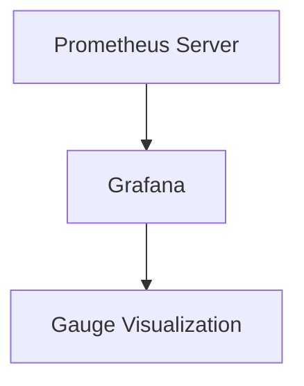

# Gauge仪表盘

在 Prometheus 中，**Gauge** 是一种用于表示可增可减的数值的指标类型。与 Counter 不同，Gauge 的值可以随时增加或减少，适用于表示当前状态或瞬时值。本文将详细介绍 Gauge 的概念、使用方法以及实际应用场景。

## 什么是 Gauge？

Gauge 是一种表示瞬时值的指标类型。它的值可以随时间增加或减少，适用于表示当前状态或瞬时值。例如，当前的内存使用量、CPU 使用率、温度等都可以用 Gauge 来表示。

:::note
Gauge 的值是瞬时的，不会随着时间的推移而累积。这与 Counter 不同，Counter 的值只会增加，不会减少。
:::

## Gauge 的基本用法

在 Prometheus 中，Gauge 通常通过客户端库来创建和更新。以下是一个使用 Prometheus 客户端库（以 Python 为例）创建和更新 Gauge 的示例：

```python
from prometheus_client import Gauge, start_http_server
import time

# 创建一个 Gauge 指标
temperature_gauge = Gauge('temperature_celsius', 'Current temperature in Celsius')

# 模拟温度变化
def simulate_temperature():
    while True:
        # 模拟温度变化
        temperature_gauge.set(25.0 + (time.time() % 10))  # 温度在 25.0 到 35.0 之间波动
        time.sleep(1)

if __name__ == '__main__':
    # 启动 Prometheus HTTP 服务器
    start_http_server(8000)
    # 开始模拟温度变化
    simulate_temperature()
```

在这个示例中，我们创建了一个名为 `temperature_celsius` 的 Gauge 指标，并模拟了温度的变化。`set()` 方法用于设置 Gauge 的当前值。

## Gauge 的实际应用场景

Gauge 在实际应用中有很多用途，以下是一些常见的应用场景：

1. **系统监控**：监控系统的 CPU 使用率、内存使用量、磁盘空间等。
2. **温度监控**：监控设备的当前温度。
3. **队列长度**：监控消息队列的当前长度。
4. **用户在线数量**：监控当前在线用户的数量。

### 示例：监控系统内存使用量

以下是一个使用 Gauge 监控系统内存使用量的示例：

```python
import psutil
from prometheus_client import Gauge, start_http_server
import time

# 创建一个 Gauge 指标
memory_usage_gauge = Gauge('system_memory_usage_percent', 'Current system memory usage in percent')

# 监控内存使用量
def monitor_memory_usage():
    while True:
        # 获取当前内存使用量
        memory_usage = psutil.virtual_memory().percent
        # 更新 Gauge 的值
        memory_usage_gauge.set(memory_usage)
        time.sleep(1)

if __name__ == '__main__':
    # 启动 Prometheus HTTP 服务器
    start_http_server(8000)
    # 开始监控内存使用量
    monitor_memory_usage()
```

在这个示例中，我们使用 `psutil` 库获取系统的内存使用量，并使用 Gauge 指标 `system_memory_usage_percent` 来监控内存使用量的百分比。

## Gauge 的查询与可视化

在 Prometheus 中，你可以使用 PromQL 查询 Gauge 指标。例如，查询 `temperature_celsius` 指标的当前值：

```promql
temperature_celsius
```

你还可以使用 Prometheus 的图形界面或 Grafana 来可视化 Gauge 指标的变化趋势。



## 总结

Gauge 是 Prometheus 中用于表示瞬时值的指标类型，适用于监控当前状态或瞬时值。通过本文的介绍，你应该已经掌握了 Gauge 的基本概念、使用方法以及实际应用场景。

:::tip
在实际使用中，Gauge 通常与其他指标类型（如 Counter、Histogram 等）结合使用，以提供更全面的监控和报警功能。
:::

## 附加资源与练习

- **练习**：尝试使用 Gauge 监控你的应用程序的某个瞬时值（如请求处理时间、队列长度等）。
- **资源**：阅读 [Prometheus 官方文档](https://prometheus.io/docs/) 以了解更多关于 Gauge 和其他指标类型的详细信息。