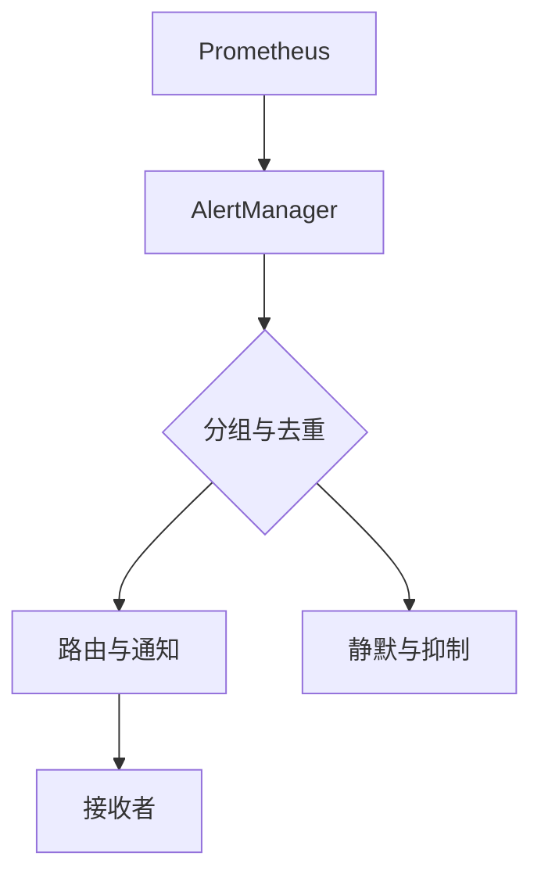

## 什么是 AlertManager？

AlertManager 是 Prometheus 生态系统中的一个重要组件，用于管理和处理来自 Prometheus 的告警。Prometheus 负责监控和收集指标数据，而 AlertManager 则负责对这些数据进行告警管理，包括告警的去重、分组、静默和路由等功能。

简单来说，AlertManager 是 Prometheus 的“告警中枢”，它确保告警信息能够以合理的方式传递给相关人员或系统。

## AlertManager 的核心功能

AlertManager 提供了以下核心功能：

1. **告警分组**：将相关的告警合并为一个通知，减少告警噪音。
2. **告警抑制**：在某些条件下，抑制特定的告警通知。
3. **告警静默**：临时屏蔽某些告警，避免不必要的通知。
4. **告警路由**：根据告警的标签或内容，将告警发送到不同的接收者或渠道。

## AlertManager 的工作原理

AlertManager 的工作流程可以分为以下几个步骤：

1. **接收告警**：Prometheus 将触发的告警发送到 AlertManager。
2. **分组与去重**：AlertManager 根据配置对告警进行分组和去重。
3. **路由与通知**：根据路由规则，将告警发送到相应的接收者（如邮件、Slack、PagerDuty 等）。
4. **静默与抑制**：根据配置，对某些告警进行静默或抑制。

以下是一个简单的工作流程图：



## 配置 AlertManager

AlertManager 的配置文件通常为 `alertmanager.yml`，以下是一个简单的配置示例：

```yaml
global:
  resolve_timeout: 5m

route:
  receiver: 'email-notifications'
  group_by: ['alertname', 'cluster', 'service']
  group_wait: 30s
  group_interval: 5m
  repeat_interval: 3h

receivers:
  - name: 'email-notifications'
    email_configs:
      - to: 'team@example.com'
```

### 配置解析

- **global**: 全局配置，例如 `resolve_timeout` 定义了告警被标记为“已解决”的时间。
- **route**: 定义了告警的路由规则，包括分组、等待时间、重复间隔等。
- **receivers**: 定义了告警的接收者，例如通过邮件发送告警。

## 实际案例

假设我们有一个 Kubernetes 集群，监控了多个服务的 CPU 使用率。当某个服务的 CPU 使用率超过 80% 时，Prometheus 会触发告警，并将告警发送到 AlertManager。

### 场景描述

- **告警名称**: `HighCPUUsage`
- **服务名称**: `frontend-service`
- **集群名称**: `production-cluster`

### 告警分组

AlertManager 会将所有 `HighCPUUsage` 告警按照 `service` 和 `cluster` 进行分组，避免重复发送相同的告警。

### 告警路由

根据配置，AlertManager 会将告警发送到 `email-notifications` 接收者，即通过邮件通知团队。

### 告警静默

如果团队正在进行维护，可以临时静默 `frontend-service` 的告警，避免干扰。

## 总结

AlertManager 是 Prometheus 生态系统中不可或缺的一部分，它通过分组、去重、路由和静默等功能，帮助用户高效地管理告警。通过合理的配置，AlertManager 可以显著减少告警噪音，确保关键问题能够及时得到处理。

## 附加资源与练习

- **官方文档**: [AlertManager 官方文档](https://prometheus.io/docs/alerting/latest/alertmanager/)
- **练习**: 尝试在本地环境中配置一个简单的 AlertManager，并模拟告警的发送与接收。
- **进阶阅读**: 学习如何将 AlertManager 与 Slack、PagerDuty 等工具集成，实现多渠道告警通知。

:::tip
提示：在实际生产环境中，建议定期审查和优化 AlertManager 的配置，以确保告警系统的稳定性和高效性。
:::