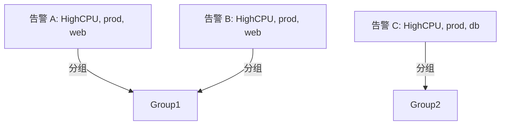

# 告警分组策略

在 Prometheus 告警系统中，告警分组（Grouping）是一种重要的策略，用于将相关的告警合并为一个通知，从而减少告警噪音并提高告警管理的效率。本文将详细介绍告警分组的概念、配置方法以及实际应用场景。

## 什么是告警分组？

告警分组是指将具有相同特征或相关性的告警合并为一个通知的过程。例如，如果多个服务实例在同一时间发生相同的故障，Prometheus 可以将这些告警合并为一个通知，而不是为每个实例发送单独的通知。这种方式可以显著减少告警的数量，避免告警风暴，同时帮助运维人员更快地定位问题。

:::note
告警分组的核心思想是**减少重复告警**，同时确保**关键信息不被遗漏**。
:::

## 告警分组的配置

在 Prometheus 中，告警分组是通过 Alertmanager 的配置文件（`alertmanager.yml`）来实现的。以下是一个简单的配置示例：

```yaml
route:
  group_by: ['alertname', 'cluster', 'service']
  group_wait: 30s
  group_interval: 5m
  repeat_interval: 3h
  receiver: 'web.hook'
```

### 配置项说明

- **`group_by`**: 指定分组的依据字段。例如，`['alertname', 'cluster', 'service']` 表示根据告警名称、集群和服务名称进行分组。
- **`group_wait`**: 等待时间，表示在发送第一个通知之前，等待相同分组的其他告警的时间。默认值为 30 秒。
- **`group_interval`**: 同一分组内告警的发送间隔。默认值为 5 分钟。
- **`repeat_interval`**: 重复发送相同告警的间隔时间。默认值为 3 小时。
- **`receiver`**: 指定接收告警通知的接收器。

:::tip
通过调整 `group_wait` 和 `group_interval`，可以控制告警的发送频率，从而避免告警过于频繁。
:::

## 告警分组的工作原理

为了更好地理解告警分组的工作原理，我们可以通过一个简单的示例来说明。

假设有以下告警：

1. 告警 A：`alertname=HighCPU, cluster=prod, service=web`
2. 告警 B：`alertname=HighCPU, cluster=prod, service=web`
3. 告警 C：`alertname=HighCPU, cluster=prod, service=db`

如果配置了 `group_by: ['alertname', 'cluster']`，那么告警 A 和 B 会被分到同一组，因为它们具有相同的 `alertname` 和 `cluster` 值。告警 C 则会被分到另一组，因为它的 `service` 值与 A 和 B 不同。



## 实际应用场景

### 场景 1：减少告警噪音

在一个大型分布式系统中，可能会有数百个服务实例同时发生相同的故障。如果没有告警分组，每个实例都会触发一个独立的告警，导致告警数量激增。通过告警分组，可以将这些告警合并为一个通知，从而显著减少告警噪音。

### 场景 2：提高告警的可读性

告警分组不仅减少了告警数量，还提高了告警的可读性。例如，如果一个集群中的所有服务都发生了高 CPU 使用率的告警，分组后可以清楚地看到问题的范围，而不是被大量的单个告警淹没。

## 总结

告警分组是 Prometheus 告警系统中一个非常实用的功能，能够有效减少告警噪音，提高告警管理的效率。通过合理配置 `group_by`、`group_wait` 和 `group_interval` 等参数，可以根据实际需求优化告警的分组策略。

:::caution
在实际使用中，告警分组的配置需要根据具体的业务场景进行调整。过于宽松的分组可能会导致关键信息被忽略，而过于严格的分组则可能无法有效减少告警数量。
:::

## 附加资源与练习

1. **练习**: 尝试在本地环境中配置一个简单的告警分组策略，观察告警的发送行为。
2. **资源**: 阅读 [Prometheus 官方文档](https://prometheus.io/docs/alerting/latest/configuration/) 中关于告警分组的更多细节。
3. **思考**: 在你的业务场景中，哪些字段适合作为分组的依据？如何平衡告警的数量和信息的完整性？

通过本文的学习，你应该已经掌握了告警分组的基本概念和配置方法。希望你能在实际应用中灵活运用这一策略，提升告警管理的效率！