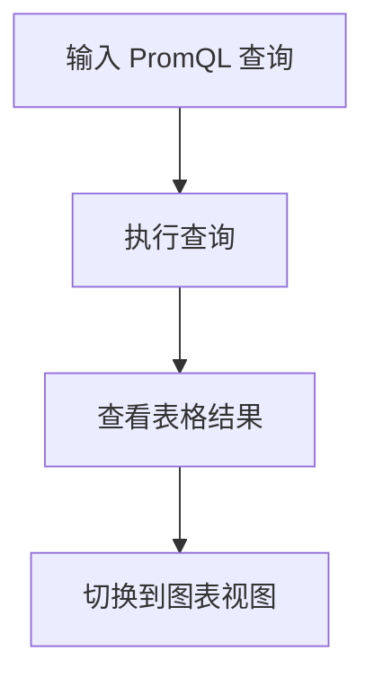

# Prometheus 内置图表

Prometheus 是一个强大的开源监控和告警工具，广泛用于监控分布式系统和微服务架构。除了强大的数据采集和存储能力外，Prometheus 还提供了内置的图表功能，帮助用户直观地查看和分析监控数据。本文将详细介绍 Prometheus 内置图表的使用方法，并通过实际案例展示其应用场景。

## 什么是 Prometheus 内置图表？

Prometheus 内置图表是通过 Prometheus 的 Web UI 提供的可视化工具。它允许用户直接在 Prometheus 的 Web 界面中绘制和查看监控数据的图表。这些图表基于 Prometheus 的查询语言（PromQL）生成，能够实时展示监控指标的变化趋势。

:::note
Prometheus 内置图表功能虽然简单，但对于快速查看和分析监控数据非常有用，尤其是在调试和初步分析阶段。
:::

## 如何使用 Prometheus 内置图表

### 1. 访问 Prometheus Web UI

首先，确保你已经安装并运行了 Prometheus。然后，通过浏览器访问 Prometheus 的 Web UI，默认地址通常是 `http://localhost:9090`。

### 2. 输入 PromQL 查询

在 Prometheus Web UI 的顶部，你会看到一个输入框，用于输入 PromQL 查询语句。PromQL 是 Prometheus 的查询语言，用于从时间序列数据库中提取数据。

例如，如果你想查看某个服务的请求速率，可以输入以下查询：

```promql
rate(http_requests_total[1m])
```

### 3. 查看图表

输入查询语句后，点击 "Execute" 按钮，Prometheus 会执行查询并在下方显示结果。默认情况下，结果会以表格形式展示。你可以点击 "Graph" 标签，切换到图表视图。



### 4. 调整时间范围

在图表视图中，你可以通过顶部的时间范围选择器调整图表的时间范围。例如，你可以选择查看过去 1 小时、6 小时或 24 小时的数据。

### 5. 自定义图表

Prometheus 内置图表还允许你自定义图表的显示方式。例如，你可以调整图表的线条颜色、粗细，或者选择不同的图表类型（如折线图、面积图等）。

## 实际案例：监控 HTTP 请求速率

假设你正在监控一个 Web 服务的 HTTP 请求速率。你可以使用以下 PromQL 查询来获取过去 5 分钟的请求速率：

```promql
rate(http_requests_total{job="web-server"}[5m])
```

执行查询后，你可以在图表视图中看到 HTTP 请求速率的变化趋势。这有助于你快速识别流量高峰或异常情况。

:::tip
在实际生产环境中，你可以将 Prometheus 与 Grafana 结合使用，以获得更强大的可视化功能。Grafana 提供了丰富的图表类型和自定义选项，适合长期监控和告警。
:::

## 总结

Prometheus 内置图表是一个简单但功能强大的工具，适合快速查看和分析监控数据。通过 PromQL 查询语言，你可以轻松地从时间序列数据库中提取数据，并在 Web UI 中绘制图表。虽然内置图表功能相对简单，但对于初步分析和调试非常有用。

## 附加资源

- [Prometheus 官方文档](https://prometheus.io/docs/)
- [PromQL 查询语言指南](https://prometheus.io/docs/prometheus/latest/querying/basics/)
- [Grafana 与 Prometheus 集成指南](https://grafana.com/docs/grafana/latest/datasources/prometheus/)

## 练习

1. 使用 Prometheus 内置图表功能，监控你的应用程序的 CPU 使用率。
2. 尝试使用不同的 PromQL 查询，查看不同指标的图表。
3. 将 Prometheus 与 Grafana 集成，探索更高级的可视化功能。

通过以上步骤和练习，你将能够熟练使用 Prometheus 内置图表功能，并为进一步的监控和可视化打下坚实的基础。