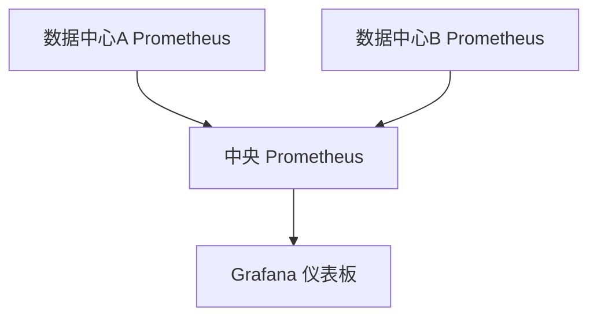

# 多数据源整合

在现代监控系统中，数据通常来自多个来源。Prometheus 作为一个强大的监控工具，支持从多个数据源收集和整合数据。本文将介绍如何在 Prometheus 中实现多数据源整合，并通过实际案例展示其应用场景。

## 什么是多数据源整合？

多数据源整合是指将来自不同来源的数据合并到一个统一的视图中，以便进行更全面的分析和监控。在 Prometheus 中，这通常涉及从多个 Prometheus 实例、外部数据库或其他监控系统中提取数据，并将其整合到一个统一的仪表板或报告中。

## 为什么需要多数据源整合？

1. **全面监控**：通过整合多个数据源，可以获得更全面的系统视图。
2. **数据冗余**：多个数据源可以提供冗余，确保在某个数据源失效时，仍然可以获取关键数据。
3. **跨系统分析**：整合不同系统的数据，可以进行跨系统的性能分析和故障排查。

## 如何在 Prometheus 中实现多数据源整合？

### 1. 使用 Prometheus 联邦（Federation）

Prometheus 联邦允许一个 Prometheus 服务器从其他 Prometheus 服务器中抓取数据。这对于在多个 Prometheus 实例之间共享数据非常有用。

#### 示例配置

```yaml
scrape_configs:
  - job_name: 'federate'
    scrape_interval: 15s
    honor_labels: true
    metrics_path: '/federate'
    params:
      'match[]':
        - '{job="prometheus"}'
    static_configs:
      - targets:
        - 'source-prometheus-1:9090'
        - 'source-prometheus-2:9090'
```

在这个配置中，`source-prometheus-1` 和 `source-prometheus-2` 是两个源 Prometheus 服务器，它们的数据将被整合到当前的 Prometheus 实例中。

### 2. 使用远程存储适配器

Prometheus 支持通过远程存储适配器（Remote Storage Adapter）将数据写入外部存储系统，如 Thanos、Cortex 或 InfluxDB。这些外部存储系统可以整合多个 Prometheus 实例的数据。

#### 示例配置

```yaml
remote_write:
  - url: "http://thanos-receive:10908/api/v1/receive"
```

在这个配置中，Prometheus 会将数据写入 Thanos 接收器，Thanos 可以整合多个 Prometheus 实例的数据。

### 3. 使用 PromQL 查询多个数据源

PromQL 是 Prometheus 的查询语言，它允许你从多个数据源中提取数据并进行整合。

#### 示例查询

```promql
sum(rate(http_requests_total{job="web-server"}[5m])) by (instance) + sum(rate(http_requests_total{job="api-server"}[5m])) by (instance)
```

这个查询将从 `web-server` 和 `api-server` 两个 job 中提取数据，并计算它们的总和。

## 实际案例

### 案例：跨数据中心的监控

假设你有两个数据中心，每个数据中心都有一个独立的 Prometheus 实例。你希望在一个统一的仪表板中监控这两个数据中心的服务状态。

1. **配置联邦**：在每个数据中心的 Prometheus 实例中配置联邦，将数据整合到一个中央 Prometheus 实例中。
2. **创建仪表板**：使用 Grafana 创建一个仪表板，从中央 Prometheus 实例中提取数据，并展示两个数据中心的服务状态。



## 总结

多数据源整合是 Prometheus 中一个强大的功能，它允许你从多个来源收集和整合数据，以实现更全面的监控和分析。通过联邦、远程存储适配器和 PromQL，你可以轻松实现这一目标。

## 附加资源

- [Prometheus 官方文档](https://prometheus.io/docs/)
- [Grafana 官方文档](https://grafana.com/docs/)
- [Thanos 官方文档](https://thanos.io/)

## 练习

1. 配置一个 Prometheus 联邦，从两个不同的 Prometheus 实例中抓取数据。
2. 使用 PromQL 编写一个查询，从多个数据源中提取数据并计算总和。
3. 在 Grafana 中创建一个仪表板，展示多个数据中心的监控数据。

通过完成这些练习，你将更深入地理解多数据源整合的概念和应用。